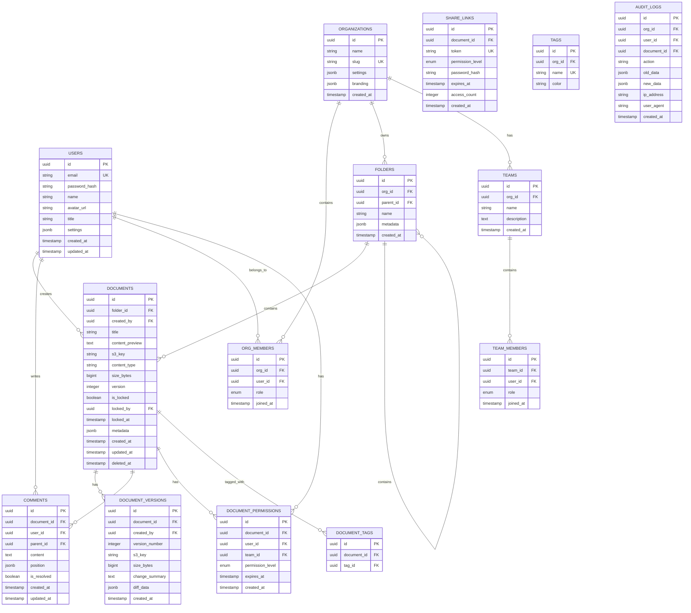
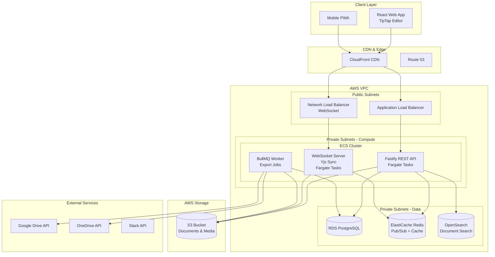
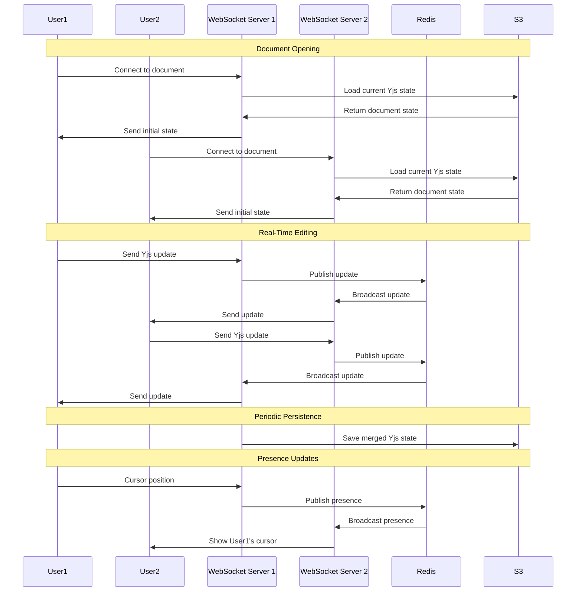

# Project 4 of 8: Document Collaboration Platform

## 1. Project Overview

### Project Name and Number
**Project 4 of 8: Document Collaboration Platform**

### Executive Summary
A highly-collaborative, real-time document creation, editing, and sharing platform for individuals, teams, and organizations. The system supports synchronous editing, comments, version control, media embedding, granular sharing permissions, and compliance features. Built with Fastify and featuring CRDT-based real-time collaboration, this project demonstrates advanced real-time systems, conflict resolution, and WebSocket architecture.

### Target Audience
- **Knowledge Workers & Teams:** Co-authoring reports, notes, proposals, and wikis
- **Organizations:** Managing policies, SOPs, manuals, and internal knowledge bases
- **Content Creators:** Writers, researchers, and technical writers requiring publishing tools
- **Educational Institutions:** Faculty and students collaborating on documents
- **Developers/Integrators:** Building plugins and workflow automation

### Key Value Propositions
1. **Real-Time Multi-User Editing** – Synchronous updates with live cursors and presence indicators
2. **Granular Sharing Controls** – Per-user, per-group, link sharing with expiration
3. **Rich Content Support** – Markdown, WYSIWYG, tables, code blocks, math, diagrams, multimedia
4. **Unlimited Versioning** – Full history with diff, compare, and rollback capabilities
5. **Powerful Search** – Global full-text search with faceted filtering
6. **Deep Integrations** – Google Drive, OneDrive, S3, Slack, webhooks
7. **Enterprise Compliance** – Audit logs, legal hold, retention policies, GDPR/SOC2

### Developer Learning Objectives
- Build high-performance APIs with Fastify
- Implement CRDT (Conflict-free Replicated Data Types) for real-time collaboration
- Master WebSocket architecture for live presence and editing
- Design version control systems for document history
- Build enterprise-grade compliance and audit features
- Deploy real-time services at scale on AWS

### 🧠 Core Engineering Fundamentals

This project provides excellent opportunities to apply and demonstrate core computer science concepts:

| Area | Concept | Application in This Project |
|------|---------|----------------------------|
| **DSA** | CRDT (Conflict-free Replicated Data Types) | Merge concurrent edits without coordination using mathematical properties |
| **DSA** | Operational Transformation | Alternative approach to real-time collaborative editing |
| **DSA** | Diff Algorithms | Compute document changes for version history and conflict resolution |
| **DSA** | Linked Lists | Represent document structure for efficient insertions and deletions |
| **System Design** | Consistency Models | Eventual consistency for collaborative editing; strong consistency for permissions |
| **System Design** | Version Control | Design document versioning with branching and merge capabilities |
| **System Design** | Presence System | Track active users and cursor positions in real-time |
| **Networks** | WebSocket Protocol | Bidirectional communication for live editing and presence |
| **Networks** | TCP vs UDP | Understand why WebSocket (TCP) is used for reliable document sync |
| **OS** | Concurrency | Handle multiple users editing the same document section simultaneously |

**Interview Preparation:**
- Explain how CRDTs enable conflict-free collaboration without a central coordinator
- Discuss trade-offs between Operational Transformation and CRDTs
- Design a system to handle 100 concurrent editors on the same document

---

## 2. Detailed Functional Requirements

### 2.1 User Management & Authentication
- **Authentication Options**
  - Email/password with email verification
  - OAuth2 (Google, Microsoft, Apple)
  - SSO (SAML/OIDC) for enterprise
  - 2FA with authenticator apps
  - Device and session management

- **Profile Management**
  - Avatar, name, title, organization
  - Notification preferences
  - Per-user and per-team settings

- **Organization & Team Structure**
  - Create/join organizations and teams
  - Invite by email or SSO
  - Roles: admin, editor, commenter, viewer, owner
  - LDAP directory integration

- **Sharing & Permissions**
  - Granular per-document/folder/tag permissions
  - Link sharing with password/expiration options
  - Access levels: edit, comment, view

### 2.2 Core Business Logic (Document Authoring)
- **Rich Editor**
  - WYSIWYG and Markdown toggle
  - Code blocks with syntax highlighting
  - Math (LaTeX) support
  - Tables, diagrams, and checklists
  - File, image, video, audio embeds
  - Task assignments within documents

- **Live Collaboration**
  - Real-time cursor positions
  - User presence indicators
  - Typing indicators and status badges
  - Color-coded user cursors

- **Comments & Suggestions**
  - Threaded comments with replies
  - Suggestion mode (tracked changes)
  - @mentions with notifications
  - Emoji reactions and comment history

- **Document Workflow**
  - Approval workflows
  - Lock for review
  - Section assignments
  - Action items and todos

- **Templates**
  - Pre-configured layouts (reports, agendas, wikis)
  - Template creation and sharing
  - Start from template

### 2.3 Search & Discovery
- **Elasticsearch-Powered Search**
  - Real-time full-text search
  - Fuzzy matching and typo tolerance
  - Search by keyword, content type, tag, user, date
  - Search within version history and comments

- **Organization**
  - Folders and tree structure
  - Tags and custom fields
  - Favorites and recent documents
  - Shared-with-me and collections
  - Smart sorting and drag-drop

### 2.4 Notifications & Communication
- **Multi-Channel Notifications**
  - In-app notification center
  - Email digests and real-time alerts
  - Push notifications
  - User-controlled preferences per action type

- **Collaboration Notifications**
  - Comments and mentions
  - Document shares and access requests
  - Review requests and approvals
  - Reminder notifications

### 2.5 Analytics & Reporting
- **Document Analytics**
  - View counts and edit history
  - Collaborator activity
  - Time spent on documents

- **Export Capabilities**
  - Export to PDF, Word, Markdown, HTML
  - Import from Markdown, Word, Google Docs, Confluence

### 2.6 File Management
- **Media & Attachments**
  - S3/MinIO storage with presigned URLs
  - Quotas per user/organization
  - Content type validation and virus scanning

- **External Storage Sync**
  - Google Drive integration
  - OneDrive/SharePoint sync
  - Dropbox support
  - S3 bucket mounting

### 2.7 External Integrations
- **Native Storage Sync**
  - One-click export/import from cloud storage
  - OAuth token management
  - Automatic sync options

- **Webhooks**
  - Outbound webhooks per action/event
  - HMAC signed payloads
  - Retry with error logging
  - Admin UI for configuration

- **Chat Integration**
  - Slack notifications
  - Microsoft Teams integration
  - Calendar invites for review deadlines

- **Public API**
  - Token-based authentication
  - Organization/role-scoped endpoints
  - CRUD operations for documents
  - Automated workflow triggers

### 2.8 Accessibility & Internationalization
- **Accessibility (WCAG 2.1 AA)**
  - Full keyboard navigation
  - ARIA roles and labels
  - High contrast mode
  - Screen reader support
  - Accessible modals and menus

- **Localization**
  - Multi-language UI and notifications
  - i18next for translations
  - Date/time/currency formatting per locale

- **Mobile Support**
  - PWA with offline caching
  - Touch gestures for editing
  - Mobile-first layouts
  - Push notifications

- **Voice**
  - Voice-to-text for document input
  - Voice commands for navigation

### 2.9 Security & Compliance
- **Authentication Security**
  - JWT/SSO/OAuth
  - Session audit and per-device history
  - Password hashing (bcrypt/Argon2)
  - Per-session revocation

- **Data Isolation**
  - Hard access boundaries per org/team
  - API and database-level isolation

- **Granular RBAC/ACL**
  - Per-resource, per-action permissions
  - Comprehensive logging

- **Compliance Features**
  - Audit logging (TB-scale friendly)
  - Retention policies with scheduled erasure
  - Legal hold capability
  - Export-on-demand for compliance
  - GDPR/SOC2/HIPAA readiness

---

## 3. Technical Stack Specification

```yaml
Backend:
  Runtime: Node.js 20 LTS
  Framework: Fastify 4.x
  API_Style: REST + GraphQL (optional) + WebSocket
  ORM: TypeORM 0.3.x / Prisma 5.x
  Real_Time: Yjs (CRDT), Socket.io / ws
  Validation: Zod, @sinclair/typebox
  Documentation: OpenAPI 3.0 (Fastify Swagger)

Frontend:
  Framework: Next.js 14
  State_Management: Zustand / React Query
  Editor: TipTap / ProseMirror / Yjs bindings
  Styling: TailwindCSS 3.x
  Real_Time: Socket.io-client

Databases:
  Primary_SQL: PostgreSQL 15
  Document_Store: S3 (document binary storage)
  Search_Engine: Elasticsearch 8.x
  Cache: Redis 7.x

Message_Queue:
  Queue: BullMQ (Redis-backed)

File_Storage:
  Development: MinIO
  Production: AWS S3 + CloudFront CDN

Real_Time:
  CRDT_Library: Yjs / Automerge
  WebSocket: Socket.io / ws
  Presence: Redis Pub/Sub

Authentication:
  Strategy: @fastify/passport
  Tokens: JWT (RS256)
  OAuth: Google, Microsoft, Apple
  SSO: SAML 2.0, OIDC

Infrastructure:
  Containerization: Docker + Docker Compose
  Orchestration: Kubernetes (Helm Charts)
  CI_CD: GitHub Actions
  IaC: Terraform

AWS_Services:
  Compute: ECS Fargate
  Database: RDS (Postgres)
  Search: OpenSearch Service
  Cache: ElastiCache (Redis)
  Storage: S3
  CDN: CloudFront
  Secrets: AWS Secrets Manager
  Monitoring: CloudWatch

Monitoring_Observability:
  Metrics: Prometheus + Grafana
  Logging: Pino → ELK Stack
  Error_Tracking: Sentry
```

---

## 4. Database Schema Design

### Entity Relationship Diagram (PostgreSQL)



### CRDT Document Storage (S3)

```
Documents are stored as Yjs binary updates in S3:

s3://documents-bucket/
├── org-{id}/
│   ├── doc-{id}/
│   │   ├── current.yjs          # Current document state
│   │   ├── versions/
│   │   │   ├── v001.yjs
│   │   │   ├── v002.yjs
│   │   │   └── v003.yjs
│   │   └── media/
│   │       ├── image-001.png
│   │       └── video-001.mp4
```

---

## 5. Technical Architecture Diagram



---

## 6. Frontend Functional & Technical Requirements

### 6.1 UI/UX Pages & Screens

| Page/Screen | Description | Key Components |
|-------------|-------------|----------------|
| **Landing Page** | Product overview | Hero section, Feature demos, CTA |
| **Login/Register** | Authentication | SSO buttons, Form inputs, 2FA setup |
| **Dashboard** | Recent documents | Document grid, Quick actions, Activity feed |
| **Document Editor** | Real-time editing | TipTap/ProseMirror editor, Toolbar, Sidebar |
| **Folder Browser** | File organization | Tree view, Breadcrumbs, Grid/list toggle |
| **Document Sharing** | Permission management | User search, Role selector, Link sharing |
| **Version History** | Document revisions | Timeline, Diff viewer, Restore button |
| **Comments Panel** | Discussion threads | Comment list, Reply input, Resolve button |
| **Team/Org Settings** | Administration | Member list, Role management, Billing |
| **Search Results** | Global search | Result cards, Filters, Preview |
| **Template Gallery** | Document templates | Template cards, Preview, Use button |
| **Trash** | Deleted documents | Restore, Permanent delete |

### 6.2 Component Architecture

```
src/
├── components/
│   ├── common/                 # Shared UI components
│   │   ├── Button/
│   │   ├── Input/
│   │   ├── Modal/
│   │   ├── Dropdown/
│   │   ├── Avatar/
│   │   ├── Tooltip/
│   │   ├── TreeView/
│   │   └── Toast/
│   ├── layout/                 # Layout components
│   │   ├── Header/
│   │   ├── Sidebar/
│   │   ├── EditorLayout/
│   │   └── SplitPane/
│   ├── editor/                 # Rich text editor
│   │   ├── TipTapEditor/
│   │   ├── Toolbar/
│   │   ├── BubbleMenu/
│   │   ├── SlashCommands/
│   │   ├── CodeBlock/
│   │   ├── MathBlock/
│   │   ├── TableEditor/
│   │   └── ImageEmbed/
│   ├── collaboration/          # Real-time features
│   │   ├── Cursors/
│   │   ├── PresenceList/
│   │   ├── TypingIndicator/
│   │   └── SyncStatus/
│   ├── features/               # Feature-specific
│   │   ├── documents/
│   │   │   ├── DocumentCard/
│   │   │   ├── DocumentList/
│   │   │   └── DocumentPreview/
│   │   ├── folders/
│   │   │   ├── FolderTree/
│   │   │   └── Breadcrumbs/
│   │   ├── comments/
│   │   │   ├── CommentThread/
│   │   │   ├── CommentInput/
│   │   │   └── CommentBubble/
│   │   ├── versions/
│   │   │   ├── VersionTimeline/
│   │   │   ├── DiffViewer/
│   │   │   └── RestoreModal/
│   │   └── sharing/
│   │       ├── ShareModal/
│   │       ├── PermissionList/
│   │       └── LinkSettings/
│   └── search/
│       ├── SearchBar/
│       ├── SearchResults/
│       └── Filters/
├── hooks/                      # Custom React hooks
│   ├── useAuth.ts
│   ├── useDocument.ts
│   ├── useCollaboration.ts     # Yjs provider hook
│   ├── usePresence.ts
│   └── useVersionHistory.ts
├── providers/                  # Context providers
│   ├── YjsProvider.tsx         # CRDT sync provider
│   ├── PresenceProvider.tsx
│   └── EditorProvider.tsx
├── store/                      # State management
│   ├── documentStore.ts
│   ├── uiStore.ts
│   └── searchStore.ts
└── types/
    ├── document.types.ts
    ├── collaboration.types.ts
    └── editor.types.ts
```

### 6.3 State Management

| State Type | Solution | Use Case |
|------------|----------|----------|
| **Document State** | Yjs (CRDT) | Real-time document content sync |
| **Presence State** | Yjs Awareness | Cursor positions, user presence |
| **UI State** | Zustand | Sidebar, panels, theme |
| **Server State** | React Query | Folders, metadata, versions |
| **Editor State** | TipTap/ProseMirror | Selection, formatting state |

### 6.4 Real-Time Editor Features

| Feature | Implementation |
|---------|----------------|
| **Live Cursors** | Yjs awareness, colored by user |
| **Presence Indicators** | Avatar stack, active users sidebar |
| **Typing Indicators** | Show when users are editing |
| **Sync Status** | Saved/syncing/offline indicator |
| **Conflict Resolution** | CRDT automatic merge |
| **Offline Support** | IndexedDB persistence, sync on reconnect |

### 6.5 Client-Side Validation Rules

| Field | Validation | Error Message |
|-------|------------|---------------|
| Document Title | Required, 1-255 chars | "Title is required (max 255 characters)" |
| Folder Name | Required, no special chars | "Folder name contains invalid characters" |
| Share Email | Valid email format | "Please enter a valid email address" |
| Link Password | Min 6 chars | "Password must be at least 6 characters" |
| Link Expiry | Future date | "Expiry date must be in the future" |

### 6.6 Responsive Design Breakpoints

| Breakpoint | Width | Layout Changes |
|------------|-------|----------------|
| `xs` | < 640px | Mobile editor, bottom toolbar, sheet panels |
| `sm` | ≥ 640px | Collapsible sidebar, floating toolbar |
| `md` | ≥ 768px | Side panels, inline comments |
| `lg` | ≥ 1024px | Full editor with sidebar, split view |
| `xl` | ≥ 1280px | Extended toolbar, wide panels |

### 6.7 Frontend Accessibility Requirements

| Requirement | Implementation |
|-------------|----------------|
| **Keyboard Shortcuts** | Ctrl/Cmd+B/I/K, Markdown shortcuts |
| **Screen Reader** | Content structure, toolbar labels, status announcements |
| **Focus Management** | Editor focus, modal trapping, panel navigation |
| **High Contrast** | Cursor colors, selection highlighting |
| **Voice Input** | Browser speech-to-text integration |

### 6.8 Frontend Performance Requirements

| Metric | Target | Measurement |
|--------|--------|-------------|
| **Editor Load Time** | < 2s | Performance API |
| **Typing Latency** | < 50ms | Input to render time |
| **Sync Latency** | < 100ms | Update propagation |
| **Bundle Size** | < 300KB initial, lazy load editor | Webpack Analyzer |
| **Offline Cache** | 100+ documents | IndexedDB |

### 6.9 Frontend Testing Requirements

| Test Type | Coverage Target | Tools |
|-----------|-----------------|-------|
| **Unit Tests** | > 80% components | Jest, RTL |
| **Editor Tests** | All formatting, blocks | TipTap testing utils |
| **Collaboration Tests** | Multi-user scenarios | Yjs test utilities |
| **E2E Tests** | Document CRUD, sharing | Cypress, Playwright |
| **Accessibility Tests** | Editor, modals | axe-core |

### 6.10 Microfrontend Architecture

#### Architecture Overview

| Aspect | Implementation |
|--------|----------------|
| **Framework** | Module Federation (Webpack 5) |
| **Container App** | Shell application handling routing, auth, shared state |
| **Remote Apps** | Editor, Dashboard, Settings, Templates |
| **Communication** | Custom Events + Shared State Store |
| **Deployment** | Independent deployment per microfrontend |

#### Microfrontend Structure

```
document-collaboration-platform/
├── apps/
│   ├── shell/                      # Container application
│   │   ├── src/
│   │   │   ├── App.tsx             # Main routing & layout
│   │   │   ├── bootstrap.tsx       # Dynamic remote loading
│   │   │   ├── shared/
│   │   │   │   ├── authContext.tsx # Shared authentication
│   │   │   │   ├── eventBus.ts     # Cross-MFE communication
│   │   │   │   └── sharedStore.ts  # Zustand shared state
│   │   │   └── remotes.d.ts        # Remote type declarations
│   │   └── webpack.config.js       # Module Federation config
│   ├── editor-mfe/                 # Document editor microfrontend
│   │   ├── src/
│   │   │   ├── EditorApp.tsx
│   │   │   ├── components/
│   │   │   │   ├── TipTapEditor/
│   │   │   │   ├── Toolbar/
│   │   │   │   ├── Collaboration/
│   │   │   │   └── Comments/
│   │   │   └── exposes.ts          # Exposed components
│   │   └── webpack.config.js
│   ├── dashboard-mfe/              # Dashboard microfrontend
│   │   ├── src/
│   │   │   ├── DashboardApp.tsx
│   │   │   ├── components/
│   │   │   │   ├── DocumentGrid/
│   │   │   │   ├── RecentFiles/
│   │   │   │   ├── ActivityFeed/
│   │   │   │   └── QuickActions/
│   │   │   └── exposes.ts
│   │   └── webpack.config.js
│   ├── settings-mfe/               # Settings microfrontend
│   │   ├── src/
│   │   │   ├── SettingsApp.tsx
│   │   │   ├── components/
│   │   │   │   ├── TeamManagement/
│   │   │   │   ├── Permissions/
│   │   │   │   └── Integrations/
│   │   │   └── exposes.ts
│   │   └── webpack.config.js
│   └── templates-mfe/              # Templates microfrontend
│       ├── src/
│       │   ├── TemplatesApp.tsx
│       │   ├── components/
│       │   │   ├── TemplateGallery/
│       │   │   ├── TemplateEditor/
│       │   │   └── TemplatePreview/
│       │   └── exposes.ts
│       └── webpack.config.js
├── packages/
│   ├── shared-ui/                  # Shared component library
│   │   ├── src/
│   │   │   ├── Button/
│   │   │   ├── Modal/
│   │   │   ├── Input/
│   │   │   └── index.ts
│   │   └── package.json
│   ├── shared-utils/               # Shared utilities
│   │   ├── src/
│   │   │   ├── api.ts
│   │   │   ├── auth.ts
│   │   │   └── analytics.ts
│   │   └── package.json
│   └── shared-types/               # Shared TypeScript types
│       ├── src/
│       │   ├── document.types.ts
│       │   ├── user.types.ts
│       │   └── index.ts
│       └── package.json
└── infrastructure/
    └── docker/
        ├── shell.Dockerfile
        ├── editor-mfe.Dockerfile
        ├── dashboard-mfe.Dockerfile
        └── nginx.conf              # Routing configuration
```

#### Module Federation Configuration

```javascript
// shell/webpack.config.js
const ModuleFederationPlugin = require('webpack/lib/container/ModuleFederationPlugin');

module.exports = {
  plugins: [
    new ModuleFederationPlugin({
      name: 'shell',
      remotes: {
        editorMfe: 'editorMfe@/editor/remoteEntry.js',
        dashboardMfe: 'dashboardMfe@/dashboard/remoteEntry.js',
        settingsMfe: 'settingsMfe@/settings/remoteEntry.js',
        templatesMfe: 'templatesMfe@/templates/remoteEntry.js',
      },
      shared: {
        react: { singleton: true, requiredVersion: '^18.0.0' },
        'react-dom': { singleton: true, requiredVersion: '^18.0.0' },
        zustand: { singleton: true },
        '@tanstack/react-query': { singleton: true },
      },
    }),
  ],
};

// editor-mfe/webpack.config.js
module.exports = {
  plugins: [
    new ModuleFederationPlugin({
      name: 'editorMfe',
      filename: 'remoteEntry.js',
      exposes: {
        './EditorApp': './src/EditorApp',
        './EditorToolbar': './src/components/Toolbar',
        './CollaborationPanel': './src/components/Collaboration',
      },
      shared: {
        react: { singleton: true, requiredVersion: '^18.0.0' },
        'react-dom': { singleton: true, requiredVersion: '^18.0.0' },
        yjs: { singleton: true },
        '@tiptap/react': { singleton: true },
      },
    }),
  ],
};
```

#### Cross-Microfrontend Communication

| Pattern | Use Case | Implementation |
|---------|----------|----------------|
| **Custom Events** | Document saved, user logged out | `window.dispatchEvent(new CustomEvent('doc:saved'))` |
| **Shared Store** | Current user, active document | Zustand store exposed from shell |
| **URL State** | Document ID, view mode | React Router in shell, params to remotes |
| **Props Drilling** | Config, callbacks | Shell passes to lazy-loaded remotes |

#### Deployment Strategy

| Aspect | Strategy |
|--------|----------|
| **Independent Deploys** | Each MFE has its own CI/CD pipeline |
| **Versioning** | Semantic versioning per MFE |
| **CDN Hosting** | CloudFront for remoteEntry.js files |
| **Fallbacks** | Graceful degradation if remote fails to load |
| **Cache Strategy** | Long cache for assets, short for remoteEntry.js |

#### Microfrontend Testing

| Test Type | Scope | Tools |
|-----------|-------|-------|
| **Unit Tests** | Per MFE | Jest, RTL within each MFE |
| **Integration** | Cross-MFE communication | Cypress with multiple origins |
| **Contract Tests** | Shared interfaces | Pact, MSW |
| **Visual Regression** | Shared components | Chromatic |
| **E2E** | Full application flow | Playwright |

---

## 7. AWS Deployment Architecture

### Compute Strategy
- **ECS Fargate** for API, WebSocket, and Worker services
- **Network Load Balancer** for WebSocket connections (sticky sessions)
- Auto-scaling based on concurrent WebSocket connections
- Horizontal scaling of collaboration servers

### Real-Time Architecture
- **Yjs CRDT** for conflict-free real-time editing
- **Redis Pub/Sub** for cross-server synchronization
- **WebSocket** connections for live updates
- Document sharding by ID for scalability

### Storage Strategy
- **S3** for document binary storage (Yjs state)
- Document versions stored as immutable objects
- **CloudFront** for fast media delivery
- Lifecycle policies for version cleanup

### High Availability
- Multi-AZ deployment for all services
- Redis cluster mode for Pub/Sub reliability
- Graceful reconnection handling
- Offline mode with sync on reconnect

### CI/CD Pipeline
```yaml
Pipeline:
  1. Push to GitHub → Trigger Actions
  2. Run Unit & Integration Tests
  3. CRDT Sync Tests
  4. Build Docker Images
  5. Push to ECR
  6. Deploy WebSocket servers (rolling)
  7. Deploy API servers
  8. E2E Collaboration Tests
  9. Production Deployment
```

---

## 8. Real-Time Collaboration Architecture



### CRDT Implementation Details

```typescript
// Document collaboration server pseudocode
class CollaborationServer {
  private docs: Map<string, Y.Doc> = new Map();
  
  async joinDocument(docId: string, userId: string, ws: WebSocket) {
    let doc = this.docs.get(docId);
    
    if (!doc) {
      // Load from S3
      doc = new Y.Doc();
      const state = await this.s3.getObject(docId);
      Y.applyUpdate(doc, state);
      this.docs.set(docId, doc);
    }
    
    // Subscribe to Redis for cross-server updates
    await this.redis.subscribe(`doc:${docId}`, (update) => {
      Y.applyUpdate(doc, update);
      ws.send(update);
    });
    
    // Send current state to user
    ws.send(Y.encodeStateAsUpdate(doc));
    
    // Handle updates from this user
    ws.on('message', (update) => {
      Y.applyUpdate(doc, update);
      this.redis.publish(`doc:${docId}`, update);
    });
  }
  
  async persistDocument(docId: string) {
    const doc = this.docs.get(docId);
    if (doc) {
      const state = Y.encodeStateAsUpdate(doc);
      await this.s3.putObject(docId, state);
      await this.createVersion(docId, state);
    }
  }
}
```

---

## 9. Monorepo Structure

```
document-collaboration-platform/
├── apps/
│   ├── api/                    # Fastify REST API
│   │   ├── src/
│   │   │   ├── plugins/
│   │   │   │   ├── auth.ts
│   │   │   │   ├── swagger.ts
│   │   │   │   └── cors.ts
│   │   │   ├── routes/
│   │   │   │   ├── documents/
│   │   │   │   ├── folders/
│   │   │   │   ├── comments/
│   │   │   │   ├── search/
│   │   │   │   └── webhooks/
│   │   │   ├── services/
│   │   │   └── app.ts
│   │   └── test/
│   ├── collab-server/          # WebSocket Collaboration
│   │   └── src/
│   │       ├── yjs/
│   │       │   ├── provider.ts
│   │       │   └── persistence.ts
│   │       ├── presence/
│   │       └── server.ts
│   ├── worker/                 # Background Jobs
│   │   └── src/
│   │       ├── jobs/
│   │       │   ├── export/
│   │       │   ├── import/
│   │       │   └── cleanup/
│   │       └── processors/
│   └── web/                    # React Frontend
│       └── src/
│           ├── editor/
│           │   ├── TipTapEditor.tsx
│           │   ├── Toolbar.tsx
│           │   └── CollabProvider.tsx
│           ├── pages/
│           └── components/
├── libs/
│   ├── db/
│   │   └── postgres/
│   ├── types/
│   ├── crdt/                   # Shared Yjs utilities
│   └── storage/                # S3 abstraction
├── infrastructure/
│   ├── terraform/
│   └── helm/
├── docker-compose.yml
└── package.json
```

---

## 10. Compliance & Audit Features

### Audit Log Structure

```json
{
  "id": "uuid",
  "timestamp": "2024-01-15T10:30:00.000Z",
  "organization_id": "uuid",
  "user_id": "uuid",
  "document_id": "uuid",
  "action": "document.edited",
  "details": {
    "version_before": 15,
    "version_after": 16,
    "changes_summary": "Modified paragraph 3"
  },
  "context": {
    "ip_address": "192.168.1.1",
    "user_agent": "Mozilla/5.0...",
    "session_id": "uuid"
  }
}
```

### Legal Hold Implementation

```sql
-- Legal hold table
CREATE TABLE legal_holds (
    id UUID PRIMARY KEY,
    document_id UUID REFERENCES documents(id),
    reason TEXT NOT NULL,
    created_by UUID REFERENCES users(id),
    created_at TIMESTAMPTZ DEFAULT NOW(),
    released_at TIMESTAMPTZ,
    released_by UUID REFERENCES users(id)
);

-- Prevent deletion of documents under legal hold
CREATE OR REPLACE FUNCTION prevent_legal_hold_deletion()
RETURNS TRIGGER AS $$
BEGIN
    IF EXISTS (
        SELECT 1 FROM legal_holds 
        WHERE document_id = OLD.id 
        AND released_at IS NULL
    ) THEN
        RAISE EXCEPTION 'Cannot delete document under legal hold';
    END IF;
    RETURN OLD;
END;
$$ LANGUAGE plpgsql;
```

---

## 11. Success Criteria

1. **Real-Time Performance**: Sub-50ms latency for collaborative edits
2. **Conflict Resolution**: Zero data loss with concurrent editing by 10+ users
3. **Scale**: Support 10,000+ concurrent document sessions
4. **Reliability**: 99.9% uptime with graceful degradation
5. **Compliance**: Full audit trail for all document operations
6. **Search Quality**: <200ms search response with accurate results
7. **Version Control**: Unlimited version history with instant rollback

---

*Last Updated: December 2024*
