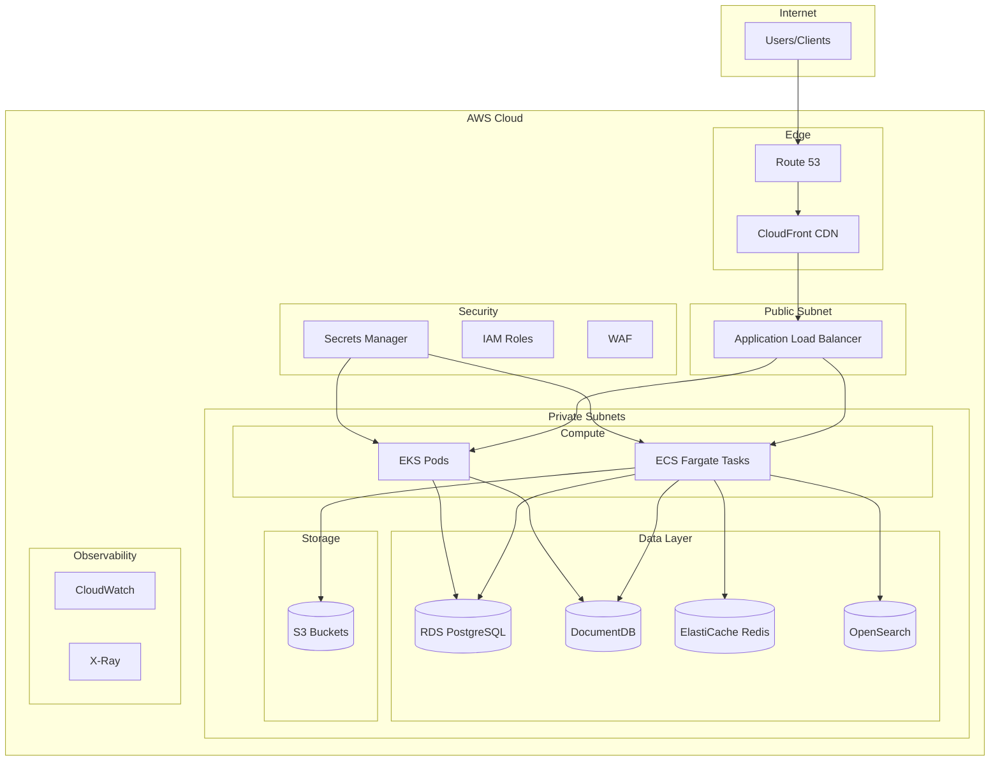

# Portfolio Project Index & Overview

## Executive Summary

This portfolio consists of **8 production-ready full-stack applications** designed to demonstrate mastery of modern software development practices, cloud-native architecture, and end-to-end deployment on AWS. Each project progresses in complexity and introduces new technologies and patterns.

---

## Project Phases

### Phase 1: Node.js Backend (Projects 1-4)
Focus on mastering backend development with different Node.js frameworks and architectural patterns.

| # | Project | Framework | API Style | Key Learning |
|---|---------|-----------|-----------|--------------|
| 1 | [Task Management Platform](./01-Task-Management-Platform.md) | NestJS | REST | Modular architecture, RBAC, MongoDB + PostgreSQL hybrid |
| 2 | [Book Library System](./02-Book-Library-System.md) | NestJS + Apollo | GraphQL | GraphQL APIs, external API integration, DataLoader |
| 3 | [Event Registration Platform](./03-Event-Registration-Platform.md) | Express.js | REST + GraphQL | Payment integration, real-time updates, multi-tenancy |
| 4 | [Document Collaboration Platform](./04-Document-Collaboration-Platform.md) | Fastify | REST + WebSocket | Real-time CRDT, WebSocket, collaborative editing |

### Phase 2: Python Backend (Projects 5-6)
Transition to Python ecosystem with modern async frameworks.

| # | Project | Framework | API Style | Key Learning |
|---|---------|-----------|-----------|--------------|
| 5 | [Fitness Tracker API](./05-Fitness-Tracker-API.md) | FastAPI | REST | Async Python, device integrations, health data |
| 6 | [Personal Finance Tracker](./06-Personal-Finance-Tracker.md) | Django | REST | Django ORM, financial APIs, transaction management |

### Phase 3: Hybrid Node.js + Python with AI/ML (Projects 7-8)
Combine both ecosystems with AI/ML capabilities.

| # | Project | Architecture | AI/ML Component | Key Learning |
|---|---------|--------------|-----------------|--------------|
| 7 | [E-Learning Platform](./07-E-Learning-Platform.md) | Node.js Gateway + Python AI | Content recommendations, adaptive learning | Microservices, gRPC, ML pipelines |
| 8 | [Movie/Media Watchlist Manager](./08-Movie-Media-Watchlist-Manager.md) | Node.js API + Python ML | Recommendation engine | Collaborative filtering, model serving |

---

## Shared Infrastructure

All projects share a common infrastructure foundation documented in the [Shared Infrastructure Guide](./09-Shared-Infrastructure-Guide.md).

### Common Tech Stack

```yaml
Databases:
  Primary_SQL: PostgreSQL 15
  Document_Store: MongoDB 7.0
  Search_Engine: Elasticsearch 8.x
  Cache: Redis 7.x

Message_Queue:
  Queue: BullMQ (Redis-backed)
  Event_Streaming: Apache Kafka (Projects 7-8)

File_Storage:
  Development: MinIO
  Production: AWS S3 + CloudFront CDN

Infrastructure:
  Containerization: Docker + Docker Compose
  Orchestration: Kubernetes (Helm Charts)
  CI_CD: GitHub Actions
  IaC: Terraform

AWS_Services:
  Compute: ECS Fargate / EKS
  Database: RDS (Postgres), DocumentDB (MongoDB), OpenSearch
  Cache: ElastiCache (Redis)
  Storage: S3
  Secrets: AWS Secrets Manager
  Monitoring: CloudWatch

Monitoring_Observability:
  Metrics: Prometheus + Grafana
  Logging: Winston/structlog → ELK Stack
  Error_Tracking: Sentry
```

---

## Technology Progression Matrix

```
┌─────────────────────────────────────────────────────────────────────────┐
│ Project 1   Project 2   Project 3   Project 4   Project 5   Project 6   │
│ NestJS      NestJS+GQL  Express     Fastify     FastAPI     Django      │
│    │            │           │           │           │           │       │
│    └────────────┴───────────┴───────────┴───────────┴───────────┘       │
│                              │                                           │
│                         AWS Foundation                                   │
│                              │                                           │
│    ┌─────────────────────────┴───────────────────────────┐              │
│    │              Project 7              Project 8        │              │
│    │          Node.js + Python       Node.js + Python     │              │
│    │           (AI Gateway)         (Recommendation)      │              │
│    └──────────────────────────────────────────────────────┘              │
└─────────────────────────────────────────────────────────────────────────┘
```

---

## AWS Architecture Overview (All Projects)



---

## Learning Path Recommendations

### Beginner Path
1. **Project 1**: Task Management Platform - Learn NestJS fundamentals
2. **Project 3**: Event Registration Platform - Practice Express.js patterns
3. **Project 5**: Fitness Tracker API - Introduction to Python/FastAPI

### Intermediate Path
1. **Project 2**: Book Library System - Master GraphQL
2. **Project 4**: Document Collaboration Platform - Real-time systems
3. **Project 6**: Personal Finance Tracker - Complex Django applications

### Advanced Path
1. **Project 7**: E-Learning Platform - Microservices + AI integration
2. **Project 8**: Movie/Media Watchlist Manager - ML recommendation systems

---

## Quick Start

### Local Development
```bash
# Clone repository
git clone <repo-url>
cd <project-folder>

# Start all services
docker-compose up -d

# View logs
docker-compose logs -f api
```

### Prerequisites
- Docker & Docker Compose
- Node.js 20 LTS (Projects 1-4, 7-8)
- Python 3.11+ (Projects 5-8)
- AWS CLI (for deployment)
- kubectl & helm (for Kubernetes)

---

## Project Status

| Project | Phase | Status | Documentation | Tests | AWS Ready |
|---------|-------|--------|---------------|-------|-----------|
| 1. Task Management | 1 | 📝 Spec Complete | ✅ | ⬜ | ⬜ |
| 2. Book Library | 1 | 📝 Spec Complete | ✅ | ⬜ | ⬜ |
| 3. Event Registration | 1 | 📝 Spec Complete | ✅ | ⬜ | ⬜ |
| 4. Document Collaboration | 1 | 📝 Spec Complete | ✅ | ⬜ | ⬜ |
| 5. Fitness Tracker | 2 | 📝 Spec Complete | ✅ | ⬜ | ⬜ |
| 6. Personal Finance | 2 | 📝 Spec Complete | ✅ | ⬜ | ⬜ |
| 7. E-Learning Platform | 3 | 📝 Spec Complete | ✅ | ⬜ | ⬜ |
| 8. Media Watchlist | 3 | 📝 Spec Complete | ✅ | ⬜ | ⬜ |

---

## Related Documentation

- [Shared Infrastructure Guide](./09-Shared-Infrastructure-Guide.md) - Common infrastructure patterns and configurations
- [AWS Deployment Playbook](./09-Shared-Infrastructure-Guide.md#aws-deployment) - Step-by-step AWS deployment
- [CI/CD Pipeline Guide](./09-Shared-Infrastructure-Guide.md#cicd-pipeline) - GitHub Actions workflows

---

*Last Updated: December 2024*
