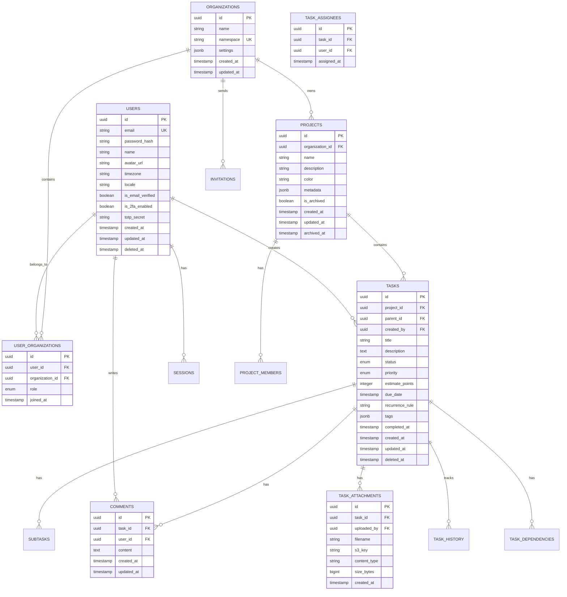

# 📋 Project 1 of 8: Task Management Platform

<div align="center">


**🚀 A collaborative, real-time task management platform built with modern architecture**

[Features](#-key-features) • [Tech Stack](#3-technical-stack-specification) • [Database](#4-database-schema-design) • [API](#-api-endpoints) • [Deployment](#6-aws-deployment-architecture)

</div>

---

## 1. Project Overview

### 📌 Project Name and Number
**Project 1 of 8: Task Management Platform**

| Attribute | Value |
|-----------|-------|
| **Difficulty** | 🟢 Beginner to Intermediate |
| **Estimated Time** | 3-4 weeks |
| **Framework** | NestJS 10.x |
| **API Style** | REST (OpenAPI 3.0) |
| **Primary Database** | PostgreSQL + MongoDB (Hybrid) |

### 📝 Executive Summary
A collaborative, secure, and extensible task management system for individuals and teams. The platform supports the full lifecycle of projects and tasks, including advanced collaboration features, data analytics, external tool integration, and robust operational excellence. Built with NestJS on Node.js, this project demonstrates modular architecture, real-time collaboration, and hybrid PostgreSQL + MongoDB database design.

### 👥 Target Audience

| Audience | Use Case |
|----------|----------|
| **Individual professionals** | Freelancers, consultants managing multiple personal or client projects |
| **Small/medium teams** | Teams managing parallel projects with real-time collaboration needs |
| **Project managers** | Macro- and micro-views with dashboards, boards, calendars, and analytics |
| **Organizations** | Businesses requiring data isolation, audit trails, and GDPR compliance |
| **Educational groups** | Classrooms and study circles managing assignments and deadlines |
| **Agencies** | Multi-organization support with custom reports per client |

### ✨ Key Features

| Feature | Description |
|---------|-------------|
| 🏠 **Unified work hub** | Create, assign, and track tasks/projects with all files and communications in one secure location |
| 📊 **Flexible visualization** | Toggle between Kanban, Calendar, Gantt, and List/Table views for any project |
| ⚡ **Real-time collaboration** | Instant updates across all devices for task changes, comments, and file sharing |
| 📈 **Data-driven management** | Built-in analytics, trend-spotting, overdue reporting, and project dashboards |
| 🔗 **Deep integration** | Two-way sync with Google/MS Calendars, Slack/Teams, exposed API, and webhook automation |
| 🔒 **Compliance-ready** | Comprehensive logging, audit trails, permissions, and GDPR data privacy tools |
| 💾 **Hybrid database** | PostgreSQL for relational data, MongoDB for document-oriented features |

### 🎓 Developer Learning Objectives

By completing this project, you will learn:

- ✅ Master **NestJS modular architecture** and dependency injection
- ✅ Implement **JWT authentication** with Passport.js and RBAC authorization
- ✅ Design and implement **hybrid PostgreSQL + MongoDB** database architecture
- ✅ Build **real-time features** with WebSockets and Redis Pub/Sub
- ✅ Integrate with **external APIs** (Google Calendar, Slack) with circuit breakers
- ✅ Deploy to **AWS using ECS Fargate** with full observability stack
- ✅ Write comprehensive **unit and integration tests** with Jest
- ✅ Implement **CI/CD pipelines** with GitHub Actions

---

## 2. Detailed Functional Requirements

### 2.1 User Management & Authentication
- **Registration & Login**
  - Email/password registration with email verification
  - OAuth2 integration (Google, Microsoft)
  - Two-factor authentication (TOTP) optional per user/org policy
  - Account lockout after configurable failed attempts
  - Per-device/session login tracking and management

- **Profile Management**
  - Edit name, avatar (S3/CDN uploads), timezone, language/locale
  - Notification preferences (in-app, email, push, webhook)
  - View and manage organization memberships
  - Account deletion with data export and acknowledgment

- **Organization & Roles**
  - Create/join organizations with unique namespace
  - Role hierarchy: Owner > Admin > Member > Guest
  - Row- and field-level RBAC
  - Email invitations with role preassignment
  - Ownership transfer with full audit log

### 2.2 Core Business Logic (Projects & Tasks)
- **Project Management**
  - CRUD operations with rich metadata (name, color, description, custom fields)
  - Archive/unarchive functionality
  - Member-level and project-level access control
  - Real-time chat thread per project with markdown and @mentions
  - Dashboard view: tasks by status/user/date, activity feed, upcoming deadlines

- **Task & Subtask Management**
  - Unlimited tasks per project with one-level subtasks
  - Rich attributes: title, markdown description, priority, estimates, due dates
  - Multiple assignees, tags, dependencies (blockers, precedents)
  - Recurrence patterns (RFC 5545 compliant)
  - Batch operations: bulk assign, status change, move/copy between projects
  - Import/export: CSV, XLS, zipped JSON with attachments

- **Task History & Audit**
  - Every field change, assignment, status shift logged with timestamp
  - Timeline UI for per-task and project-level history
  - Soft delete with configurable retention period

### 2.3 Search & Discovery
- **Elasticsearch-Powered Search**
  - Full-text search across tasks, comments, projects, assignees, tags
  - Real-time indexing on every CRUD operation
  - Faceted UI with AND/OR filters and autocomplete
  - Saved filters and "Smart Views" per user/team/org
  - Recent activity and favorites tracking

### 2.4 Notifications & Communication
- **Multi-Channel Notifications**
  - In-app notification center with filtering and mark as read
  - Email notifications with customizable templates
  - Push notifications (web and mobile)
  - Webhook notifications for automation

- **Communication Features**
  - Threaded comments on tasks and projects
  - Markdown support with file attachments
  - @mention functionality with notifications
  - Per-task/project activity feed

### 2.5 Analytics & Reporting
- **Dashboards**
  - Key stats: open/overdue tasks, sprint burndown, completion rates
  - Per-user load analysis and idle task flagging
  - Custom chart builder with filters and groupings

- **Reports**
  - Downloadable reports: CSV, XLS, PDF
  - Async report generation with email notification
  - Weekly summary emails
  - Snapshot sharing for stakeholders

### 2.6 File Management
- **S3/MinIO Integration**
  - Direct-to-S3 upload with signed URLs
  - Path structure: org/project/task
  - File type and size validation
  - Virus scanning (stub/job) with suspicious file flagging
  - Quotas by role/org/plan
  - Expiring signed URLs for downloads
  - Full audit logging of file operations

### 2.7 External Integrations
- **Calendar Sync**
  - OAuth2 for Google/MS Calendar
  - Two-way sync: task deadlines ↔ calendar events
  - Per-user and per-project mapping

- **Public Holiday Detection**
  - External API integration with country/state awareness
  - Cache per week/country
  - Deadline conflict flagging

- **Outbound Webhooks**
  - Configurable per org/project
  - HMAC signing for security
  - Delivery logs visible to admins
  - Retry with exponential backoff

- **Chat Integration**
  - Slack/MS Teams/Discord notifications
  - Configurable per org/project/channel

- **Public API**
  - OAuth/API key authentication
  - Auto-generated Swagger/OpenAPI documentation

### 2.8 Accessibility & Internationalization
- **WCAG 2.1 AA Compliance**
  - Full keyboard navigation
  - ARIA labels and roles
  - High contrast and readable colors
  - Screen reader tested

- **Localization**
  - Multi-language UI, emails, and notifications
  - i18next for string management
  - User locale preference for date/time/currency formatting

### 2.9 Security & Compliance
- **Authentication Security**
  - JWT (RS256) with refresh tokens
  - Argon2 or bcrypt (12+ rounds) for password hashing
  - OAuth2 tokens encrypted at rest

- **Authorization**
  - Route and service-level guards
  - Per-org, per-project, per-field permissions
  - Invalid access attempts logged and surfaced

- **API Safety**
  - Input sanitization with class-validator
  - Output field filtering with class-transformer
  - Rate limiting at endpoint/user/IP/plan levels
  - Helmet + CORS enabled

- **Audit & Compliance**
  - Deep event logging for all actions
  - GDPR data export and deletion endpoints
  - Scheduled background job for hard deletes

---

## 3. Technical Stack Specification

```yaml
Backend:
  Runtime: Node.js 20 LTS
  Framework: NestJS 10.x
  API_Style: REST (OpenAPI 3.0)
  ORM: TypeORM 0.3.x
  Validation: class-validator, class-transformer
  Documentation: Swagger/OpenAPI

Frontend:
  Framework: React 18
  State_Management: Redux Toolkit / React Query
  Styling: TailwindCSS 3.x
  Forms: React Hook Form + Zod

Databases:
  Primary_SQL: PostgreSQL 15
  Document_Store: MongoDB 7.0
  Search_Engine: Elasticsearch 8.x
  Cache: Redis 7.x

Message_Queue:
  Queue: BullMQ (Redis-backed)

File_Storage:
  Development: MinIO
  Production: AWS S3 + CloudFront CDN

Authentication:
  Strategy: Passport.js
  Tokens: JWT (RS256)
  OAuth: Google, Microsoft

Infrastructure:
  Containerization: Docker + Docker Compose
  Orchestration: Kubernetes (Helm Charts)
  CI_CD: GitHub Actions
  IaC: Terraform

AWS_Services:
  Compute: ECS Fargate
  Database: RDS (Postgres), DocumentDB (MongoDB)
  Search: OpenSearch Service
  Cache: ElastiCache (Redis)
  Storage: S3
  Secrets: AWS Secrets Manager
  Monitoring: CloudWatch

Monitoring_Observability:
  Metrics: Prometheus + Grafana
  Logging: Winston → ELK Stack
  Error_Tracking: Sentry
```

---

## 4. Database Schema Design

### Entity Relationship Diagram (PostgreSQL)



### MongoDB Collections

```javascript
// Activity Logs Collection
{
  _id: ObjectId,
  organizationId: ObjectId,
  userId: ObjectId,
  action: String, // "task.created", "comment.added", etc.
  resourceType: String,
  resourceId: String,
  metadata: {
    before: Object,
    after: Object,
    diff: Object,
    ip: String,
    userAgent: String
  },
  createdAt: ISODate,
  expiresAt: ISODate // TTL index
}

// User Undo Stack Collection
{
  _id: ObjectId,
  userId: ObjectId,
  actions: [
    {
      actionId: ObjectId,
      type: String,
      resourceType: String,
      resourceId: String,
      beforeState: Object,
      afterState: Object,
      timestamp: ISODate,
      canUndo: Boolean
    }
  ],
  maxActions: Number,
  updatedAt: ISODate
}

// Notification Preferences Collection
{
  _id: ObjectId,
  userId: ObjectId,
  rules: [
    {
      event: String,
      channels: [String],
      conditions: Object,
      enabled: Boolean
    }
  ],
  quietHours: {
    enabled: Boolean,
    start: String,
    end: String,
    timezone: String
  },
  updatedAt: ISODate
}

// Real-Time Collaboration State Collection
{
  _id: ObjectId,
  resourceType: String,
  resourceId: String,
  activeUsers: [
    {
      userId: ObjectId,
      sessionId: String,
      cursorPosition: Object,
      lastActivity: ISODate
    }
  ],
  pendingChanges: [Object],
  version: Number,
  updatedAt: ISODate
}
```

---

## 5. Technical Architecture Diagram


---

## 6. Frontend Functional & Technical Requirements

### 6.1 UI/UX Pages & Screens

| Page/Screen | Description | Key Components |
|-------------|-------------|----------------|
| **Landing Page** | Public marketing page with features, pricing | Hero section, Feature cards, CTA buttons, Testimonials |
| **Login/Register** | Authentication flows | Form inputs, OAuth buttons, Password strength indicator |
| **Dashboard** | Main workspace overview | Stats cards, Activity feed, Quick actions, Charts |
| **Projects List** | All projects view with filtering | Project cards, Search/filter bar, Pagination |
| **Project Board** | Kanban-style task board | Drag-drop columns, Task cards, Swimlanes |
| **Task Detail** | Full task view with all attributes | Rich text editor, Comments, Attachments, History |
| **Calendar View** | Timeline and calendar display | Month/week/day views, Event modals, Drag scheduling |
| **Gantt Chart** | Project timeline visualization | Timeline bars, Dependencies, Milestones |
| **Team/Members** | Organization member management | User list, Role badges, Invite modal |
| **Settings** | User and org configuration | Tabbed settings, Form sections, Toggles |
| **Profile** | User profile and preferences | Avatar upload, Form fields, Notification toggles |
| **Analytics** | Reports and dashboards | Charts (bar, line, pie), Date pickers, Export buttons |

### 6.2 Component Architecture

```
src/
├── components/
│   ├── common/                 # Shared UI components
│   │   ├── Button/
│   │   ├── Input/
│   │   ├── Modal/
│   │   ├── Dropdown/
│   │   ├── Avatar/
│   │   ├── Badge/
│   │   ├── Card/
│   │   ├── Table/
│   │   ├── Pagination/
│   │   └── Toast/
│   ├── layout/                 # Layout components
│   │   ├── Header/
│   │   ├── Sidebar/
│   │   ├── Footer/
│   │   └── PageWrapper/
│   ├── forms/                  # Form components
│   │   ├── TaskForm/
│   │   ├── ProjectForm/
│   │   ├── CommentForm/
│   │   └── FilterForm/
│   ├── features/               # Feature-specific components
│   │   ├── tasks/
│   │   │   ├── TaskCard/
│   │   │   ├── TaskList/
│   │   │   ├── TaskBoard/
│   │   │   └── TaskDetail/
│   │   ├── projects/
│   │   ├── calendar/
│   │   └── analytics/
│   └── charts/                 # Data visualization
│       ├── BarChart/
│       ├── LineChart/
│       └── PieChart/
├── hooks/                      # Custom React hooks
│   ├── useAuth.ts
│   ├── useTasks.ts
│   ├── useProjects.ts
│   ├── useWebSocket.ts
│   └── useDebounce.ts
├── store/                      # Redux Toolkit store
│   ├── slices/
│   │   ├── authSlice.ts
│   │   ├── tasksSlice.ts
│   │   ├── projectsSlice.ts
│   │   └── uiSlice.ts
│   └── store.ts
├── services/                   # API services
│   ├── api.ts
│   ├── authService.ts
│   ├── taskService.ts
│   └── projectService.ts
├── utils/                      # Utility functions
│   ├── formatters.ts
│   ├── validators.ts
│   └── helpers.ts
└── types/                      # TypeScript types
    ├── task.types.ts
    ├── project.types.ts
    └── user.types.ts
```

### 6.3 State Management

| State Type | Solution | Use Case |
|------------|----------|----------|
| **Server State** | React Query / TanStack Query | API data caching, background refetching |
| **Client State** | Redux Toolkit | Auth state, UI preferences, filters |
| **Form State** | React Hook Form | Form validation, submission handling |
| **URL State** | React Router | Current route, query parameters |
| **Local State** | useState/useReducer | Component-specific state |

### 6.4 Client-Side Validation Rules

| Field | Validation | Error Message |
|-------|------------|---------------|
| Email | RFC 5322 format | "Please enter a valid email address" |
| Password | Min 8 chars, 1 uppercase, 1 number | "Password must be at least 8 characters with 1 uppercase and 1 number" |
| Task Title | Required, 3-200 chars | "Title is required (3-200 characters)" |
| Due Date | Must be future date | "Due date must be in the future" |
| Priority | One of: low, medium, high, urgent | "Please select a valid priority" |
| Tags | Max 10 tags, each max 30 chars | "Maximum 10 tags allowed (30 chars each)" |

### 6.5 Responsive Design Breakpoints

| Breakpoint | Width | Target Devices |
|------------|-------|----------------|
| `xs` | < 640px | Mobile phones (portrait) |
| `sm` | ≥ 640px | Mobile phones (landscape), small tablets |
| `md` | ≥ 768px | Tablets |
| `lg` | ≥ 1024px | Laptops, small desktops |
| `xl` | ≥ 1280px | Desktops |
| `2xl` | ≥ 1536px | Large desktops |

### 6.6 Frontend Accessibility Requirements

| Requirement | Implementation |
|-------------|----------------|
| **Keyboard Navigation** | All interactive elements focusable via Tab, Enter/Space to activate |
| **Screen Reader Support** | ARIA labels, roles, and live regions for dynamic content |
| **Focus Management** | Visible focus indicators, focus trapping in modals |
| **Color Contrast** | WCAG AA minimum (4.5:1 for text, 3:1 for UI components) |
| **Skip Links** | "Skip to main content" link for keyboard users |
| **Form Labels** | All inputs have associated labels, error messages announced |
| **Alt Text** | All images have descriptive alt text |
| **Reduced Motion** | Respect `prefers-reduced-motion` media query |

### 6.7 Frontend Performance Requirements

| Metric | Target | Measurement |
|--------|--------|-------------|
| **First Contentful Paint (FCP)** | < 1.5s | Lighthouse |
| **Largest Contentful Paint (LCP)** | < 2.5s | Lighthouse |
| **Time to Interactive (TTI)** | < 3.5s | Lighthouse |
| **Cumulative Layout Shift (CLS)** | < 0.1 | Lighthouse |
| **Bundle Size (gzipped)** | < 200KB initial | Webpack Bundle Analyzer |
| **Image Optimization** | WebP format, lazy loading | Built-in Next.js optimization |

### 6.8 Frontend Testing Requirements

| Test Type | Coverage Target | Tools |
|-----------|-----------------|-------|
| **Unit Tests** | > 80% components | Jest, React Testing Library |
| **Integration Tests** | Critical user flows | Cypress Component Testing |
| **E2E Tests** | Core workflows | Cypress, Playwright |
| **Visual Regression** | UI components | Chromatic, Percy |
| **Accessibility Tests** | All pages | axe-core, pa11y |

---

## 7. AWS Deployment Architecture

### Compute Strategy
- **ECS Fargate** for container orchestration without managing EC2 instances
- Separate task definitions for API, Worker, and WebSocket services
- Auto-scaling based on CPU/memory utilization and request count
- Blue-green deployments for zero-downtime updates

### Database Strategy
- **RDS PostgreSQL Multi-AZ** for relational data with automatic failover
- **DocumentDB** for MongoDB-compatible document storage
- **ElastiCache Redis Cluster** for caching and real-time pub/sub
- **OpenSearch Service** for full-text search capabilities
- Automated backups with point-in-time recovery

### Storage Strategy
- **S3** for file storage with lifecycle policies
- **CloudFront** CDN for static assets and signed URL delivery
- Versioning enabled for file recovery
- Cross-region replication for disaster recovery

### Networking
- VPC with public and private subnets across 3 AZs
- NAT Gateways for outbound internet access from private subnets
- Security groups with least-privilege access
- VPC endpoints for AWS services (S3, Secrets Manager)

### CI/CD Pipeline
```yaml
Pipeline:
  1. GitHub Push → GitHub Actions Trigger
  2. Run Tests (Unit, Integration)
  3. Build Docker Images
  4. Push to ECR
  5. Update ECS Task Definition
  6. Deploy to Staging (automated)
  7. Run E2E Tests
  8. Deploy to Production (manual approval)
  9. Health Check Verification
```

### Secrets Management
- AWS Secrets Manager for database credentials, API keys
- Environment-specific secrets
- Automatic rotation for database passwords
- IAM roles for ECS tasks to access secrets

---

## 8. Monorepo Structure

```
task-management-platform/
├── apps/
│   ├── api/                    # NestJS REST API
│   │   ├── src/
│   │   │   ├── modules/
│   │   │   │   ├── auth/
│   │   │   │   ├── users/
│   │   │   │   ├── organizations/
│   │   │   │   ├── projects/
│   │   │   │   ├── tasks/
│   │   │   │   ├── comments/
│   │   │   │   ├── notifications/
│   │   │   │   ├── files/
│   │   │   │   ├── search/
│   │   │   │   └── integrations/
│   │   │   ├── common/
│   │   │   ├── config/
│   │   │   └── main.ts
│   │   └── test/
│   ├── worker/                 # BullMQ Worker Service
│   │   └── src/
│   │       ├── jobs/
│   │       └── processors/
│   └── web/                    # React Frontend
│       └── src/
├── libs/
│   ├── types/                  # Shared TypeScript types
│   ├── db/                     # Database entities & migrations
│   │   ├── postgres/
│   │   └── mongodb/
│   └── utils/                  # Shared utilities
├── infrastructure/
│   ├── terraform/
│   ├── helm/
│   └── docker/
├── docker-compose.yml
├── nx.json
└── package.json
```

---

## 📡 API Endpoints

### Authentication

| Method | Endpoint | Description |
|--------|----------|-------------|
| `POST` | `/api/v1/auth/register` | Register new user |
| `POST` | `/api/v1/auth/login` | Login with email/password |
| `POST` | `/api/v1/auth/logout` | Logout current session |
| `POST` | `/api/v1/auth/refresh` | Refresh access token |
| `GET` | `/api/v1/auth/oauth/google` | Google OAuth login |
| `POST` | `/api/v1/auth/2fa/enable` | Enable 2FA |
| `POST` | `/api/v1/auth/2fa/verify` | Verify 2FA code |

### Users & Profile

| Method | Endpoint | Description |
|--------|----------|-------------|
| `GET` | `/api/v1/users/me` | Get current user profile |
| `PATCH` | `/api/v1/users/me` | Update profile |
| `POST` | `/api/v1/users/me/avatar` | Upload avatar |
| `GET` | `/api/v1/users/:id` | Get user by ID |

### Organizations

| Method | Endpoint | Description |
|--------|----------|-------------|
| `POST` | `/api/v1/organizations` | Create organization |
| `GET` | `/api/v1/organizations` | List user's organizations |
| `GET` | `/api/v1/organizations/:id` | Get organization details |
| `PATCH` | `/api/v1/organizations/:id` | Update organization |
| `POST` | `/api/v1/organizations/:id/invite` | Invite member |
| `GET` | `/api/v1/organizations/:id/members` | List members |

### Projects

| Method | Endpoint | Description |
|--------|----------|-------------|
| `POST` | `/api/v1/projects` | Create project |
| `GET` | `/api/v1/projects` | List projects |
| `GET` | `/api/v1/projects/:id` | Get project details |
| `PATCH` | `/api/v1/projects/:id` | Update project |
| `DELETE` | `/api/v1/projects/:id` | Archive project |
| `GET` | `/api/v1/projects/:id/stats` | Get project statistics |

### Tasks

| Method | Endpoint | Description |
|--------|----------|-------------|
| `POST` | `/api/v1/projects/:projectId/tasks` | Create task |
| `GET` | `/api/v1/projects/:projectId/tasks` | List tasks |
| `GET` | `/api/v1/tasks/:id` | Get task details |
| `PATCH` | `/api/v1/tasks/:id` | Update task |
| `DELETE` | `/api/v1/tasks/:id` | Delete task |
| `POST` | `/api/v1/tasks/:id/assign` | Assign users |
| `POST` | `/api/v1/tasks/:id/comments` | Add comment |
| `GET` | `/api/v1/tasks/:id/history` | Get task history |

### Example Request/Response

```bash
# Create a new task
POST /api/v1/projects/123/tasks
Authorization: Bearer <token>
Content-Type: application/json

{
  "title": "Implement user authentication",
  "description": "Add JWT-based auth with refresh tokens",
  "priority": "high",
  "status": "todo",
  "dueDate": "2024-02-15T00:00:00Z",
  "assignees": ["user-uuid-1", "user-uuid-2"],
  "tags": ["backend", "security"]
}
```

```json
// Response: 201 Created
{
  "id": "task-uuid",
  "title": "Implement user authentication",
  "description": "Add JWT-based auth with refresh tokens",
  "priority": "high",
  "status": "todo",
  "dueDate": "2024-02-15T00:00:00Z",
  "assignees": [
    { "id": "user-uuid-1", "name": "John Doe", "avatar": "..." },
    { "id": "user-uuid-2", "name": "Jane Smith", "avatar": "..." }
  ],
  "tags": ["backend", "security"],
  "project": { "id": "123", "name": "API Development" },
  "createdBy": { "id": "...", "name": "..." },
  "createdAt": "2024-01-15T10:30:00Z",
  "updatedAt": "2024-01-15T10:30:00Z"
}
```

---

## 9. ✅ Success Criteria

| Criteria | Target | Measurement |
|----------|--------|-------------|
| **Test Coverage** | >90% | Jest coverage reports |
| **API Response Time** | <200ms | 95th percentile under normal load |
| **Concurrent Users** | 1000+ | Load testing with k6 |
| **Dev Setup Time** | <15 min | Docker compose up to running |
| **Onboarding Time** | <4 hours | New engineer can contribute |
| **Zero Downtime Deploys** | 100% | Blue-green deployment |
| **GDPR Compliance** | ✓ | Data export/delete endpoints |

### Definition of Done Checklist

- [ ] All endpoints documented in Swagger
- [ ] Unit tests for all services (>90% coverage)
- [ ] Integration tests for all API endpoints
- [ ] E2E tests for critical user flows
- [ ] Docker Compose runs locally without errors
- [ ] CI/CD pipeline deploys to staging
- [ ] Performance benchmarks passing
- [ ] Security audit completed
- [ ] GDPR endpoints implemented
- [ ] Monitoring dashboards configured

---

## 🚀 Getting Started

### Prerequisites

```bash
# Required tools
node --version  # v20.x
docker --version  # v24.x
docker-compose --version  # v2.20.x
```

### Quick Start

```bash
# 1. Clone and install
git clone <repo-url>
cd task-management-platform
npm install

# 2. Start infrastructure
docker-compose up -d postgres redis mongodb elasticsearch minio

# 3. Run migrations
npm run migration:run

# 4. Start development server
npm run start:dev

# 5. Open API docs
open http://localhost:3000/api/docs
```

### Development Commands

| Command | Description |
|---------|-------------|
| `npm run start:dev` | Start in development mode with hot reload |
| `npm run test` | Run unit tests |
| `npm run test:e2e` | Run end-to-end tests |
| `npm run test:cov` | Generate coverage report |
| `npm run lint` | Run ESLint |
| `npm run build` | Build for production |
| `npm run migration:generate` | Generate new migration |
| `npm run migration:run` | Run pending migrations |

---

<div align="center">

**[⬅️ Previous: Index](./00-Project-Index-Overview.md)** | **[Next: Book Library System ➡️](./02-Book-Library-System.md)**

</div>

---

*Last Updated: December 2024*
