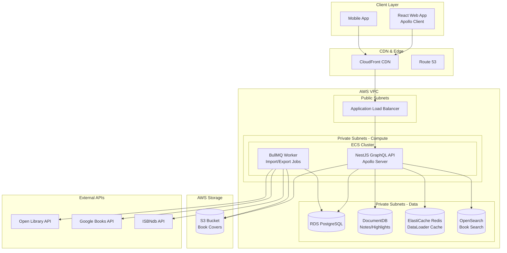

# Project 2 of 8: Book Library System

## 1. Project Overview

### Project Name and Number
**Project 2 of 8: Book Library System**

### Executive Summary
A powerful, extensible library management platform for readers, collectors, small libraries, schools, and book clubs. The system catalogs, searches, annotates, and reviews books while managing user collections and integrating with external book databases. Built with NestJS and Apollo GraphQL, this project demonstrates advanced GraphQL patterns, external API integration, and recommendation algorithms.

### Target Audience
- **Individual Book Lovers:** Readers tracking personal collections, reading progress, and wishlists
- **Clubs & Reading Circles:** Shared libraries for book clubs with curated lists and discussions
- **Small Libraries/Organizations:** Public/NGO/school libraries managing inventory and lending
- **Collectors:** Managing special collections and rare editions with import/export for insurance
- **Researchers/Educators:** Maintaining reading lists with annotations and citations

### Key Value Propositions
1. **Digital Book Catalog** – Searchable collection with ISBN lookup, barcode scanning, and manual entry
2. **Personal and Shared Shelves** – Organize books in custom shelves with collaborative management
3. **Deep Metadata Enrichment** – Autofill details via Open Library, Google Books, and ISBNdb APIs
4. **Reading Progress & Notes** – Log progress, set goals, create highlights, and save quotes
5. **Reviews, Ratings & Social** – Write reviews, rate books, follow users, and get recommendations
6. **Advanced Search & Discovery** – Full-text fuzzy search with faceted filtering
7. **GraphQL API** – Flexible, efficient data fetching with subscriptions for real-time updates

### Developer Learning Objectives
- Build GraphQL APIs with Apollo Server and NestJS
- Implement DataLoader pattern to solve N+1 query problems
- Integrate multiple external APIs with circuit breaker patterns
- Design recommendation algorithms based on user activity
- Implement real-time subscriptions for live updates
- Master code-first GraphQL schema development

### 🧠 Core Engineering Fundamentals

This project provides excellent opportunities to apply and demonstrate core computer science concepts:

| Area | Concept | Application in This Project |
|------|---------|----------------------------|
| **DSA** | Trie | Implement efficient autocomplete for book search by title and author |
| **DSA** | Inverted Index | Build full-text search indexing for book descriptions and notes |
| **DSA** | Hash Tables | DataLoader pattern for batching and caching GraphQL queries |
| **DSA** | Graph Traversal | Model "similar books" and "readers also liked" relationships |
| **System Design** | N+1 Query Problem | Use DataLoader to batch database queries in GraphQL resolvers |
| **System Design** | External API Integration | Circuit breaker pattern for Open Library/Google Books API calls |
| **System Design** | Caching Layers | Redis for DataLoader cache, Elasticsearch for search indexes |
| **Networks** | GraphQL Subscriptions | WebSocket-based real-time updates for friend activity feeds |
| **Networks** | CDN Configuration | CloudFront for book cover image delivery with cache headers |
| **OS** | Memory Management | Efficient handling of large book catalogs and batch imports |

**Interview Preparation:**
- Explain how a trie data structure improves autocomplete performance
- Discuss how DataLoader solves the N+1 problem in GraphQL
- Design a recommendation system for "books you might like"

---

## 2. Detailed Functional Requirements

### 2.1 User Management & Authentication
- **Registration & Login**
  - Email/password with email verification
  - OAuth2 (Google, Apple) integration
  - Optional 2FA with authenticator apps
  - Password reset via email token

- **Profile & Preferences**
  - Display name, avatar upload (S3/CDN)
  - Timezone and locale settings
  - Public/private profile toggle
  - Preferred genres and reading preferences
  - Notification options

- **Privacy Controls**
  - Profile visibility settings
  - Review and reading activity sharing preferences
  - Data export and account deletion (GDPR compliant)

### 2.2 Core Business Logic (Book Cataloging)
- **Book Database**
  - Add by ISBN/API lookup with external validation
  - Manual entry with cover image upload
  - Bulk import via CSV or barcode scan
  - Full metadata: title, subtitle, author(s), series, publisher, ISBN(s), language, edition, summary, publication year, genre(s), tags, cover images
  - Unique deduplication per library
  - Link editions (hardcover, paperback, translations)

- **Shelves & Lists**
  - System shelves: Want to Read, Reading, Completed, Abandoned, Wishlist
  - Custom shelf creation with sorting options
  - Books can appear on multiple shelves
  - Drag-and-drop reordering

- **Collections Management**
  - Create custom collections per user, group, or organization
  - Permission settings: private/public/collaborative
  - Assign administrators and manage users

### 2.3 Search & Discovery
- **Elasticsearch-Powered Search**
  - Full-text fuzzy search on title, author, ISBN, tags, description, notes
  - Faceted filtering by genre, tag, year, language, rating, shelf, status, author, publisher
  - Sort by title, author, rating, last activity, publish date, custom order
  - Saved search filters and favorite queries

- **Discovery Features**
  - "Popular books" and "New releases" feeds
  - "Recommended for you" based on reading history
  - "Trending in your circles" for social discovery
  - Algorithmic suggestions based on ratings and tags

### 2.4 Notifications & Communication
- **Notification Types**
  - New friend/follow requests
  - Review comments and replies
  - Reading goal reminders
  - Streak notifications
  - Author subscription alerts for new releases

- **Delivery Channels**
  - In-app notifications
  - Email notifications
  - Push notifications
  - All channels opt-in/opt-out by category

### 2.5 Analytics & Reporting
- **Reading Analytics**
  - Visual graphs: books read per month/year
  - Genre breakdown and time spent reading
  - Longest/shortest reads
  - Completion history and goal progress

- **Export Capabilities**
  - CSV/XLS/JSON export for all data
  - Shelf/list export with custom field selection
  - Review and rating export
  - GDPR data portability

### 2.6 File Management
- **Cover Art & Attachments**
  - S3/MinIO storage for all uploads
  - Automatic thumbnail generation
  - CDN-backed delivery
  - Signed URL downloads with expiration

- **File Organization**
  - Reference linking in database (book_covers, review_attachments)
  - User quotas and validation
  - Content type verification

### 2.7 External Integrations
- **Book Metadata APIs**
  - Open Library integration
  - Google Books API
  - ISBNdb API
  - Barcode scan support (webcam/image)
  - Merge/conflict handling for local edits

- **Library Availability (Advanced)**
  - Worldcat integration
  - Local library system APIs
  - Check borrow options

- **Error Handling**
  - Circuit breaker pattern
  - Rate limiting
  - Retry with exponential backoff
  - User-visible failure notifications

### 2.8 Accessibility & Internationalization
- **Accessibility (WCAG 2.1 AA)**
  - Keyboard navigation
  - ARIA labels
  - Screen reader support
  - High contrast and resizable text
  - axe-core testing

- **Localization**
  - Multi-language UI and notifications
  - i18next for string management
  - User-selectable default language
  - Locale-aware date/time formatting

### 2.9 Security & Compliance
- **Authentication Security**
  - JWT (RS256) tokens
  - OAuth/OIDC support
  - CSRF protection
  - CORS configuration per environment
  - API rate limiting
  - Argon2/bcrypt password hashing

- **Authorization**
  - RBAC: regular users, admins, guests, library managers
  - Per-user, per-collection, per-org data isolation

- **Audit & Compliance**
  - Full action logging (edit, import, export, delete)
  - GDPR retention settings
  - Scheduled automated backups
  - Disaster recovery plan

---

## 3. Technical Stack Specification

```yaml
Backend:
  Runtime: Node.js 20 LTS
  Framework: NestJS 10.x
  API_Style: GraphQL (Apollo Server 4.x) + REST (webhooks/files)
  ORM: TypeORM 0.3.x / Prisma 5.x
  Validation: class-validator, class-transformer
  GraphQL: @nestjs/graphql, graphql-codegen
  Documentation: GraphQL Playground, OpenAPI for REST

Frontend:
  Framework: React 18
  State_Management: Apollo Client 3.x
  Styling: TailwindCSS 3.x
  Forms: React Hook Form + Zod

Databases:
  Primary_SQL: PostgreSQL 15
  Document_Store: MongoDB 7.0 (notes, highlights)
  Search_Engine: Elasticsearch 8.x
  Cache: Redis 7.x

Message_Queue:
  Queue: BullMQ (Redis-backed)

File_Storage:
  Development: MinIO
  Production: AWS S3 + CloudFront CDN

Authentication:
  Strategy: Passport.js
  Tokens: JWT (RS256)
  OAuth: Google, Apple

Infrastructure:
  Containerization: Docker + Docker Compose
  Orchestration: Kubernetes (Helm Charts)
  CI_CD: GitHub Actions
  IaC: Terraform

AWS_Services:
  Compute: ECS Fargate
  Database: RDS (Postgres), DocumentDB (MongoDB)
  Search: OpenSearch Service
  Cache: ElastiCache (Redis)
  Storage: S3
  Secrets: AWS Secrets Manager
  Notifications: SES, SNS
  Monitoring: CloudWatch

Monitoring_Observability:
  Metrics: Prometheus + Grafana
  Logging: Winston → ELK Stack
  Error_Tracking: Sentry
```

---

## 4. Database Schema Design

### Entity Relationship Diagram (PostgreSQL)


### MongoDB Collections

```javascript
// User Notes & Highlights Collection
{
  _id: ObjectId,
  userId: ObjectId,
  bookId: ObjectId,
  highlights: [
    {
      id: ObjectId,
      text: String,
      page: Number,
      chapter: String,
      color: String,
      note: String,
      createdAt: ISODate
    }
  ],
  notes: [
    {
      id: ObjectId,
      content: String,
      page: Number,
      isPrivate: Boolean,
      createdAt: ISODate,
      updatedAt: ISODate
    }
  ],
  quotes: [
    {
      id: ObjectId,
      text: String,
      page: Number,
      isPublic: Boolean,
      createdAt: ISODate
    }
  ],
  updatedAt: ISODate
}

// Reading Activity Collection
{
  _id: ObjectId,
  userId: ObjectId,
  date: ISODate,
  activities: [
    {
      type: String, // "started", "finished", "progress", "review", "shelved"
      bookId: ObjectId,
      details: Object,
      timestamp: ISODate
    }
  ]
}

// Book Enrichment Cache Collection
{
  _id: ObjectId,
  isbn: String,
  source: String, // "openLibrary", "googleBooks", "isbndb"
  data: Object,
  fetchedAt: ISODate,
  expiresAt: ISODate
}
```

---

## 5. Technical Architecture Diagram



---

## 6. Frontend Functional & Technical Requirements

### 6.1 UI/UX Pages & Screens

| Page/Screen | Description | Key Components |
|-------------|-------------|----------------|
| **Landing Page** | Public page showcasing features | Hero section, Feature highlights, CTA buttons |
| **Login/Register** | Authentication flows | Form inputs, OAuth buttons (Google, Apple) |
| **Dashboard** | Personal library overview | Reading stats, Currently reading, Recommendations |
| **Book Search** | Discovery and search | Search bar, Filter sidebar, Book grid/list |
| **Book Detail** | Individual book view | Cover image, Metadata, Reviews, Add to shelf |
| **My Library** | User's book collection | Shelf tabs, Book cards, Sorting options |
| **Shelves** | Custom shelf management | Shelf list, Drag-drop books, Create/edit shelf |
| **Reading Progress** | Track book progress | Progress bar, Page input, Notes section |
| **Reviews** | Write and view reviews | Star rating, Rich text editor, Spoiler toggle |
| **Profile** | User profile and stats | Avatar, Bio, Reading stats, Public/private toggle |
| **Settings** | User preferences | Notification settings, Privacy, Theme |
| **Social Feed** | Friend activity | Activity cards, Follow suggestions |

### 6.2 Component Architecture

```
src/
├── components/
│   ├── common/                 # Shared UI components
│   │   ├── Button/
│   │   ├── Input/
│   │   ├── Modal/
│   │   ├── Dropdown/
│   │   ├── Avatar/
│   │   ├── Badge/
│   │   ├── Card/
│   │   ├── Rating/             # Star rating component
│   │   ├── Pagination/
│   │   └── Toast/
│   ├── layout/                 # Layout components
│   │   ├── Header/
│   │   ├── Sidebar/
│   │   ├── Footer/
│   │   └── PageWrapper/
│   ├── forms/                  # Form components
│   │   ├── BookSearchForm/
│   │   ├── ReviewForm/
│   │   ├── ShelfForm/
│   │   └── ProgressForm/
│   ├── features/               # Feature-specific components
│   │   ├── books/
│   │   │   ├── BookCard/
│   │   │   ├── BookGrid/
│   │   │   ├── BookDetail/
│   │   │   └── BookCover/
│   │   ├── shelves/
│   │   │   ├── ShelfList/
│   │   │   ├── ShelfItem/
│   │   │   └── ShelfSelector/
│   │   ├── reviews/
│   │   │   ├── ReviewCard/
│   │   │   ├── ReviewList/
│   │   │   └── ReviewEditor/
│   │   └── reading/
│   │       ├── ProgressTracker/
│   │       ├── ReadingStats/
│   │       └── GoalProgress/
│   └── charts/                 # Data visualization
│       ├── ReadingChart/
│       ├── GenreBreakdown/
│       └── YearlyProgress/
├── graphql/                    # Apollo Client queries
│   ├── queries/
│   │   ├── books.ts
│   │   ├── shelves.ts
│   │   └── reviews.ts
│   ├── mutations/
│   │   ├── books.ts
│   │   ├── shelves.ts
│   │   └── reviews.ts
│   └── subscriptions/
│       ├── activity.ts
│       └── notifications.ts
├── hooks/                      # Custom React hooks
│   ├── useAuth.ts
│   ├── useBooks.ts
│   ├── useShelves.ts
│   ├── useReviews.ts
│   └── useReadingProgress.ts
├── store/                      # Local state (Zustand/Redux)
│   ├── authStore.ts
│   ├── uiStore.ts
│   └── filterStore.ts
├── utils/                      # Utility functions
│   ├── formatters.ts
│   ├── validators.ts
│   └── bookUtils.ts
└── types/                      # TypeScript types
    ├── book.types.ts
    ├── shelf.types.ts
    └── review.types.ts
```

### 6.3 State Management

| State Type | Solution | Use Case |
|------------|----------|----------|
| **Server State** | Apollo Client | GraphQL data, caching, optimistic updates |
| **Client State** | Zustand | UI state, filters, theme preferences |
| **Form State** | React Hook Form + Zod | Book entry, reviews, shelf creation |
| **URL State** | React Router | Search queries, pagination, filters |
| **Real-time State** | Apollo Subscriptions | Friend activity, new reviews |

### 6.4 Client-Side Validation Rules

| Field | Validation | Error Message |
|-------|------------|---------------|
| ISBN-10 | 10 digits, valid checksum | "Please enter a valid ISBN-10" |
| ISBN-13 | 13 digits, starts with 978/979 | "Please enter a valid ISBN-13" |
| Review Content | Min 50 chars, max 5000 chars | "Review must be 50-5000 characters" |
| Rating | Integer 1-5 | "Please select a rating (1-5 stars)" |
| Shelf Name | Required, 2-50 chars, unique | "Shelf name must be 2-50 characters and unique" |
| Progress (Pages) | Number, ≤ total pages | "Pages read cannot exceed total pages" |

### 6.5 Responsive Design Breakpoints

| Breakpoint | Width | Layout Changes |
|------------|-------|----------------|
| `xs` | < 640px | Single column, bottom nav, stacked book cards |
| `sm` | ≥ 640px | 2-column book grid, collapsible sidebar |
| `md` | ≥ 768px | 3-column book grid, side navigation |
| `lg` | ≥ 1024px | 4-column book grid, expanded sidebar |
| `xl` | ≥ 1280px | 5-column book grid, full sidebar with stats |
| `2xl` | ≥ 1536px | 6-column book grid, enhanced detail panels |

### 6.6 Frontend Accessibility Requirements

| Requirement | Implementation |
|-------------|----------------|
| **Keyboard Navigation** | Tab through books, Enter to view details, arrow keys in grids |
| **Screen Reader Support** | Book title, author, rating announced; ARIA labels for all actions |
| **Focus Management** | Focus returns to trigger after modal close |
| **Color Contrast** | WCAG AA compliant for all text and UI elements |
| **Image Alt Text** | Book covers have title and author as alt text |
| **Form Accessibility** | Labels, error announcements, required field indicators |
| **Skip Navigation** | Skip to main content, skip to search |
| **Reduced Motion** | Disable book card hover animations when preferred |

### 6.7 Frontend Performance Requirements

| Metric | Target | Measurement |
|--------|--------|-------------|
| **First Contentful Paint (FCP)** | < 1.2s | Lighthouse |
| **Largest Contentful Paint (LCP)** | < 2.0s | Lighthouse |
| **Time to Interactive (TTI)** | < 3.0s | Lighthouse |
| **Cumulative Layout Shift (CLS)** | < 0.1 | Lighthouse |
| **Bundle Size (gzipped)** | < 180KB initial | Webpack Bundle Analyzer |
| **Image Loading** | Lazy load book covers, WebP with fallback | IntersectionObserver |
| **GraphQL Caching** | Apollo normalized cache, 5min TTL | Apollo DevTools |

### 6.8 Frontend Testing Requirements

| Test Type | Coverage Target | Tools |
|-----------|-----------------|-------|
| **Unit Tests** | > 85% components | Jest, React Testing Library |
| **GraphQL Mocking** | All queries/mutations | MSW (Mock Service Worker) |
| **Integration Tests** | Book CRUD, shelf management | Cypress Component Testing |
| **E2E Tests** | Search, add book, review flow | Cypress, Playwright |
| **Visual Regression** | Book cards, shelf views | Chromatic |
| **Accessibility Tests** | All pages, modals | axe-core, jest-axe |

---

## 7. AWS Deployment Architecture

### Compute Strategy
- **ECS Fargate** for API and Worker services
- Separate task definitions for GraphQL API and background workers
- Auto-scaling based on request count and CPU utilization
- GraphQL query complexity limiting to prevent resource abuse

### Database Strategy
- **RDS PostgreSQL** for core relational data
- **DocumentDB** for notes, highlights, and flexible document data
- **ElastiCache Redis** for DataLoader caching and session management
- **OpenSearch** for full-text book search with fuzzy matching

### Storage Strategy
- **S3** for book cover images and user attachments
- Automatic image resizing with Lambda@Edge
- **CloudFront** for global content delivery
- Lifecycle policies for cost optimization

### Networking
- VPC with multi-AZ deployment
- Private subnets for all compute and data resources
- VPC endpoints for AWS services
- NAT Gateway for external API access

### CI/CD Pipeline
```yaml
Pipeline:
  1. Push to GitHub → Trigger Actions
  2. GraphQL Schema Validation
  3. Run Unit & Integration Tests
  4. Build Docker Images
  5. Push to ECR
  6. Deploy to Staging
  7. Run E2E Tests (GraphQL queries)
  8. Deploy to Production (manual approval)
```

---

## 8. GraphQL Schema (Code-First)

```graphql
type Query {
  # User queries
  me: User!
  user(id: ID!): User
  
  # Book queries
  book(id: ID!): Book
  bookByIsbn(isbn: String!): Book
  searchBooks(input: SearchBooksInput!): BookConnection!
  
  # Shelf queries
  shelves: [Shelf!]!
  shelf(id: ID!): Shelf
  
  # Discovery
  recommendedBooks(limit: Int): [Book!]!
  popularBooks(period: TimePeriod!, limit: Int): [Book!]!
  
  # Reviews
  reviews(bookId: ID!, pagination: PaginationInput): ReviewConnection!
}

type Mutation {
  # Book management
  addBookToLibrary(input: AddBookInput!): UserBook!
  updateReadingProgress(input: UpdateProgressInput!): UserBook!
  removeBookFromLibrary(bookId: ID!): Boolean!
  
  # Shelf management
  createShelf(input: CreateShelfInput!): Shelf!
  addBookToShelf(bookId: ID!, shelfId: ID!): ShelfBook!
  reorderShelfBooks(shelfId: ID!, bookIds: [ID!]!): Shelf!
  
  # Reviews
  createReview(input: CreateReviewInput!): Review!
  updateReview(id: ID!, input: UpdateReviewInput!): Review!
  
  # Social
  followUser(userId: ID!): Follow!
  unfollowUser(userId: ID!): Boolean!
}

type Subscription {
  bookAdded(userId: ID!): UserBook!
  reviewPosted(bookId: ID!): Review!
  friendActivity(userId: ID!): ActivityEvent!
}

type Book {
  id: ID!
  title: String!
  subtitle: String
  authors: [Author!]!
  genres: [Genre!]!
  isbn10: String
  isbn13: String
  publicationYear: Int
  publisher: String
  language: String
  edition: String
  description: String
  coverUrl: String
  averageRating: Float
  ratingCount: Int
  reviews(pagination: PaginationInput): ReviewConnection!
  myProgress: UserBook
}

type User {
  id: ID!
  displayName: String!
  avatarUrl: String
  isPublicProfile: Boolean!
  shelves: [Shelf!]!
  recentlyRead(limit: Int): [UserBook!]!
  currentlyReading: [UserBook!]!
  followers: [User!]!
  following: [User!]!
  readingStats: ReadingStats!
}
```

---

## 9. Monorepo Structure

```
book-library-system/
├── apps/
│   ├── api/                    # NestJS GraphQL API
│   │   ├── src/
│   │   │   ├── modules/
│   │   │   │   ├── auth/
│   │   │   │   ├── users/
│   │   │   │   ├── books/
│   │   │   │   ├── authors/
│   │   │   │   ├── shelves/
│   │   │   │   ├── reviews/
│   │   │   │   ├── search/
│   │   │   │   ├── enrichment/
│   │   │   │   └── recommendations/
│   │   │   ├── graphql/
│   │   │   │   ├── dataloaders/
│   │   │   │   └── scalars/
│   │   │   └── main.ts
│   │   └── test/
│   ├── worker/                 # Background Jobs
│   │   └── src/
│   │       ├── jobs/
│   │       │   ├── book-import/
│   │       │   ├── cover-fetch/
│   │       │   └── recommendation-refresh/
│   │       └── processors/
│   └── web/                    # React Frontend
│       └── src/
│           ├── graphql/
│           │   ├── queries/
│           │   ├── mutations/
│           │   └── subscriptions/
│           └── components/
├── libs/
│   ├── graphql-schema/         # Generated types
│   ├── db/
│   │   ├── postgres/
│   │   └── mongodb/
│   └── book-apis/              # External API clients
│       ├── open-library/
│       ├── google-books/
│       └── isbndb/
├── infrastructure/
│   ├── terraform/
│   └── helm/
├── docker-compose.yml
└── codegen.yml                 # GraphQL codegen config
```

---

## 10. Success Criteria

1. **GraphQL Performance**: Query response times <100ms for 95th percentile with DataLoader optimization
2. **Search Quality**: Elasticsearch returns relevant results with typo tolerance and highlighting
3. **API Coverage**: 100% of book operations available via GraphQL with proper error handling
4. **External API Reliability**: Graceful degradation when Open Library/Google Books APIs are unavailable
5. **Real-time Updates**: Subscriptions deliver updates within 100ms of changes
6. **Test Coverage**: >90% code coverage including GraphQL resolver tests
7. **Documentation**: Interactive GraphQL Playground with complete schema documentation

---

*Last Updated: December 2024*
