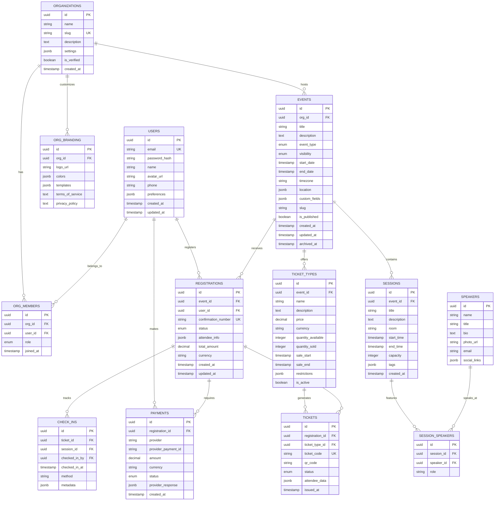
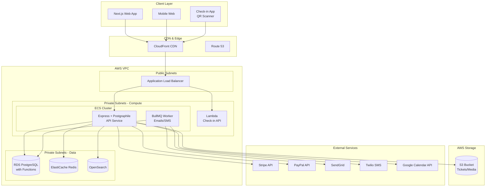
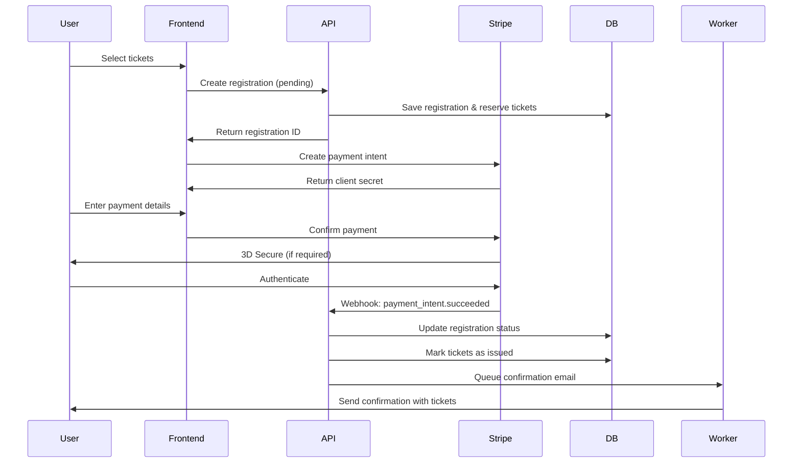

# Project 3 of 8: Event Registration Platform

## 1. Project Overview

### Project Name and Number
**Project 3 of 8: Event Registration Platform**

### Executive Summary
A scalable, secure, multi-tenant platform to create, manage, and monitor events—conferences, workshops, webinars, and meetups. The system supports registration, ticketing, payment processing, reminders, analytics, and deep integrations with email, payment, calendar, and external communication tools. Built with Express.js and Postgraphile, this project demonstrates auto-generated GraphQL APIs from PostgreSQL schema and payment gateway integration.

### Target Audience
- **Event Organizers:** Companies, universities, clubs hosting events with attendee management needs
- **Attendees:** Individuals registering for virtual or in-person events
- **Multi-Organization Coordinators:** Agencies running events for different brands/clients
- **Sponsors/Partners:** Accessing event lists and analytics
- **Staff/Volunteers:** Assigned to events for check-in, support, and feedback handling

### Key Value Propositions
1. **Centralized Event Management** – All event setup, communication, tickets, and analytics in one place
2. **Flexible Event Formats** – Support for one-off, multi-day, recurring, hybrid, and virtual events
3. **Branded Experiences** – Customizable registration forms and public pages per organization
4. **Payment Integration** – Stripe and PayPal support with refunds, invoices, and tax handling
5. **Real-Time Analytics** – Live dashboards for registration, attendance, ticket sales, and feedback
6. **Deep Calendar Integration** – Google Calendar, iCal, and Outlook sync with automatic updates
7. **Scalable Check-in** – QR code scanning and real-time attendance tracking

### Developer Learning Objectives
- Build Express.js applications with proper middleware patterns
- Use Postgraphile for auto-generated GraphQL APIs from PostgreSQL
- Implement payment gateway integration (Stripe, PayPal)
- Design multi-tenant SaaS architecture
- Build real-time check-in systems with WebSockets
- Handle PCI compliance and secure payment flows

### 🧠 Core Engineering Fundamentals

This project provides excellent opportunities to apply and demonstrate core computer science concepts:

| Area | Concept | Application in This Project |
|------|---------|----------------------------|
| **DSA** | Priority Queue/Heap | Manage event waitlists with priority (VIP, early-bird, standard) |
| **DSA** | Hash Tables | Fast ticket validation and QR code lookup during check-in |
| **DSA** | Sorting Algorithms | Order events by date, popularity, or relevance for discovery |
| **System Design** | Multi-Tenancy | Design data isolation for multiple organizations sharing infrastructure |
| **System Design** | Idempotency | Ensure payment operations are idempotent to handle retries safely |
| **System Design** | Rate Limiting | Protect ticket purchase endpoints from bots and abuse |
| **Networks** | HTTPS/TLS | Secure payment data transmission; PCI DSS compliance |
| **Networks** | Webhooks | Handle async payment confirmations from Stripe/PayPal |
| **Networks** | QR Code Scanning | Real-time check-in system with WebSocket status updates |
| **OS** | Concurrency Control | Handle race conditions during limited ticket purchases |

**Interview Preparation:**
- Explain how you would prevent overselling tickets (concurrency and locking strategies)
- Discuss idempotency in payment processing and why it matters
- Design a system to handle 10K concurrent ticket purchases for a popular event

---

## 2. Detailed Functional Requirements

### 2.1 User Management & Authentication
- **Registration & Login**
  - Email/password with email verification
  - OAuth2 (Google, Microsoft)
  - SSO (SAML/OIDC) for enterprise clients
  - Password reset and account lockout

- **Profile Management**
  - Display name, avatar, organization details
  - Multi-organization switching
  - Notification preferences

- **Organization Structure**
  - Create/claim organizations
  - Invite admins, staff, and partners
  - Roles: Owner, Admin, Staff, Attendee, Guest
  - Branding: logos, colors, templates, legal documents

- **GDPR Compliance**
  - Data export/erasure for all users
  - Consent management
  - Right to be forgotten implementation

### 2.2 Core Business Logic (Events & Sessions)
- **Event Management**
  - Create events: name, description, type, dates, locations
  - Event types: public/private, in-person/online/hybrid
  - Custom fields and contact information
  - Clone/repeat events and link multi-event series
  - Archive, restore, or delete (soft/hard)

- **Session Management**
  - Add/update/cancel sessions within events
  - Session details: title, speaker, room, times, capacity
  - Category/tags and attached files/media
  - Speaker management with bios and photos

- **Multi-Tenancy**
  - Full organization separation
  - Custom URL slugs per organization
  - Sharable event pages with branding

### 2.3 Search & Discovery
- **Event Search (Elasticsearch)**
  - Organization-wide instant search
  - Filter by name, location, tags, date, speaker, ticket type
  - Full-text search with autocomplete

- **Public Discovery**
  - SEO-optimized public event pages
  - Rich snippets and Open Graph tags
  - Optional web crawler visibility

### 2.4 Notifications & Communication
- **Automated Communications**
  - Scheduled email/SMS reminders (SendGrid/Mailgun/Twilio)
  - Pre-event, during event, and post-event messages
  - Customizable templates per org/event

- **Announcements**
  - Event-wide or targeted notifications
  - Multiple channels: platform, email, push, chat

- **Feedback & Polls**
  - Create feedback forms and session polls
  - Schedule automated reminders
  - Analytics and result downloads

### 2.5 Analytics & Reporting
- **Live Dashboard**
  - Real-time registration and sales tracking
  - Check-in status and attendance rates
  - Revenue and ticket type breakdowns

- **Reports**
  - Per-event, org-wide, per-staff analytics
  - Custom date range and grouping
  - Export: CSV, XLS, PDF

- **Audit Logs**
  - All event, account, financial changes logged
  - Timestamp, user, before/after values

### 2.6 File Management
- **Event Resources**
  - S3/MinIO storage for event materials
  - PDF tickets with QR/barcode generation
  - Event media and speaker photos

- **Document Management**
  - Presigned URL uploads
  - Secure downloads with expiration
  - File type validation and quotas

### 2.7 External Integrations
- **Calendar Integration**
  - "Add to Calendar" for Google, iCal, Outlook
  - .ics feed generation
  - OAuth sync with user calendars

- **Payment Gateways**
  - Stripe and PayPal integration
  - Pluggable adapter architecture
  - Secure webhook handling
  - Refunds, voids, and partial payments

- **Communication APIs**
  - SendGrid/Mailgun for email
  - Twilio for SMS
  - Webhook notifications to external systems

- **CRM/External Systems**
  - Outbound webhooks for signups, payments, check-ins
  - Inbound pull from external CRMs
  - Zapier triggers and actions

- **Public API**
  - GraphQL via Postgraphile
  - REST endpoints for specific flows
  - API token management

### 2.8 Accessibility & Internationalization
- **Accessibility (WCAG 2.1 AA)**
  - Keyboard navigation
  - High contrast mode
  - ARIA roles and screen reader support

- **Localization**
  - Multi-language UI and event pages
  - i18next for translations
  - Multi-timezone and currency support

- **Mobile Responsive**
  - Touch-optimized web UI
  - Mobile-friendly ticket scanning
  - Admin and attendee mobile experience

### 2.9 Security & Compliance
- **Payment Security**
  - PCI DSS compliance
  - No card data retention
  - Encrypted sensitive data

- **Authentication Security**
  - JWT (RS256) tokens
  - OAuth2 and optional SSO
  - 2FA support
  - Session and device tracking

- **Data Isolation**
  - Per-organization data boundaries
  - Server-side access validation
  - Rate limiting and abuse controls

- **Audit & Compliance**
  - All security events logged
  - Login attempts and role changes
  - Webhook and payment audit trails

---

## 3. Technical Stack Specification

```yaml
Backend:
  Runtime: Node.js 20 LTS
  Framework: Express.js 4.x
  API_Style: GraphQL (Postgraphile) + REST
  ORM: Direct PostgreSQL with pg/knex
  Validation: Joi, express-validator
  Documentation: GraphQL Playground, OpenAPI

Frontend:
  Framework: Next.js 14
  State_Management: React Query
  Styling: TailwindCSS 3.x
  Forms: React Hook Form + Zod
  Charts: Recharts / Chart.js

Databases:
  Primary_SQL: PostgreSQL 15 (with triggers/functions)
  Search_Engine: Elasticsearch 8.x
  Cache: Redis 7.x

Message_Queue:
  Queue: BullMQ (Redis-backed)

File_Storage:
  Development: MinIO
  Production: AWS S3 + CloudFront CDN

Payment:
  Processors: Stripe, PayPal
  Webhooks: Secure HMAC validation

Authentication:
  Strategy: Passport.js
  Tokens: JWT (RS256)
  OAuth: Google, Microsoft
  SSO: SAML 2.0, OIDC

Infrastructure:
  Containerization: Docker + Docker Compose
  Orchestration: Kubernetes (Helm Charts)
  CI_CD: GitHub Actions
  IaC: Terraform

AWS_Services:
  Compute: ECS Fargate, Lambda (check-in API)
  Database: RDS PostgreSQL
  Search: OpenSearch Service
  Cache: ElastiCache (Redis)
  Storage: S3
  CDN: CloudFront
  Notifications: SES, SNS
  Secrets: AWS Secrets Manager
  Monitoring: CloudWatch

Monitoring_Observability:
  Metrics: Prometheus + Grafana
  Logging: Winston → ELK Stack
  Error_Tracking: Sentry
```

---

## 4. Database Schema Design

### Entity Relationship Diagram (PostgreSQL)



### PostgreSQL Functions for Postgraphile

```sql
-- Custom function for ticket availability check
CREATE OR REPLACE FUNCTION check_ticket_availability(
    p_ticket_type_id UUID,
    p_quantity INTEGER
) RETURNS BOOLEAN AS $$
DECLARE
    v_available INTEGER;
BEGIN
    SELECT (quantity_available - quantity_sold)
    INTO v_available
    FROM ticket_types
    WHERE id = p_ticket_type_id
    AND is_active = true
    AND NOW() BETWEEN sale_start AND sale_end
    FOR UPDATE;
    
    RETURN v_available >= p_quantity;
END;
$$ LANGUAGE plpgsql;

-- Trigger for automatic confirmation number generation
CREATE OR REPLACE FUNCTION generate_confirmation_number()
RETURNS TRIGGER AS $$
BEGIN
    NEW.confirmation_number := 'REG-' || 
        TO_CHAR(NOW(), 'YYYYMMDD') || '-' ||
        UPPER(SUBSTRING(MD5(RANDOM()::TEXT) FROM 1 FOR 6));
    RETURN NEW;
END;
$$ LANGUAGE plpgsql;

CREATE TRIGGER trigger_confirmation_number
    BEFORE INSERT ON registrations
    FOR EACH ROW
    EXECUTE FUNCTION generate_confirmation_number();

-- Immutable audit log trigger
CREATE OR REPLACE FUNCTION audit_log_trigger()
RETURNS TRIGGER AS $$
BEGIN
    INSERT INTO audit_logs (
        table_name, record_id, action, 
        old_data, new_data, user_id, created_at
    ) VALUES (
        TG_TABLE_NAME, 
        COALESCE(NEW.id, OLD.id),
        TG_OP,
        CASE WHEN TG_OP != 'INSERT' THEN row_to_json(OLD) END,
        CASE WHEN TG_OP != 'DELETE' THEN row_to_json(NEW) END,
        current_setting('app.current_user_id', true)::UUID,
        NOW()
    );
    RETURN NEW;
END;
$$ LANGUAGE plpgsql;
```

---

## 5. Technical Architecture Diagram



---

## 6. Frontend Functional & Technical Requirements

### 6.1 UI/UX Pages & Screens

| Page/Screen | Description | Key Components |
|-------------|-------------|----------------|
| **Landing Page** | Public event discovery | Hero section, Event carousel, Search bar |
| **Event Directory** | Browse all events | Event cards, Filters, Map view toggle |
| **Event Detail** | Individual event page | Event info, Sessions, Speakers, Registration CTA |
| **Registration Flow** | Multi-step checkout | Ticket selection, Attendee form, Payment |
| **Checkout** | Payment processing | Cart summary, Payment form, Stripe/PayPal elements |
| **Confirmation** | Post-registration | Ticket details, QR code, Add to calendar |
| **My Tickets** | User's registrations | Ticket cards, QR codes, Cancel/transfer options |
| **Organizer Dashboard** | Event management | Stats cards, Attendee list, Revenue charts |
| **Event Editor** | Create/edit events | Multi-step wizard, Session builder, Ticket config |
| **Check-in App** | QR scanner | Camera view, Scan result, Attendee info |
| **Analytics** | Reports dashboard | Charts, Export options, Date range picker |
| **Settings** | Org configuration | Branding, Payment setup, Team management |

### 6.2 Component Architecture

```
src/
├── components/
│   ├── common/                 # Shared UI components
│   │   ├── Button/
│   │   ├── Input/
│   │   ├── Modal/
│   │   ├── Card/
│   │   ├── Badge/
│   │   ├── DatePicker/
│   │   ├── TimePicker/
│   │   ├── Stepper/            # Multi-step flow
│   │   └── Toast/
│   ├── layout/                 # Layout components
│   │   ├── Header/
│   │   ├── Sidebar/
│   │   ├── Footer/
│   │   └── OrganizerLayout/
│   ├── forms/                  # Form components
│   │   ├── EventForm/
│   │   ├── TicketForm/
│   │   ├── AttendeeForm/
│   │   └── PaymentForm/
│   ├── features/               # Feature-specific components
│   │   ├── events/
│   │   │   ├── EventCard/
│   │   │   ├── EventGrid/
│   │   │   ├── EventDetail/
│   │   │   └── SessionList/
│   │   ├── registration/
│   │   │   ├── TicketSelector/
│   │   │   ├── AttendeeInfo/
│   │   │   └── OrderSummary/
│   │   ├── checkout/
│   │   │   ├── PaymentMethods/
│   │   │   ├── StripeElements/
│   │   │   └── PayPalButton/
│   │   ├── tickets/
│   │   │   ├── TicketCard/
│   │   │   ├── QRCode/
│   │   │   └── TicketTransfer/
│   │   └── checkin/
│   │       ├── QRScanner/
│   │       ├── ScanResult/
│   │       └── AttendeeSearch/
│   └── charts/                 # Analytics
│       ├── RegistrationChart/
│       ├── RevenueChart/
│       └── AttendanceChart/
├── hooks/                      # Custom React hooks
│   ├── useAuth.ts
│   ├── useEvents.ts
│   ├── useRegistration.ts
│   ├── usePayment.ts
│   └── useQRScanner.ts
├── store/                      # State management
│   ├── slices/
│   │   ├── authSlice.ts
│   │   ├── eventsSlice.ts
│   │   ├── cartSlice.ts
│   │   └── checkoutSlice.ts
│   └── store.ts
├── services/                   # API services
│   ├── eventService.ts
│   ├── registrationService.ts
│   ├── paymentService.ts
│   └── checkinService.ts
└── types/                      # TypeScript types
    ├── event.types.ts
    ├── ticket.types.ts
    └── registration.types.ts
```

### 6.3 State Management

| State Type | Solution | Use Case |
|------------|----------|----------|
| **Server State** | React Query | Events, registrations, attendees |
| **Client State** | Redux Toolkit | Cart, checkout flow, UI state |
| **Form State** | React Hook Form + Zod | Registration forms, event editor |
| **Payment State** | Stripe/PayPal SDK | Payment elements, transaction status |
| **Real-time State** | WebSocket | Check-in status, live dashboard updates |

### 6.4 Client-Side Validation Rules

| Field | Validation | Error Message |
|-------|------------|---------------|
| Email | RFC 5322 format | "Please enter a valid email address" |
| Phone | E.164 format | "Please enter a valid phone number" |
| Ticket Quantity | > 0, ≤ available | "Please select at least 1 ticket" |
| Event Date | Future date, valid range | "Event must be scheduled for a future date" |
| Promo Code | Alphanumeric, 4-20 chars | "Invalid promo code format" |
| Card Number | Valid Luhn checksum | "Please enter a valid card number" |

### 6.5 Responsive Design Breakpoints

| Breakpoint | Width | Layout Changes |
|------------|-------|----------------|
| `xs` | < 640px | Single column, bottom sheet checkout |
| `sm` | ≥ 640px | Event cards 2-column, sticky cart summary |
| `md` | ≥ 768px | Event cards 3-column, side cart |
| `lg` | ≥ 1024px | Dashboard grid, expanded filters |
| `xl` | ≥ 1280px | Full dashboard, inline check-in |

### 6.6 Frontend Accessibility Requirements

| Requirement | Implementation |
|-------------|----------------|
| **Keyboard Navigation** | All checkout steps, modal dialogs, QR scanner fallback |
| **Screen Reader Support** | Cart announcements, payment status, error messages |
| **Focus Management** | Step progression, form error focus, modal trapping |
| **Color Contrast** | Ticket status badges, price displays |
| **Form Accessibility** | Required fields, inline validation, error summaries |
| **Mobile Accessibility** | Touch targets 44x44px, swipe gestures |

### 6.7 Frontend Performance Requirements

| Metric | Target | Measurement |
|--------|--------|-------------|
| **First Contentful Paint (FCP)** | < 1.5s | Lighthouse |
| **Largest Contentful Paint (LCP)** | < 2.5s | Lighthouse |
| **Time to Interactive (TTI)** | < 4.0s | Lighthouse |
| **Bundle Size (gzipped)** | < 250KB initial | Webpack Bundle Analyzer |
| **Stripe.js Load** | Async, < 1s | Network waterfall |
| **QR Scanner Init** | < 2s camera access | Performance API |

### 6.8 Frontend Testing Requirements

| Test Type | Coverage Target | Tools |
|-----------|-----------------|-------|
| **Unit Tests** | > 80% components | Jest, React Testing Library |
| **Payment Mocking** | Stripe test mode | Stripe Test Cards |
| **E2E Tests** | Registration, checkout flow | Cypress, Playwright |
| **Mobile Tests** | QR scanner, responsive | Cypress mobile viewport |
| **Accessibility Tests** | All pages, checkout flow | axe-core, pa11y |

---

## 7. AWS Deployment Architecture

### Compute Strategy
- **ECS Fargate** for main API and worker services
- **AWS Lambda** for high-frequency check-in API (scales to thousands of concurrent requests)
- Auto-scaling based on registration volume and check-in activity
- Blue-green deployments for zero-downtime updates

### Database Strategy
- **RDS PostgreSQL** with rich constraints and stored procedures
- Read replicas for reporting queries
- Connection pooling via PgBouncer
- Point-in-time recovery enabled

### Payment Processing
- Stripe and PayPal webhooks via dedicated endpoints
- Webhook signature verification
- Idempotent payment processing
- Secure credential storage in Secrets Manager

### Real-Time Check-in
- Lambda function for check-in API (sub-100ms response)
- WebSocket connection for live dashboard updates
- Redis for check-in state synchronization
- QR code validation with ticket status updates

### CI/CD Pipeline
```yaml
Pipeline:
  1. Push to GitHub → Trigger Actions
  2. Database Migration Validation
  3. Run Unit & Integration Tests
  4. Build Docker Images
  5. Push to ECR
  6. Deploy to Staging
  7. Payment Flow Tests (Stripe Test Mode)
  8. Deploy to Production (manual approval)
  9. Post-deploy Health Checks
```

---

## 8. Payment Flow Architecture



---

## 9. Monorepo Structure

```
event-registration-platform/
├── apps/
│   ├── api/                    # Express + Postgraphile
│   │   ├── src/
│   │   │   ├── middleware/
│   │   │   │   ├── auth.ts
│   │   │   │   ├── orgScope.ts
│   │   │   │   └── rateLimit.ts
│   │   │   ├── routes/
│   │   │   │   ├── webhooks/
│   │   │   │   │   ├── stripe.ts
│   │   │   │   │   └── paypal.ts
│   │   │   │   ├── calendar.ts
│   │   │   │   └── checkin.ts
│   │   │   ├── plugins/
│   │   │   │   └── postgraphile/
│   │   │   ├── services/
│   │   │   │   ├── payment/
│   │   │   │   ├── ticket/
│   │   │   │   └── notification/
│   │   │   └── app.ts
│   │   └── test/
│   ├── worker/                 # Background Jobs
│   │   └── src/
│   │       ├── jobs/
│   │       │   ├── email/
│   │       │   ├── sms/
│   │       │   ├── reminder/
│   │       │   └── report/
│   │       └── processors/
│   ├── web/                    # Next.js Frontend
│   │   └── src/
│   │       ├── pages/
│   │       │   ├── events/
│   │       │   ├── dashboard/
│   │       │   └── checkout/
│   │       └── components/
│   └── checkin-lambda/         # Check-in Lambda
│       └── src/
├── libs/
│   ├── db/
│   │   ├── migrations/
│   │   ├── seeds/
│   │   └── functions/
│   ├── types/
│   └── payment-adapters/
│       ├── stripe/
│       └── paypal/
├── infrastructure/
│   ├── terraform/
│   └── helm/
├── docker-compose.yml
└── package.json
```

---

## 10. Success Criteria

1. **Registration Performance**: Handle 1000+ concurrent registrations during popular event launches
2. **Payment Reliability**: 99.9% payment success rate with proper error handling and retry logic
3. **Check-in Speed**: Sub-100ms check-in response time via Lambda
4. **Real-time Updates**: Dashboard updates within 1 second of check-in
5. **Multi-tenancy**: Complete data isolation between organizations
6. **Compliance**: PCI DSS compliant payment handling, GDPR data management
7. **Uptime**: 99.9% availability during event registration windows

---

*Last Updated: December 2024*
