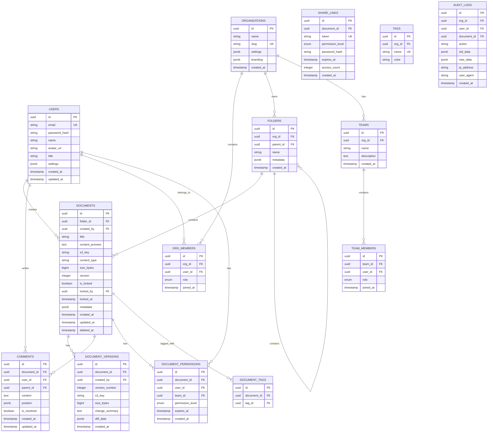
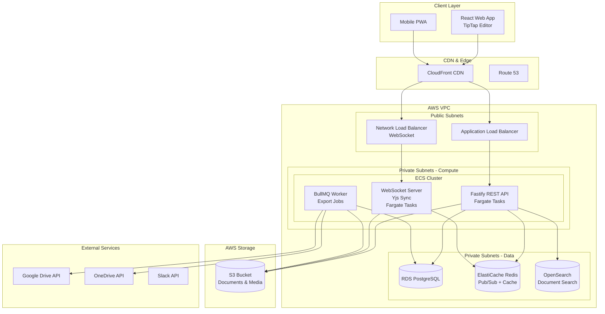
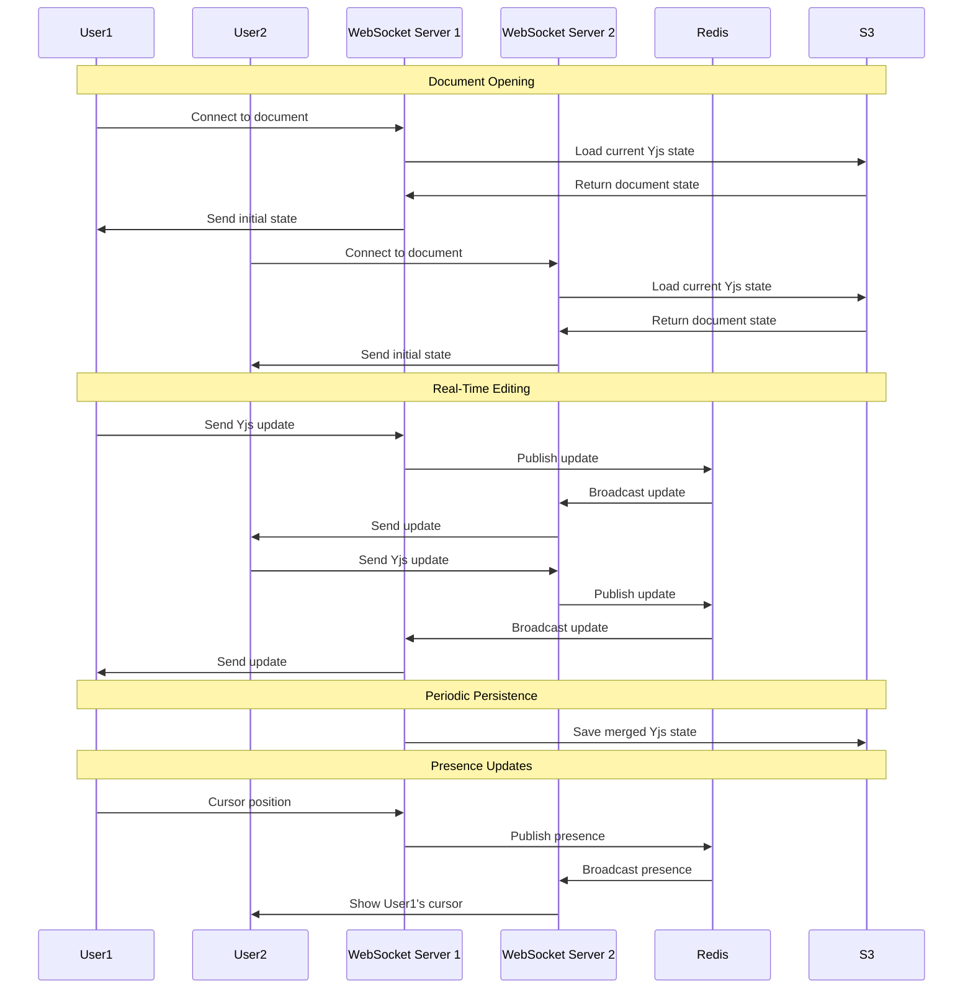

# Project 4 of 8: Document Collaboration Platform

## 1. Project Overview

### Project Name and Number
**Project 4 of 8: Document Collaboration Platform**

### Executive Summary
A highly-collaborative, real-time document creation, editing, and sharing platform for individuals, teams, and organizations. The system supports synchronous editing, comments, version control, media embedding, granular sharing permissions, and compliance features. Built with Fastify and featuring CRDT-based real-time collaboration, this project demonstrates advanced real-time systems, conflict resolution, and WebSocket architecture.

### Target Audience
- **Knowledge Workers & Teams:** Co-authoring reports, notes, proposals, and wikis
- **Organizations:** Managing policies, SOPs, manuals, and internal knowledge bases
- **Content Creators:** Writers, researchers, and technical writers requiring publishing tools
- **Educational Institutions:** Faculty and students collaborating on documents
- **Developers/Integrators:** Building plugins and workflow automation

### Key Value Propositions
1. **Real-Time Multi-User Editing** – Synchronous updates with live cursors and presence indicators
2. **Granular Sharing Controls** – Per-user, per-group, link sharing with expiration
3. **Rich Content Support** – Markdown, WYSIWYG, tables, code blocks, math, diagrams, multimedia
4. **Unlimited Versioning** – Full history with diff, compare, and rollback capabilities
5. **Powerful Search** – Global full-text search with faceted filtering
6. **Deep Integrations** – Google Drive, OneDrive, S3, Slack, webhooks
7. **Enterprise Compliance** – Audit logs, legal hold, retention policies, GDPR/SOC2

### Developer Learning Objectives
- Build high-performance APIs with Fastify
- Implement CRDT (Conflict-free Replicated Data Types) for real-time collaboration
- Master WebSocket architecture for live presence and editing
- Design version control systems for document history
- Build enterprise-grade compliance and audit features
- Deploy real-time services at scale on AWS

---

## 2. Detailed Functional Requirements

### 2.1 User Management & Authentication
- **Authentication Options**
  - Email/password with email verification
  - OAuth2 (Google, Microsoft, Apple)
  - SSO (SAML/OIDC) for enterprise
  - 2FA with authenticator apps
  - Device and session management

- **Profile Management**
  - Avatar, name, title, organization
  - Notification preferences
  - Per-user and per-team settings

- **Organization & Team Structure**
  - Create/join organizations and teams
  - Invite by email or SSO
  - Roles: admin, editor, commenter, viewer, owner
  - LDAP directory integration

- **Sharing & Permissions**
  - Granular per-document/folder/tag permissions
  - Link sharing with password/expiration options
  - Access levels: edit, comment, view

### 2.2 Core Business Logic (Document Authoring)
- **Rich Editor**
  - WYSIWYG and Markdown toggle
  - Code blocks with syntax highlighting
  - Math (LaTeX) support
  - Tables, diagrams, and checklists
  - File, image, video, audio embeds
  - Task assignments within documents

- **Live Collaboration**
  - Real-time cursor positions
  - User presence indicators
  - Typing indicators and status badges
  - Color-coded user cursors

- **Comments & Suggestions**
  - Threaded comments with replies
  - Suggestion mode (tracked changes)
  - @mentions with notifications
  - Emoji reactions and comment history

- **Document Workflow**
  - Approval workflows
  - Lock for review
  - Section assignments
  - Action items and todos

- **Templates**
  - Pre-configured layouts (reports, agendas, wikis)
  - Template creation and sharing
  - Start from template

### 2.3 Search & Discovery
- **Elasticsearch-Powered Search**
  - Real-time full-text search
  - Fuzzy matching and typo tolerance
  - Search by keyword, content type, tag, user, date
  - Search within version history and comments

- **Organization**
  - Folders and tree structure
  - Tags and custom fields
  - Favorites and recent documents
  - Shared-with-me and collections
  - Smart sorting and drag-drop

### 2.4 Notifications & Communication
- **Multi-Channel Notifications**
  - In-app notification center
  - Email digests and real-time alerts
  - Push notifications
  - User-controlled preferences per action type

- **Collaboration Notifications**
  - Comments and mentions
  - Document shares and access requests
  - Review requests and approvals
  - Reminder notifications

### 2.5 Analytics & Reporting
- **Document Analytics**
  - View counts and edit history
  - Collaborator activity
  - Time spent on documents

- **Export Capabilities**
  - Export to PDF, Word, Markdown, HTML
  - Import from Markdown, Word, Google Docs, Confluence

### 2.6 File Management
- **Media & Attachments**
  - S3/MinIO storage with presigned URLs
  - Quotas per user/organization
  - Content type validation and virus scanning

- **External Storage Sync**
  - Google Drive integration
  - OneDrive/SharePoint sync
  - Dropbox support
  - S3 bucket mounting

### 2.7 External Integrations
- **Native Storage Sync**
  - One-click export/import from cloud storage
  - OAuth token management
  - Automatic sync options

- **Webhooks**
  - Outbound webhooks per action/event
  - HMAC signed payloads
  - Retry with error logging
  - Admin UI for configuration

- **Chat Integration**
  - Slack notifications
  - Microsoft Teams integration
  - Calendar invites for review deadlines

- **Public API**
  - Token-based authentication
  - Organization/role-scoped endpoints
  - CRUD operations for documents
  - Automated workflow triggers

### 2.8 Accessibility & Internationalization
- **Accessibility (WCAG 2.1 AA)**
  - Full keyboard navigation
  - ARIA roles and labels
  - High contrast mode
  - Screen reader support
  - Accessible modals and menus

- **Localization**
  - Multi-language UI and notifications
  - i18next for translations
  - Date/time/currency formatting per locale

- **Mobile Support**
  - PWA with offline caching
  - Touch gestures for editing
  - Mobile-first layouts
  - Push notifications

- **Voice**
  - Voice-to-text for document input
  - Voice commands for navigation

### 2.9 Security & Compliance
- **Authentication Security**
  - JWT/SSO/OAuth
  - Session audit and per-device history
  - Password hashing (bcrypt/Argon2)
  - Per-session revocation

- **Data Isolation**
  - Hard access boundaries per org/team
  - API and database-level isolation

- **Granular RBAC/ACL**
  - Per-resource, per-action permissions
  - Comprehensive logging

- **Compliance Features**
  - Audit logging (TB-scale friendly)
  - Retention policies with scheduled erasure
  - Legal hold capability
  - Export-on-demand for compliance
  - GDPR/SOC2/HIPAA readiness

---

## 3. Technical Stack Specification

```yaml
Backend:
  Runtime: Node.js 20 LTS
  Framework: Fastify 4.x
  API_Style: REST + GraphQL (optional) + WebSocket
  ORM: TypeORM 0.3.x / Prisma 5.x
  Real_Time: Yjs (CRDT), Socket.io / ws
  Validation: Zod, @sinclair/typebox
  Documentation: OpenAPI 3.0 (Fastify Swagger)

Frontend:
  Framework: React 18 / Next.js 14
  State_Management: Zustand / React Query
  Editor: TipTap / ProseMirror / Yjs bindings
  Styling: TailwindCSS 3.x
  Real_Time: Socket.io-client

Databases:
  Primary_SQL: PostgreSQL 15
  Document_Store: S3 (document binary storage)
  Search_Engine: Elasticsearch 8.x
  Cache: Redis 7.x

Message_Queue:
  Queue: BullMQ (Redis-backed)

File_Storage:
  Development: MinIO
  Production: AWS S3 + CloudFront CDN

Real_Time:
  CRDT_Library: Yjs / Automerge
  WebSocket: Socket.io / ws
  Presence: Redis Pub/Sub

Authentication:
  Strategy: @fastify/passport
  Tokens: JWT (RS256)
  OAuth: Google, Microsoft, Apple
  SSO: SAML 2.0, OIDC

Infrastructure:
  Containerization: Docker + Docker Compose
  Orchestration: Kubernetes (Helm Charts)
  CI_CD: GitHub Actions
  IaC: Terraform

AWS_Services:
  Compute: ECS Fargate
  Database: RDS (Postgres)
  Search: OpenSearch Service
  Cache: ElastiCache (Redis)
  Storage: S3
  CDN: CloudFront
  Secrets: AWS Secrets Manager
  Monitoring: CloudWatch

Monitoring_Observability:
  Metrics: Prometheus + Grafana
  Logging: Pino → ELK Stack
  Error_Tracking: Sentry
```

---

## 4. Database Schema Design

### Entity Relationship Diagram (PostgreSQL)



### CRDT Document Storage (S3)

```
Documents are stored as Yjs binary updates in S3:

s3://documents-bucket/
├── org-{id}/
│   ├── doc-{id}/
│   │   ├── current.yjs          # Current document state
│   │   ├── versions/
│   │   │   ├── v001.yjs
│   │   │   ├── v002.yjs
│   │   │   └── v003.yjs
│   │   └── media/
│   │       ├── image-001.png
│   │       └── video-001.mp4
```

---

## 5. Technical Architecture Diagram



---

## 6. AWS Deployment Architecture

### Compute Strategy
- **ECS Fargate** for API, WebSocket, and Worker services
- **Network Load Balancer** for WebSocket connections (sticky sessions)
- Auto-scaling based on concurrent WebSocket connections
- Horizontal scaling of collaboration servers

### Real-Time Architecture
- **Yjs CRDT** for conflict-free real-time editing
- **Redis Pub/Sub** for cross-server synchronization
- **WebSocket** connections for live updates
- Document sharding by ID for scalability

### Storage Strategy
- **S3** for document binary storage (Yjs state)
- Document versions stored as immutable objects
- **CloudFront** for fast media delivery
- Lifecycle policies for version cleanup

### High Availability
- Multi-AZ deployment for all services
- Redis cluster mode for Pub/Sub reliability
- Graceful reconnection handling
- Offline mode with sync on reconnect

### CI/CD Pipeline
```yaml
Pipeline:
  1. Push to GitHub → Trigger Actions
  2. Run Unit & Integration Tests
  3. CRDT Sync Tests
  4. Build Docker Images
  5. Push to ECR
  6. Deploy WebSocket servers (rolling)
  7. Deploy API servers
  8. E2E Collaboration Tests
  9. Production Deployment
```

---

## 7. Real-Time Collaboration Architecture



### CRDT Implementation Details

```typescript
// Document collaboration server pseudocode
class CollaborationServer {
  private docs: Map<string, Y.Doc> = new Map();
  
  async joinDocument(docId: string, userId: string, ws: WebSocket) {
    let doc = this.docs.get(docId);
    
    if (!doc) {
      // Load from S3
      doc = new Y.Doc();
      const state = await this.s3.getObject(docId);
      Y.applyUpdate(doc, state);
      this.docs.set(docId, doc);
    }
    
    // Subscribe to Redis for cross-server updates
    await this.redis.subscribe(`doc:${docId}`, (update) => {
      Y.applyUpdate(doc, update);
      ws.send(update);
    });
    
    // Send current state to user
    ws.send(Y.encodeStateAsUpdate(doc));
    
    // Handle updates from this user
    ws.on('message', (update) => {
      Y.applyUpdate(doc, update);
      this.redis.publish(`doc:${docId}`, update);
    });
  }
  
  async persistDocument(docId: string) {
    const doc = this.docs.get(docId);
    if (doc) {
      const state = Y.encodeStateAsUpdate(doc);
      await this.s3.putObject(docId, state);
      await this.createVersion(docId, state);
    }
  }
}
```

---

## 8. Monorepo Structure

```
document-collaboration-platform/
├── apps/
│   ├── api/                    # Fastify REST API
│   │   ├── src/
│   │   │   ├── plugins/
│   │   │   │   ├── auth.ts
│   │   │   │   ├── swagger.ts
│   │   │   │   └── cors.ts
│   │   │   ├── routes/
│   │   │   │   ├── documents/
│   │   │   │   ├── folders/
│   │   │   │   ├── comments/
│   │   │   │   ├── search/
│   │   │   │   └── webhooks/
│   │   │   ├── services/
│   │   │   └── app.ts
│   │   └── test/
│   ├── collab-server/          # WebSocket Collaboration
│   │   └── src/
│   │       ├── yjs/
│   │       │   ├── provider.ts
│   │       │   └── persistence.ts
│   │       ├── presence/
│   │       └── server.ts
│   ├── worker/                 # Background Jobs
│   │   └── src/
│   │       ├── jobs/
│   │       │   ├── export/
│   │       │   ├── import/
│   │       │   └── cleanup/
│   │       └── processors/
│   └── web/                    # React Frontend
│       └── src/
│           ├── editor/
│           │   ├── TipTapEditor.tsx
│           │   ├── Toolbar.tsx
│           │   └── CollabProvider.tsx
│           ├── pages/
│           └── components/
├── libs/
│   ├── db/
│   │   └── postgres/
│   ├── types/
│   ├── crdt/                   # Shared Yjs utilities
│   └── storage/                # S3 abstraction
├── infrastructure/
│   ├── terraform/
│   └── helm/
├── docker-compose.yml
└── package.json
```

---

## 9. Compliance & Audit Features

### Audit Log Structure

```json
{
  "id": "uuid",
  "timestamp": "2024-01-15T10:30:00.000Z",
  "organization_id": "uuid",
  "user_id": "uuid",
  "document_id": "uuid",
  "action": "document.edited",
  "details": {
    "version_before": 15,
    "version_after": 16,
    "changes_summary": "Modified paragraph 3"
  },
  "context": {
    "ip_address": "192.168.1.1",
    "user_agent": "Mozilla/5.0...",
    "session_id": "uuid"
  }
}
```

### Legal Hold Implementation

```sql
-- Legal hold table
CREATE TABLE legal_holds (
    id UUID PRIMARY KEY,
    document_id UUID REFERENCES documents(id),
    reason TEXT NOT NULL,
    created_by UUID REFERENCES users(id),
    created_at TIMESTAMPTZ DEFAULT NOW(),
    released_at TIMESTAMPTZ,
    released_by UUID REFERENCES users(id)
);

-- Prevent deletion of documents under legal hold
CREATE OR REPLACE FUNCTION prevent_legal_hold_deletion()
RETURNS TRIGGER AS $$
BEGIN
    IF EXISTS (
        SELECT 1 FROM legal_holds 
        WHERE document_id = OLD.id 
        AND released_at IS NULL
    ) THEN
        RAISE EXCEPTION 'Cannot delete document under legal hold';
    END IF;
    RETURN OLD;
END;
$$ LANGUAGE plpgsql;
```

---

## 10. Success Criteria

1. **Real-Time Performance**: Sub-50ms latency for collaborative edits
2. **Conflict Resolution**: Zero data loss with concurrent editing by 10+ users
3. **Scale**: Support 10,000+ concurrent document sessions
4. **Reliability**: 99.9% uptime with graceful degradation
5. **Compliance**: Full audit trail for all document operations
6. **Search Quality**: <200ms search response with accurate results
7. **Version Control**: Unlimited version history with instant rollback

---

*Last Updated: December 2024*
