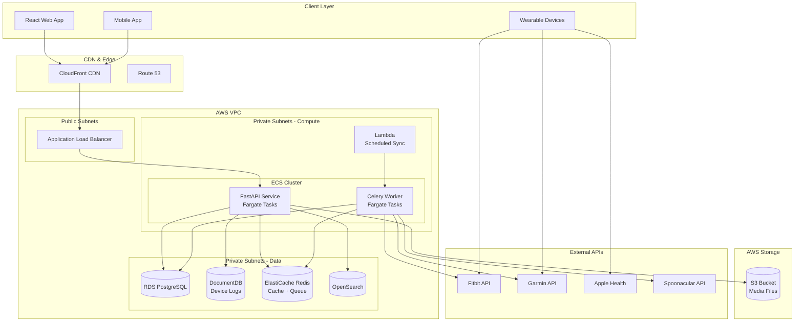
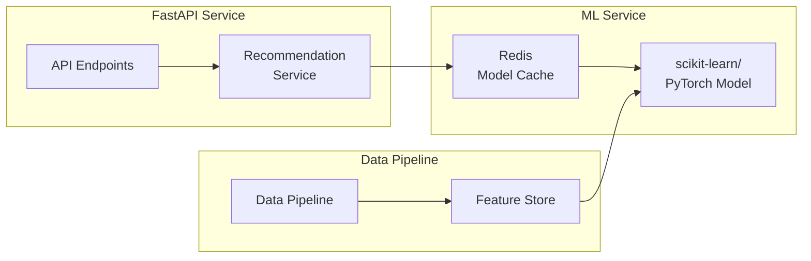

# Project 5 of 8: Fitness Tracker API

## 1. Project Overview

### Project Name and Number
**Project 5 of 8: Fitness Tracker API**

### Executive Summary
A secure, extensible API-centric platform for individuals and fitness professionals to track workouts, log health data, set and analyze progress against goals, and connect with devices and external fitness/nutrition APIs. Built with Python and FastAPI, this project demonstrates async Python patterns, device integrations, health data handling, and HIPAA-ready architecture.

### Target Audience
- **Fitness Enthusiasts:** Individuals tracking personal workouts, health metrics, and goals
- **Personal Trainers/Coaches:** Managing multiple clients with workout assignments and progress monitoring
- **Gyms/Studios:** Providing members access to logging, challenges, and leaderboards
- **App Developers:** Leveraging robust APIs for custom health apps and wearable integrations
- **Healthcare & Research:** Optional modules for patient data and cohort analytics

### Key Value Propositions
1. **Full-Featured Workout Logging** – Track routines, sets, reps, weights, cardio, and more
2. **Goal-Centric Personalization** – Set and monitor goals for weight, reps, distance, calories, streaks
3. **Comprehensive Health Metrics** – Log body measurements, HR, BP, sleep, hydration
4. **Device Integrations** – Connect with Fitbit, Garmin, Apple Health, Google Fit
5. **Nutrition Tracking** – Food logging with macro/micro breakdown via external APIs
6. **Advanced Analytics** – Charts, PR tracking, trends, training load analysis
7. **Social Features** – Challenges, leaderboards, and shared progress (optional)

### Developer Learning Objectives
- Build high-performance async APIs with FastAPI and Python
- Implement OAuth2 flows for third-party device integrations
- Handle sensitive health data with HIPAA-ready patterns
- Design flexible schema for varied workout types
- Build recommendation algorithms for workout suggestions
- Master Python async patterns with asyncio and aiohttp

### 🧠 Core Engineering Fundamentals

This project provides excellent opportunities to apply and demonstrate core computer science concepts:

| Area | Concept | Application in This Project |
|------|---------|----------------------------|
| **DSA** | Sliding Window | Calculate rolling averages (7-day steps, weekly calories, moving averages) |
| **DSA** | Time Series Analysis | Store and query workout data efficiently over time ranges |
| **DSA** | Sorting & Searching | Leaderboard rankings, personal best (PR) tracking |
| **DSA** | Statistical Algorithms | Calculate percentiles, trends, and training load metrics |
| **System Design** | Data Aggregation | Pre-compute daily/weekly/monthly summaries for dashboard performance |
| **System Design** | OAuth2 Flows | Integrate with Fitbit, Garmin, Apple Health APIs |
| **System Design** | Data Privacy | HIPAA-ready architecture for sensitive health information |
| **Networks** | REST API Design | Design intuitive endpoints for mobile and wearable device clients |
| **Networks** | Webhook Handling | Receive real-time updates from fitness device APIs |
| **OS** | Async I/O | Use Python asyncio for concurrent API calls to external services |
| **OS** | Process vs Thread | Async for I/O-bound tasks; multiprocessing for CPU-bound analytics |

**Interview Preparation:**
- Explain how sliding window algorithms optimize rolling average calculations
- Discuss async/await patterns in Python and when to use them
- Design a system to process real-time heart rate data from millions of devices

---

## 2. Detailed Functional Requirements

### 2.1 User Management & Authentication
- **Registration & Login**
  - Email/password with email verification
  - OAuth2 (Google, Facebook, Apple, Fitbit, Garmin)
  - Optional 2FA with authenticator apps
  - Session and device tracking

- **Profile Management**
  - Avatar upload (S3/CDN)
  - Health details: age, DOB, height, weight, gender
  - Notification preferences
  - Privacy controls (public/private profile)

- **Multi-User Support**
  - Trainer/gym accounts with client management
  - Role management: trainer, client, admin
  - Client assignment and progress access

- **Privacy & Compliance**
  - Data sharing controls
  - GDPR/HIPAA-compliant data export and deletion
  - Consent management

### 2.2 Core Business Logic (Workout Management)
- **Workout CRUD**
  - Create, clone, update, delete workouts
  - Templates and historical logs
  - Fields: name, description, tags, visibility, planned date/time
  - Coach-assigned or self-logged workouts

- **Exercise Management**
  - Exercise catalog (per org or public)
  - Fields: name, type, muscle group, equipment, video/media
  - Custom exercise creation

- **Session Logging**
  - Date/time, location (GPS), duration, effort rating
  - Per-set tracking: reps, weight, time, RPE, heart rate
  - Rest intervals, supersets, custom fields
  - Failure/completion status

- **Progression & Templates**
  - Weekly workout plans
  - Template versioning and sharing
  - Personal best (PR) tracking
  - Streak and goal progress visualization

### 2.3 Search & Discovery
- **Elasticsearch-Powered Search**
  - Full-text search on workouts, exercises, metrics
  - Fuzzy search with auto-suggest
  - Filter by goal type, frequency, muscle group, equipment

- **Exercise Library**
  - Video demonstrations
  - How-to instructions
  - Best practices per movement

### 2.4 Notifications & Communication
- **Reminder System**
  - Workout reminders
  - Goal achievement notifications
  - PR alerts ("PR possible on deadlift!")
  - Health trend alerts

- **Delivery Channels**
  - In-app notifications
  - Email notifications
  - SMS via Twilio
  - Push notifications

### 2.5 Analytics & Reporting
- **Goal Management**
  - Short/long-term goals: weight, reps, distance, calories, streaks
  - Inline metric visualization
  - Daily/weekly analytics dashboard
  - Personal best notifications

- **Trends & History**
  - Performance over time graphs
  - Progress toward goals
  - Injury/rehab tracking
  - Export: CSV, Excel

- **Custom Dashboards**
  - Widget-based dashboards
  - Favorite metrics selection

### 2.6 File Management
- **Media Uploads**
  - Progress photos and form check videos
  - S3/MinIO storage with presigned URLs
  - User quotas and validation
  - Preview in dashboard

### 2.7 External Integrations
- **Device APIs**
  - Fitbit, Garmin, Apple Health, Google Fit, Withings, Oura
  - OAuth token management with refresh
  - Real-time or scheduled sync
  - Steps, workouts, sleep, HR, calories

- **Nutrition APIs**
  - Spoonacular, USDA food database
  - Macro/micro breakdown
  - Food images and portion sizing
  - Saved/favorite meals

- **Error Handling**
  - Circuit breaker pattern
  - Re-auth flow for expired tokens
  - Device error status in UI
  - Historical sync logs

### 2.8 Accessibility & Internationalization
- **Responsive Design**
  - Keyboard navigation
  - Screen reader support
  - High contrast mode
  - Touch gestures for mobile

- **Localization**
  - Multi-language support
  - Unit preference (metric/imperial)
  - Locale-aware date/time

### 2.9 Security & Compliance
- **Authentication Security**
  - JWT (RS256) tokens
  - OAuth2 with device token handling
  - 2FA support
  - Session expiration and management

- **Data Protection**
  - Per-user, per-org data isolation
  - RBAC for coach/client access
  - Encryption at rest and in transit

- **File Security**
  - All files in S3 with AV scan
  - Expiring presigned URLs
  - Never publicly accessible

- **Compliance**
  - HIPAA-ready architecture
  - GDPR data export/delete
  - Full audit logging
  - Consent banners

---

## 3. Technical Stack Specification

```yaml
Backend:
  Runtime: Python 3.11+
  Framework: FastAPI 0.100+
  API_Style: REST (OpenAPI 3.0 auto-generated)
  ORM: SQLAlchemy 2.0 (async)
  Validation: Pydantic v2
  Documentation: FastAPI auto-docs (Swagger/ReDoc)
  Async: asyncio, aiohttp, httpx

Frontend:
  Framework: Next.js 14
  State_Management: React Query / Zustand
  Styling: TailwindCSS 3.x
  Charts: Chart.js / Recharts
  Forms: React Hook Form + Zod

Databases:
  Primary_SQL: PostgreSQL 15
  Document_Store: MongoDB 7.0 (device logs)
  Search_Engine: Elasticsearch 8.x
  Cache: Redis 7.x

Message_Queue:
  Queue: Celery (Redis broker) or ARQ
  Scheduler: Celery Beat / APScheduler

File_Storage:
  Development: MinIO
  Production: AWS S3 + CloudFront CDN

Authentication:
  Strategy: FastAPI OAuth2
  Tokens: JWT (RS256) via python-jose
  OAuth: Google, Facebook, Apple, Fitbit, Garmin

Infrastructure:
  Containerization: Docker + Docker Compose
  Orchestration: Kubernetes (Helm Charts)
  CI_CD: GitHub Actions
  IaC: Terraform

AWS_Services:
  Compute: ECS Fargate
  Database: RDS (Postgres)
  Search: OpenSearch Service
  Cache: ElastiCache (Redis)
  Storage: S3
  Secrets: AWS Secrets Manager
  Scheduler: Lambda + EventBridge
  Monitoring: CloudWatch

Monitoring_Observability:
  Metrics: Prometheus + Grafana
  Logging: structlog → ELK Stack
  Error_Tracking: Sentry
  APM: AWS X-Ray
```

---

## 4. Database Schema Design

### Entity Relationship Diagram (PostgreSQL)

```mermaid
erDiagram
    USERS ||--o{ WORKOUTS : logs
    USERS ||--o{ GOALS : sets
    USERS ||--o{ BODY_METRICS : records
    USERS ||--o{ DEVICE_CONNECTIONS : has
    USERS ||--o{ NUTRITION_LOGS : tracks
    
    TRAINERS ||--o{ TRAINER_CLIENTS : manages
    USERS ||--o{ TRAINER_CLIENTS : assigned_to
    
    WORKOUTS ||--o{ WORKOUT_EXERCISES : contains
    WORKOUTS ||--o{ WORKOUT_SETS : includes
    
    EXERCISES ||--o{ WORKOUT_EXERCISES : used_in
    EXERCISES ||--o{ EXERCISE_MEDIA : has
    
    USERS {
        uuid id PK
        string email UK
        string password_hash
        string display_name
        string avatar_url
        date birth_date
        enum gender
        float height_cm
        float weight_kg
        string timezone
        jsonb preferences
        boolean is_trainer
        timestamp created_at
        timestamp updated_at
    }
    
    TRAINERS {
        uuid id PK
        uuid user_id FK UK
        string business_name
        text bio
        jsonb certifications
        boolean is_verified
    }
    
    TRAINER_CLIENTS {
        uuid id PK
        uuid trainer_id FK
        uuid client_id FK
        enum status
        timestamp assigned_at
    }
    
    EXERCISES {
        uuid id PK
        string name
        enum exercise_type
        jsonb muscle_groups
        jsonb equipment
        text instructions
        string video_url
        boolean is_public
        uuid created_by FK
        timestamp created_at
    }
    
    EXERCISE_MEDIA {
        uuid id PK
        uuid exercise_id FK
        string s3_key
        enum media_type
        integer sort_order
    }
    
    WORKOUTS {
        uuid id PK
        uuid user_id FK
        uuid template_id FK
        string name
        text notes
        enum status
        timestamp scheduled_for
        timestamp started_at
        timestamp completed_at
        integer duration_minutes
        integer calories_burned
        float perceived_exertion
        jsonb location
        timestamp created_at
    }
    
    WORKOUT_TEMPLATES {
        uuid id PK
        uuid created_by FK
        string name
        text description
        jsonb structure
        boolean is_public
        integer times_used
        timestamp created_at
    }
    
    WORKOUT_EXERCISES {
        uuid id PK
        uuid workout_id FK
        uuid exercise_id FK
        integer sort_order
        text notes
    }
    
    WORKOUT_SETS {
        uuid id PK
        uuid workout_exercise_id FK
        integer set_number
        integer reps
        float weight_kg
        integer duration_seconds
        float distance_meters
        integer rpe
        integer heart_rate
        boolean is_warmup
        boolean is_failure
        timestamp logged_at
    }
    
    GOALS {
        uuid id PK
        uuid user_id FK
        enum goal_type
        string name
        float target_value
        string unit
        float current_value
        date start_date
        date target_date
        enum status
        timestamp created_at
        timestamp updated_at
    }
    
    BODY_METRICS {
        uuid id PK
        uuid user_id FK
        enum metric_type
        float value
        string unit
        text notes
        timestamp recorded_at
    }
    
    PERSONAL_RECORDS {
        uuid id PK
        uuid user_id FK
        uuid exercise_id FK
        enum record_type
        float value
        string unit
        uuid workout_id FK
        timestamp achieved_at
    }
    
    DEVICE_CONNECTIONS {
        uuid id PK
        uuid user_id FK
        enum provider
        string provider_user_id
        text access_token_encrypted
        text refresh_token_encrypted
        timestamp token_expires_at
        jsonb sync_settings
        timestamp last_sync_at
        enum sync_status
        timestamp created_at
    }
    
    NUTRITION_LOGS {
        uuid id PK
        uuid user_id FK
        enum meal_type
        string food_name
        float serving_size
        string serving_unit
        integer calories
        float protein_g
        float carbs_g
        float fat_g
        jsonb micronutrients
        timestamp logged_at
    }
```

### MongoDB Collections (Device Data)

```javascript
// Raw Device Sync Data Collection
{
  _id: ObjectId,
  userId: ObjectId,
  provider: String, // "fitbit", "garmin", etc.
  dataType: String, // "steps", "sleep", "heart_rate"
  rawData: Object,  // Original API response
  processedData: Object,
  syncedAt: ISODate,
  dateRange: {
    start: ISODate,
    end: ISODate
  }
}

// Activity Stream Collection
{
  _id: ObjectId,
  userId: ObjectId,
  date: ISODate,
  activities: [
    {
      type: String, // "workout", "goal_achieved", "pr"
      data: Object,
      timestamp: ISODate
    }
  ]
}
```

---

## 5. Technical Architecture Diagram



---

## 6. Frontend Functional & Technical Requirements

### 6.1 UI/UX Pages & Screens

| Page/Screen | Description | Key Components |
|-------------|-------------|----------------|
| **Landing Page** | App showcase | Hero, Features, Device integrations |
| **Login/Register** | Authentication | OAuth buttons, Device connect CTAs |
| **Dashboard** | Daily overview | Today's workout, Stats cards, Goals progress |
| **Workout Log** | Log session | Exercise picker, Set tracker, Timer |
| **Workout History** | Past workouts | Calendar view, Workout cards, Filters |
| **Exercise Library** | Exercise catalog | Search, Categories, Video demos |
| **Goals** | Goal management | Goal cards, Progress bars, Create modal |
| **Analytics** | Progress charts | Line/bar charts, PR timeline, Trends |
| **Body Metrics** | Health tracking | Weight chart, Measurements, Log form |
| **Device Connections** | Wearable sync | Device cards, Sync status, Connect flow |
| **Profile** | User settings | Avatar, Preferences, Privacy |
| **Trainer Dashboard** | Client management | Client list, Assign workouts, Progress view |

### 6.2 Component Architecture

```
src/
├── components/
│   ├── common/                 # Shared UI components
│   │   ├── Button/
│   │   ├── Input/
│   │   ├── Modal/
│   │   ├── Card/
│   │   ├── ProgressBar/
│   │   ├── Timer/
│   │   ├── NumberInput/
│   │   └── Toast/
│   ├── layout/                 # Layout components
│   │   ├── Header/
│   │   ├── BottomNav/          # Mobile navigation
│   │   ├── Sidebar/
│   │   └── PageWrapper/
│   ├── workout/                # Workout components
│   │   ├── WorkoutCard/
│   │   ├── ExercisePicker/
│   │   ├── SetTracker/
│   │   ├── RestTimer/
│   │   ├── WorkoutSummary/
│   │   └── PRBadge/
│   ├── exercises/              # Exercise components
│   │   ├── ExerciseCard/
│   │   ├── ExerciseDetail/
│   │   ├── VideoPlayer/
│   │   └── MuscleMap/
│   ├── goals/                  # Goal components
│   │   ├── GoalCard/
│   │   ├── GoalProgress/
│   │   ├── StreakCounter/
│   │   └── GoalForm/
│   ├── charts/                 # Data visualization
│   │   ├── ProgressChart/
│   │   ├── WeightChart/
│   │   ├── PRTimeline/
│   │   └── WorkoutHeatmap/
│   ├── devices/                # Device integration
│   │   ├── DeviceCard/
│   │   ├── SyncStatus/
│   │   └── ConnectFlow/
│   └── nutrition/              # Nutrition tracking
│       ├── FoodSearch/
│       ├── MealCard/
│       └── MacroBreakdown/
├── hooks/                      # Custom React hooks
│   ├── useAuth.ts
│   ├── useWorkout.ts
│   ├── useExercises.ts
│   ├── useGoals.ts
│   ├── useDeviceSync.ts
│   └── useTimer.ts
├── store/                      # State management
│   ├── workoutStore.ts         # Active workout state
│   ├── exerciseStore.ts
│   ├── settingsStore.ts
│   └── syncStore.ts
├── services/                   # API services
│   ├── workoutService.ts
│   ├── exerciseService.ts
│   ├── goalService.ts
│   └── deviceService.ts
└── types/
    ├── workout.types.ts
    ├── exercise.types.ts
    └── goal.types.ts
```

### 6.3 State Management

| State Type | Solution | Use Case |
|------------|----------|----------|
| **Server State** | React Query / TanStack Query | Workouts, exercises, metrics |
| **Active Workout** | Zustand | Current session, sets, timer |
| **Form State** | React Hook Form + Zod | Log workout, add goals |
| **Offline State** | React Query + IndexedDB | Offline workout logging |
| **Device State** | React Query | Sync status, device data |

### 6.4 Client-Side Validation Rules

| Field | Validation | Error Message |
|-------|------------|---------------|
| Weight (kg/lb) | Positive number, ≤ 1000 | "Please enter a valid weight" |
| Reps | Integer, 1-999 | "Reps must be between 1-999" |
| Duration | Positive, ≤ 24 hours | "Duration must be less than 24 hours" |
| Body Weight | Positive, realistic range | "Please enter a valid body weight" |
| Goal Target | Positive, numeric | "Please enter a valid target" |
| RPE | Integer, 1-10 | "RPE must be between 1-10" |

### 6.5 Responsive Design Breakpoints

| Breakpoint | Width | Layout Changes |
|------------|-------|----------------|
| `xs` | < 640px | Mobile-first, bottom nav, swipe gestures |
| `sm` | ≥ 640px | Tablet portrait, larger touch targets |
| `md` | ≥ 768px | Tablet landscape, side-by-side charts |
| `lg` | ≥ 1024px | Desktop, sidebar navigation |
| `xl` | ≥ 1280px | Dashboard grid, expanded charts |

### 6.6 Frontend Accessibility Requirements

| Requirement | Implementation |
|-------------|----------------|
| **Keyboard Navigation** | Tab through sets, Enter to log, space for timer |
| **Screen Reader** | Workout progress announced, exercise instructions |
| **Motor Accessibility** | Large touch targets, voice input for reps |
| **Visual Accessibility** | High contrast charts, colorblind-friendly palettes |
| **Focus Management** | Auto-focus next set, modal trapping |

### 6.7 Frontend Performance Requirements

| Metric | Target | Measurement |
|--------|--------|-------------|
| **First Contentful Paint (FCP)** | < 1.5s | Lighthouse |
| **Time to Interactive (TTI)** | < 3.0s | Lighthouse |
| **Offline Support** | Full workout logging | Service Worker |
| **Bundle Size** | < 200KB initial | Webpack Analyzer |
| **Chart Rendering** | < 500ms for 1 year data | Performance API |

### 6.8 Frontend Testing Requirements

| Test Type | Coverage Target | Tools |
|-----------|-----------------|-------|
| **Unit Tests** | > 80% components | Jest, RTL |
| **Workout Flow** | Complete session logging | Cypress |
| **Device Mocking** | All integrations | MSW |
| **Offline Tests** | Log and sync | Cypress, Workbox |
| **Accessibility** | All pages | axe-core |

### 6.9 Microfrontend Architecture

#### Architecture Overview

| Aspect | Implementation |
|--------|----------------|
| **Framework** | Module Federation (Webpack 5) |
| **Container App** | Shell application with auth, routing, shared services |
| **Remote Apps** | Workout, Analytics, Nutrition, Devices, Trainer |
| **Communication** | Event Bus + Shared Zustand Store |
| **Deployment** | Independent CI/CD per microfrontend |

#### Microfrontend Structure

```
fitness-tracker/
├── apps/
│   ├── shell/                      # Container application
│   │   ├── src/
│   │   │   ├── App.tsx             # Main routing & auth
│   │   │   ├── bootstrap.tsx       # Dynamic remote loading
│   │   │   ├── shared/
│   │   │   │   ├── authContext.tsx # Authentication state
│   │   │   │   ├── userStore.ts    # User profile, settings
│   │   │   │   ├── eventBus.ts     # Cross-MFE events
│   │   │   │   └── deviceSync.ts   # Shared device sync service
│   │   │   └── remotes.d.ts
│   │   └── webpack.config.js
│   ├── workout-mfe/                # Workout logging microfrontend
│   │   ├── src/
│   │   │   ├── WorkoutApp.tsx
│   │   │   ├── components/
│   │   │   │   ├── WorkoutLogger/
│   │   │   │   ├── ExercisePicker/
│   │   │   │   ├── SetTracker/
│   │   │   │   ├── RestTimer/
│   │   │   │   └── WorkoutHistory/
│   │   │   └── exposes.ts
│   │   └── webpack.config.js
│   ├── analytics-mfe/              # Analytics & charts microfrontend
│   │   ├── src/
│   │   │   ├── AnalyticsApp.tsx
│   │   │   ├── components/
│   │   │   │   ├── ProgressCharts/
│   │   │   │   ├── PRTimeline/
│   │   │   │   ├── BodyMetrics/
│   │   │   │   ├── GoalProgress/
│   │   │   │   └── WorkoutHeatmap/
│   │   │   └── exposes.ts
│   │   └── webpack.config.js
│   ├── nutrition-mfe/              # Nutrition tracking microfrontend
│   │   ├── src/
│   │   │   ├── NutritionApp.tsx
│   │   │   ├── components/
│   │   │   │   ├── FoodSearch/
│   │   │   │   ├── MealLogger/
│   │   │   │   ├── MacroTracker/
│   │   │   │   ├── CalorieChart/
│   │   │   │   └── MealPlanner/
│   │   │   └── exposes.ts
│   │   └── webpack.config.js
│   ├── devices-mfe/                # Device integration microfrontend
│   │   ├── src/
│   │   │   ├── DevicesApp.tsx
│   │   │   ├── components/
│   │   │   │   ├── DeviceList/
│   │   │   │   ├── ConnectFlow/
│   │   │   │   ├── SyncStatus/
│   │   │   │   ├── FitbitConnect/
│   │   │   │   ├── GarminConnect/
│   │   │   │   └── AppleHealthSync/
│   │   │   └── exposes.ts
│   │   └── webpack.config.js
│   └── trainer-mfe/                # Trainer/coach microfrontend
│       ├── src/
│       │   ├── TrainerApp.tsx
│       │   ├── components/
│       │   │   ├── ClientList/
│       │   │   ├── WorkoutAssigner/
│       │   │   ├── ClientProgress/
│       │   │   ├── ProgramBuilder/
│       │   │   └── ClientChat/
│       │   └── exposes.ts
│       └── webpack.config.js
├── packages/
│   ├── shared-ui/                  # Shared component library
│   │   ├── src/
│   │   │   ├── Button/
│   │   │   ├── Card/
│   │   │   ├── ProgressBar/
│   │   │   ├── Timer/
│   │   │   ├── Charts/
│   │   │   └── index.ts
│   │   └── package.json
│   ├── shared-utils/               # Shared utilities
│   │   ├── src/
│   │   │   ├── api.ts
│   │   │   ├── formatters.ts       # Weight, duration formatting
│   │   │   ├── calculations.ts     # 1RM, calories, etc.
│   │   │   └── offline.ts          # IndexedDB helpers
│   │   └── package.json
│   ├── shared-types/               # Shared TypeScript types
│   │   ├── src/
│   │   │   ├── workout.types.ts
│   │   │   ├── exercise.types.ts
│   │   │   ├── nutrition.types.ts
│   │   │   ├── device.types.ts
│   │   │   └── index.ts
│   │   └── package.json
│   └── exercise-db/                # Shared exercise database
│       ├── src/
│       │   ├── exercises.json
│       │   ├── muscleGroups.ts
│       │   └── index.ts
│       └── package.json
└── infrastructure/
    └── docker/
        ├── shell.Dockerfile
        ├── workout-mfe.Dockerfile
        ├── analytics-mfe.Dockerfile
        ├── nutrition-mfe.Dockerfile
        └── nginx.conf
```

#### Module Federation Configuration

```javascript
// shell/webpack.config.js
const ModuleFederationPlugin = require('webpack/lib/container/ModuleFederationPlugin');

module.exports = {
  plugins: [
    new ModuleFederationPlugin({
      name: 'shell',
      remotes: {
        workoutMfe: 'workoutMfe@/workout/remoteEntry.js',
        analyticsMfe: 'analyticsMfe@/analytics/remoteEntry.js',
        nutritionMfe: 'nutritionMfe@/nutrition/remoteEntry.js',
        devicesMfe: 'devicesMfe@/devices/remoteEntry.js',
        trainerMfe: 'trainerMfe@/trainer/remoteEntry.js',
      },
      shared: {
        react: { singleton: true, requiredVersion: '^18.0.0' },
        'react-dom': { singleton: true, requiredVersion: '^18.0.0' },
        zustand: { singleton: true },
        '@tanstack/react-query': { singleton: true },
        recharts: { singleton: true },
      },
    }),
  ],
};

// workout-mfe/webpack.config.js
module.exports = {
  plugins: [
    new ModuleFederationPlugin({
      name: 'workoutMfe',
      filename: 'remoteEntry.js',
      exposes: {
        './WorkoutApp': './src/WorkoutApp',
        './WorkoutLogger': './src/components/WorkoutLogger',
        './ExercisePicker': './src/components/ExercisePicker',
        './RestTimer': './src/components/RestTimer',
      },
      shared: {
        react: { singleton: true, requiredVersion: '^18.0.0' },
        'react-dom': { singleton: true, requiredVersion: '^18.0.0' },
      },
    }),
  ],
};
```

#### Cross-Microfrontend Communication

| Pattern | Use Case | Implementation |
|---------|----------|----------------|
| **Custom Events** | Workout started/completed, PR achieved | `window.dispatchEvent(new CustomEvent('workout:completed', { detail }))` |
| **Shared Store** | Current user, active workout, sync status | Zustand store from shell |
| **Service Workers** | Offline sync across MFEs | Shared Workbox configuration |
| **Props** | User preferences, theme | Shell passes to lazy-loaded remotes |

#### Device Sync Strategy

| Device | Sync Pattern | MFE Responsibility |
|--------|--------------|---------------------|
| **Fitbit** | OAuth + webhook | devices-mfe handles auth, shell triggers sync |
| **Garmin** | OAuth + polling | devices-mfe manages connection, analytics-mfe displays |
| **Apple Health** | HealthKit API | devices-mfe reads, workout-mfe writes |
| **Manual Entry** | Direct input | workout-mfe handles, syncs to shell store |

#### Deployment Strategy

| Aspect | Strategy |
|--------|----------|
| **Independent Deploys** | Each MFE deployed separately |
| **Feature Flags** | LaunchDarkly for gradual rollouts |
| **CDN Hosting** | CloudFront for static assets |
| **PWA Support** | Shell manages service worker, MFEs cache independently |
| **Offline First** | Each MFE uses IndexedDB via shared-utils |

#### Microfrontend Testing

| Test Type | Scope | Tools |
|-----------|-------|-------|
| **Unit Tests** | Per MFE components | Jest, RTL |
| **Integration** | Cross-MFE workout flow | Cypress |
| **Device Mocking** | OAuth flows, API responses | MSW, Cypress intercepts |
| **Offline Tests** | Sync after reconnect | Cypress, service worker mocks |
| **E2E** | Full workout logging flow | Playwright |

---

## 7. AWS Deployment Architecture

### Compute Strategy
- **ECS Fargate** for API and Celery worker services
- **Lambda** for scheduled device sync triggers
- Auto-scaling based on API request volume
- Separate task definitions for API and workers

### Database Strategy
- **RDS PostgreSQL** for structured workout and user data
- **DocumentDB** for raw device sync data and activity streams
- **ElastiCache Redis** for caching, sessions, and Celery broker
- **OpenSearch** for exercise and workout search

### Device Sync Architecture
- **EventBridge** schedules sync jobs per user preferences
- **Lambda** triggers Celery tasks for device sync
- Circuit breaker pattern for API failures
- Token refresh handling with encrypted storage

### Storage Strategy
- **S3** for progress photos and exercise videos
- **CloudFront** for global content delivery
- Presigned URLs with expiration
- Lambda@Edge for image resizing

### CI/CD Pipeline
```yaml
Pipeline:
  1. Push to GitHub → Trigger Actions
  2. Run pytest (unit + integration)
  3. Type checking (mypy)
  4. Linting (ruff)
  5. Build Docker Images
  6. Push to ECR
  7. Deploy to Staging
  8. Integration Tests with Device APIs
  9. Deploy to Production
```

---

## 8. AI/ML Feature Specification

### Use Case: Workout Recommendations & PR Predictions

#### Problem Statement
Users want personalized workout suggestions based on their history, goals, and recovery status. Additionally, the system should predict when users are likely to achieve personal records.

#### Model Architecture
1. **Workout Recommendation Model**
   - Type: Collaborative filtering + Content-based hybrid
   - Input: User workout history, goals, preferences, similar users' patterns
   - Output: Recommended exercises, sets, reps, weight progressions

2. **PR Prediction Model**
   - Type: Time-series regression
   - Input: Historical performance data, training load, recovery metrics
   - Output: Predicted 1RM and PR probability per exercise

#### Architecture Integration


#### Data Flow
1. **Training Pipeline**
   - Scheduled job extracts workout history
   - Feature engineering: volume, frequency, progression rate
   - Model training with cross-validation
   - Model versioning and A/B testing

2. **Inference Flow**
   - User requests workout recommendation
   - API calls recommendation service
   - Model generates personalized suggestions
   - Results cached for performance

---

## 9. API Design (FastAPI)

```python
# Router structure
from fastapi import APIRouter, Depends, HTTPException
from typing import List

router = APIRouter(prefix="/api/v1", tags=["workouts"])

# Workout endpoints
@router.post("/workouts", response_model=WorkoutResponse)
async def create_workout(
    workout: WorkoutCreate,
    current_user: User = Depends(get_current_user),
    db: AsyncSession = Depends(get_db)
):
    """Create a new workout session."""
    pass

@router.get("/workouts", response_model=List[WorkoutSummary])
async def list_workouts(
    start_date: date = None,
    end_date: date = None,
    status: WorkoutStatus = None,
    skip: int = 0,
    limit: int = 20,
    current_user: User = Depends(get_current_user),
    db: AsyncSession = Depends(get_db)
):
    """List user's workouts with filtering."""
    pass

@router.post("/workouts/{workout_id}/sets", response_model=SetResponse)
async def log_set(
    workout_id: UUID,
    set_data: SetCreate,
    current_user: User = Depends(get_current_user),
    db: AsyncSession = Depends(get_db)
):
    """Log a set during a workout."""
    pass

# Device sync endpoints
@router.post("/devices/connect/{provider}")
async def initiate_device_connection(
    provider: DeviceProvider,
    current_user: User = Depends(get_current_user)
):
    """Start OAuth flow for device connection."""
    pass

@router.post("/devices/{provider}/sync")
async def trigger_device_sync(
    provider: DeviceProvider,
    current_user: User = Depends(get_current_user),
    task_queue: Celery = Depends(get_celery)
):
    """Trigger manual sync for a device."""
    pass

# Analytics endpoints
@router.get("/analytics/progress", response_model=ProgressAnalytics)
async def get_progress_analytics(
    exercise_id: UUID = None,
    period: AnalyticsPeriod = AnalyticsPeriod.MONTH,
    current_user: User = Depends(get_current_user),
    db: AsyncSession = Depends(get_db)
):
    """Get progress analytics for exercises."""
    pass
```

---

## 10. Monorepo Structure

```
fitness-tracker-api/
├── apps/
│   ├── api/                    # FastAPI Application
│   │   ├── src/
│   │   │   ├── api/
│   │   │   │   ├── v1/
│   │   │   │   │   ├── endpoints/
│   │   │   │   │   │   ├── auth.py
│   │   │   │   │   │   ├── users.py
│   │   │   │   │   │   ├── workouts.py
│   │   │   │   │   │   ├── exercises.py
│   │   │   │   │   │   ├── goals.py
│   │   │   │   │   │   ├── metrics.py
│   │   │   │   │   │   ├── devices.py
│   │   │   │   │   │   └── nutrition.py
│   │   │   │   │   └── router.py
│   │   │   │   └── deps.py
│   │   │   ├── core/
│   │   │   │   ├── config.py
│   │   │   │   ├── security.py
│   │   │   │   └── exceptions.py
│   │   │   ├── models/
│   │   │   ├── schemas/
│   │   │   ├── services/
│   │   │   │   ├── workout_service.py
│   │   │   │   ├── device_sync_service.py
│   │   │   │   └── recommendation_service.py
│   │   │   └── main.py
│   │   └── tests/
│   ├── worker/                 # Celery Worker
│   │   └── src/
│   │       ├── tasks/
│   │       │   ├── device_sync.py
│   │       │   ├── notifications.py
│   │       │   └── analytics.py
│   │       └── celery_app.py
│   └── web/                    # React Frontend
│       └── src/
├── libs/
│   ├── db/
│   │   ├── models/
│   │   ├── migrations/
│   │   └── repositories/
│   ├── device_integrations/
│   │   ├── fitbit/
│   │   ├── garmin/
│   │   └── apple_health/
│   └── ml/
│       ├── recommendation/
│       └── pr_prediction/
├── infrastructure/
│   ├── terraform/
│   └── helm/
├── docker-compose.yml
├── pyproject.toml
└── requirements.txt
```

---

## 11. Success Criteria

1. **API Performance**: <100ms response time for 95th percentile requests
2. **Device Sync Reliability**: 99% successful sync rate with proper error handling
3. **Data Accuracy**: Zero data loss during device synchronization
4. **Search Quality**: Relevant exercise search results with typo tolerance
5. **Compliance**: HIPAA-ready architecture with full audit logging
6. **Test Coverage**: >90% code coverage with pytest
7. **Scalability**: Handle 10,000+ concurrent users with auto-scaling

---

*Last Updated: December 2024*
