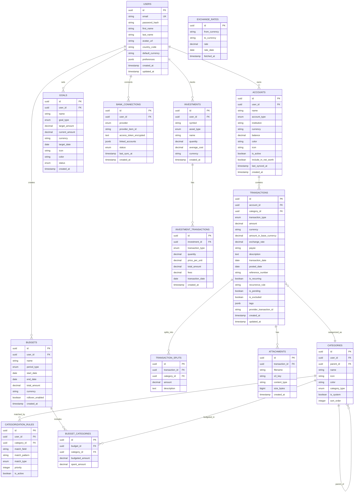
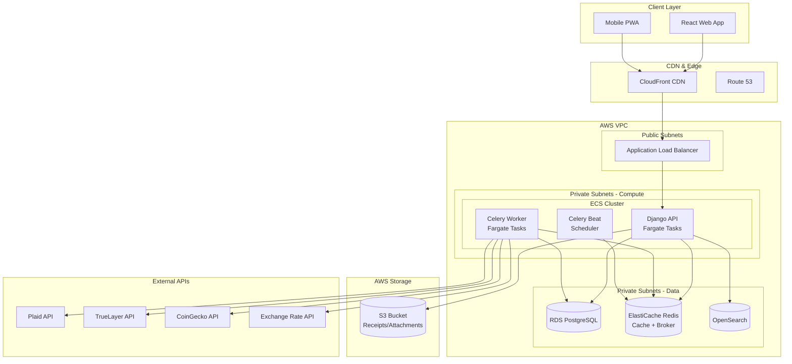
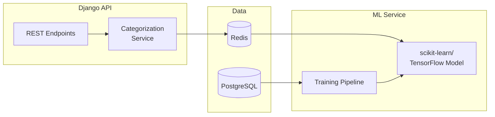
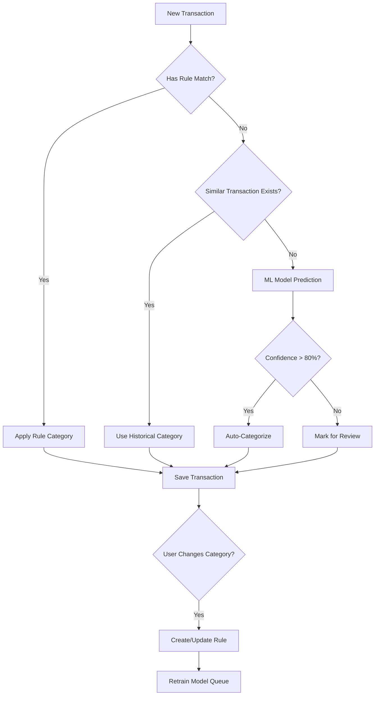

# Project 6 of 8: Personal Finance Tracker

## 1. Project Overview

### Project Name and Number
**Project 6 of 8: Personal Finance Tracker**

### Executive Summary
A secure, user-focused platform for individuals and families to manage income, expenses, budgets, investments, and financial goals. The system enables users to track transactions, analyze spending by category and period, connect external accounts, receive personalized insights, plan budgets, and visualize all financial data. Built with Python and Django, this project demonstrates Django best practices, financial API integrations, and multi-currency handling.

### Target Audience
- **Individuals and Families:** Managing household budgets, tracking spending, and building savings
- **Small Business Owners/Freelancers:** Tracking personal and business finances, invoicing, taxes
- **Power Users:** Integrating with banking APIs, monitoring investments, tracking crypto/stocks

### Key Value Propositions
1. **Comprehensive Tracking** – Record and categorize all incomes, expenses, transfers, and investments
2. **Automated Data Import** – Connect to banks and brokers for real-time updates; bulk CSV import
3. **Smart Budgeting** – Monthly/weekly budgets with alerts on overspending
4. **Insights & Analytics** – Dashboards, charts, and reports by category, merchant, time period
5. **Investment Tracking** – Monitor stocks, ETFs, crypto with real-time pricing
6. **Multi-Currency Support** – Automatic conversion with exchange rate history
7. **Security & Privacy** – Data isolation, encryption, audit logs, GDPR compliance

### Developer Learning Objectives
- Build full-stack applications with Django and Django REST Framework
- Implement financial API integrations (Plaid, banking, crypto)
- Handle multi-currency transactions and exchange rates
- Design complex categorization and rule-based systems
- Build dashboard analytics with aggregations
- Master Django ORM for complex queries

---

## 2. Detailed Functional Requirements

### 2.1 User Management & Authentication
- **Registration & Login**
  - Email/password with strong requirements
  - OAuth (Google, Microsoft)
  - Open Banking OAuth (Plaid, TrueLayer)
  - Email verification and 2FA
  - Session and device management

- **Profile Management**
  - Name, picture/avatar
  - Home country and default currency
  - Notification settings
  - Data export and deletion

- **Multi-Profile Support**
  - Multiple users per account (family/partner)
  - Per-user spending views
  - Shared budgets and goals

- **Privacy & Compliance**
  - Account deletion
  - Full data export
  - Transaction anonymization options
  - GDPR/CCPA compliance

### 2.2 Core Business Logic (Account Management)
- **Account Types**
  - Bank accounts, credit cards, cash, wallets
  - Investment accounts, loans, assets
  - Custom account types

- **API Integrations**
  - Plaid/TrueLayer for banking OAuth
  - Real-time, daily, or manual sync
  - Robust error/retry handling
  - User notification on sync failures

- **Manual Import**
  - CSV/XLS import wizard
  - Column mapping UI
  - Duplicate detection
  - Error reporting for bad data

- **Account Management**
  - Nickname, color, icon
  - Group by type/usage
  - Archive/inactivate options
  - Sync schedule configuration

### 2.3 Search & Discovery
- **Transaction Search**
  - Full-text and advanced filtering
  - Search payees, notes, categories, tags
  - Faceted filtering (amount, account, date, category)
  - Saved queries as quick-access views

- **Smart Views**
  - "All Amazon purchases over $100 in 2024"
  - "Unreconciled over last 90 days"
  - "Groceries above planned budget"

### 2.4 Notifications & Communication
- **Alert Types**
  - Large/suspicious transactions
  - Goal/budget progress
  - Periodic summaries (weekly/monthly)
  - Bill due reminders

- **Delivery Channels**
  - Email notifications
  - SMS via Twilio
  - In-app notifications
  - Push notifications

### 2.5 Analytics & Reporting
- **Dashboards**
  - Cashflow over time
  - Net worth tracking
  - Category spending breakdown
  - Monthly trend lines
  - Period comparisons

- **Reports**
  - Filter by account, category, merchant, date
  - Export: CSV, XLS, PDF
  - Scheduled email delivery
  - Webhook export

- **Automated Insights**
  - Unusual transaction flagging
  - Duplicate detection
  - Payment predictions
  - Merchant spending analysis

### 2.6 File Management
- **Receipt Attachments**
  - Upload receipts, invoices, statements
  - Image and PDF support
  - S3/MinIO storage
  - Virus scan and validation

- **Bulk Operations**
  - Import/export receipts
  - Batch transaction uploads
  - Zipped PDF archive for tax/reporting

### 2.7 External Integrations
- **Banking APIs**
  - Plaid for US/Canada
  - TrueLayer for EU/UK
  - Sync triggers via queue
  - MFA/reauth handling

- **Price APIs**
  - CoinGecko for crypto prices
  - Alpha Vantage/Yahoo Finance for stocks
  - Exchange rate APIs for currency conversion
  - Scheduled updates with caching

- **Calendar Integration**
  - Push due dates to Google/O365 Calendar
  - iCal/email/SMS reminders

- **Webhooks**
  - "On new expense" triggers
  - "Budget exceeded" alerts
  - "Goal reached" notifications

### 2.8 Accessibility & Internationalization
- **Accessibility (WCAG 2.1 AA)**
  - Full keyboard navigation
  - ARIA labels and roles
  - Color contrast compliance
  - Screen reader support

- **Localization**
  - Multi-language UI and messages
  - Currency/date/locale formatting
  - i18n string management

### 2.9 Security & Compliance
- **Data Security**
  - Secure password hashing (Argon2/bcrypt)
  - Per-session token invalidation
  - RBAC at API and DB levels
  - Input validation and sanitization

- **API Security**
  - Rate limiting
  - CORS configuration
  - Helmet-equivalent security headers
  - Secrets via environment or vault

- **Audit & Compliance**
  - Logging for sensitive actions
  - Profile edit tracking
  - Failed login monitoring
  - API key usage audit
  - GDPR data handling

---

## 3. Technical Stack Specification

```yaml
Backend:
  Runtime: Python 3.11+
  Framework: Django 4.2 LTS
  API_Style: REST (Django REST Framework)
  ORM: Django ORM
  Validation: Django Forms, DRF Serializers
  Documentation: drf-spectacular (OpenAPI)
  Async_Tasks: Celery with Redis broker

Frontend:
  Framework: Next.js 14
  State_Management: Redux Toolkit / React Query
  Styling: TailwindCSS 3.x
  Charts: D3.js / Chart.js
  Forms: React Hook Form + Zod

Databases:
  Primary_SQL: PostgreSQL 15
  Search_Engine: Elasticsearch 8.x
  Cache: Redis 7.x

Message_Queue:
  Queue: Celery (Redis broker)
  Scheduler: Celery Beat

File_Storage:
  Development: MinIO
  Production: AWS S3

Authentication:
  Strategy: Django Auth + DRF TokenAuth
  Tokens: JWT via djangorestframework-simplejwt
  OAuth: django-allauth

Infrastructure:
  Containerization: Docker + Docker Compose
  Orchestration: Kubernetes (Helm Charts)
  CI_CD: GitHub Actions
  IaC: Terraform

AWS_Services:
  Compute: ECS Fargate
  Database: RDS (Postgres)
  Search: OpenSearch Service
  Cache: ElastiCache (Redis)
  Storage: S3
  Secrets: AWS Secrets Manager
  Scheduler: Lambda + EventBridge
  Monitoring: CloudWatch

Monitoring_Observability:
  Metrics: Prometheus + Grafana
  Logging: structlog → ELK Stack
  Error_Tracking: Sentry
```

---

## 4. Database Schema Design

### Entity Relationship Diagram (PostgreSQL)



---

## 5. Technical Architecture Diagram



---

## 6. AWS Deployment Architecture

### Compute Strategy
- **ECS Fargate** for Django API and Celery workers
- **Celery Beat** in separate container for scheduling
- Auto-scaling based on request volume and queue depth
- Blue-green deployments with health checks

### Database Strategy
- **RDS PostgreSQL Multi-AZ** for financial data
- Read replica for reporting queries
- Point-in-time recovery for compliance
- Encrypted at rest with KMS

### Financial Data Sync
- **EventBridge** schedules daily bank syncs
- **Celery tasks** for transaction import
- Idempotent processing with transaction deduplication
- Token refresh handling for bank connections

### Storage Strategy
- **S3** for receipt and statement storage
- Versioning for compliance
- Lifecycle policies for archival
- Encrypted with customer-managed keys

### CI/CD Pipeline
```yaml
Pipeline:
  1. Push to GitHub → Trigger Actions
  2. Run Django tests (pytest-django)
  3. Type checking (mypy)
  4. Linting (ruff/flake8)
  5. Build Docker Images
  6. Push to ECR
  7. Run migrations
  8. Deploy to Staging
  9. Integration Tests
  10. Deploy to Production
```

---

## 7. AI/ML Feature Specification

### Use Case: Smart Categorization & Spending Predictions

#### Problem Statement
Users want automatic transaction categorization and spending predictions to help them budget effectively.

#### Model Architecture
1. **Transaction Categorization Model**
   - Type: Multi-class text classification
   - Input: Transaction description, payee, amount, date patterns
   - Output: Category prediction with confidence score
   - Algorithm: Gradient Boosting / Neural Network

2. **Spending Prediction Model**
   - Type: Time-series forecasting
   - Input: Historical spending by category, seasonal patterns
   - Output: Predicted spending for next period
   - Algorithm: Prophet / ARIMA / LSTM

#### Architecture Integration


#### Data Flow
1. **Training Pipeline**
   - Extract labeled transactions from database
   - Feature engineering: TF-IDF on descriptions, time features
   - Train model with cross-validation
   - Deploy to model registry

2. **Inference Flow**
   - New transaction arrives
   - If no rule matches, call ML model
   - Return category with confidence
   - User feedback improves model

---

## 8. API Design (Django REST Framework)

```python
# urls.py structure
from django.urls import path, include
from rest_framework.routers import DefaultRouter

router = DefaultRouter()
router.register(r'accounts', AccountViewSet)
router.register(r'transactions', TransactionViewSet)
router.register(r'categories', CategoryViewSet)
router.register(r'budgets', BudgetViewSet)
router.register(r'goals', GoalViewSet)

urlpatterns = [
    path('api/v1/', include(router.urls)),
    path('api/v1/bank-connections/', BankConnectionView.as_view()),
    path('api/v1/analytics/', include('analytics.urls')),
]

# views.py examples
class TransactionViewSet(viewsets.ModelViewSet):
    """
    CRUD for transactions with filtering and search.
    """
    serializer_class = TransactionSerializer
    permission_classes = [IsAuthenticated]
    filter_backends = [DjangoFilterBackend, SearchFilter, OrderingFilter]
    filterset_fields = ['account', 'category', 'transaction_type', 'is_pending']
    search_fields = ['payee', 'description', 'tags']
    ordering_fields = ['transaction_date', 'amount', 'created_at']
    
    def get_queryset(self):
        return Transaction.objects.filter(
            account__user=self.request.user
        ).select_related('account', 'category')
    
    @action(detail=False, methods=['post'])
    def import_csv(self, request):
        """Import transactions from CSV file."""
        pass
    
    @action(detail=False, methods=['get'])
    def summary(self, request):
        """Get transaction summary by category/period."""
        pass


class AnalyticsView(APIView):
    """Analytics endpoints for dashboards."""
    
    def get(self, request):
        """
        Get cashflow, spending breakdown, and trends.
        
        Query params:
        - period: month/quarter/year
        - start_date: YYYY-MM-DD
        - end_date: YYYY-MM-DD
        """
        pass


class BankConnectionView(APIView):
    """Handle Plaid/TrueLayer bank connections."""
    
    def post(self, request):
        """Create link token for Plaid Link."""
        pass
    
    def put(self, request, connection_id):
        """Exchange public token for access token."""
        pass
    
    @action(detail=True, methods=['post'])
    def sync(self, request, connection_id):
        """Trigger manual sync for bank connection."""
        pass
```

---

## 9. Monorepo Structure

```
personal-finance-tracker/
├── apps/
│   ├── api/                    # Django Application
│   │   ├── finance/           # Main Django project
│   │   │   ├── settings/
│   │   │   │   ├── base.py
│   │   │   │   ├── development.py
│   │   │   │   └── production.py
│   │   │   ├── urls.py
│   │   │   └── wsgi.py
│   │   ├── accounts/          # Django app: User accounts
│   │   ├── transactions/      # Django app: Transactions
│   │   ├── budgets/           # Django app: Budgets
│   │   ├── goals/             # Django app: Goals
│   │   ├── investments/       # Django app: Investments
│   │   ├── analytics/         # Django app: Analytics
│   │   ├── integrations/      # Django app: External APIs
│   │   │   ├── plaid/
│   │   │   ├── truelayer/
│   │   │   └── prices/
│   │   └── manage.py
│   ├── worker/                 # Celery Workers
│   │   └── tasks/
│   │       ├── bank_sync.py
│   │       ├── price_update.py
│   │       ├── notifications.py
│   │       └── reports.py
│   └── web/                    # React Frontend
│       └── src/
│           ├── pages/
│           │   ├── dashboard/
│           │   ├── transactions/
│           │   ├── budgets/
│           │   └── reports/
│           └── components/
├── libs/
│   ├── categorization/        # ML categorization
│   └── currency/              # Currency utilities
├── infrastructure/
│   ├── terraform/
│   └── helm/
├── docker-compose.yml
├── requirements/
│   ├── base.txt
│   ├── development.txt
│   └── production.txt
└── manage.py
```

---

## 10. Transaction Categorization Flow



---

## 11. Success Criteria

1. **Data Sync Reliability**: 99.9% successful bank sync rate
2. **Categorization Accuracy**: >85% auto-categorization accuracy
3. **Performance**: Dashboard loads in <2 seconds with 5 years of data
4. **Security**: Pass financial security audit, PCI-DSS awareness
5. **Compliance**: Full GDPR compliance with data export/deletion
6. **Test Coverage**: >90% code coverage with Django tests
7. **Uptime**: 99.9% availability for core API

---

*Last Updated: December 2024*
