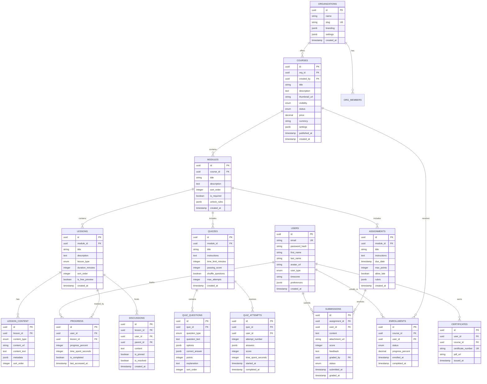

# Project 7 of 8: E-Learning Platform

## 1. Project Overview

### Project Name and Number
**Project 7 of 8: E-Learning Platform**

### Executive Summary
A modern, scalable e-learning platform for educators, students, organizations, and coaches. The system supports course creation, enrollment, modular learning, assignments, progress tracking, live classes, interactive quizzes, discussions, notifications, analytics, and certification. This hybrid architecture combines a Node.js API Gateway with Python AI services for intelligent content recommendations and adaptive learning paths.

### Target Audience
- **Educators & Trainers:** Individual teachers, corporate trainers, universities delivering structured courses
- **Students/Learners:** Individuals enrolling for self-paced or instructor-led learning
- **Organizations:** HR/L&D teams managing onboarding, compliance, and upskilling
- **Content Creators & Coaches:** Subject matter experts sharing courses and selling access
- **Developers/Integrators:** Embedding e-learning into parent portals or mobile apps

### Key Value Propositions
1. **Comprehensive Learning** – Courses, modules, lessons, assignments, quizzes, and live classes
2. **Powerful Authoring** – Drag-drop tools, reusable modules, rich media, versioning
3. **Intelligent Recommendations** – AI-powered content suggestions and adaptive learning paths
4. **Engagement Features** – Threaded discussions, announcements, gamification, badges
5. **Assessment & Feedback** – Auto-graded quizzes, assignment submission, rubric grading
6. **Analytics** – Dashboards for engagement, scores, completion, retention
7. **Standards Compliance** – SCORM/xAPI import, LTI integration, SSO support

### Developer Learning Objectives
- Build hybrid Node.js + Python microservices architecture
- Implement gRPC communication between services
- Design AI/ML pipelines for recommendations
- Handle video streaming and SCORM content
- Build real-time quiz and discussion features
- Master event-driven architecture with Kafka

---

## 2. Detailed Functional Requirements

### 2.1 User Management & Authentication
- **Registration & Login**
  - Email/password with email verification
  - OAuth2 (Google, Microsoft)
  - SSO (SAML, OIDC) for enterprise
  - Optional 2FA

- **Profile Management**
  - Avatar upload (S3/CDN)
  - Bio, timezone, skills/interests
  - User type: student, coordinator, instructor, admin
  - Notification preferences

- **Organization & Groups**
  - Multi-org tenancy
  - Invite users, assign courses/batches
  - Team/role management
  - Fine-grained RBAC

### 2.2 Core Business Logic (Course Creation)
- **Course Management**
  - CRUD with draft/publish status
  - Visibility: public, private, paid, invite-only, drip
  - Multi-module structure with ordered lessons
  - Autosave, revision, rollback
  - Collaborative authoring with activity log

- **Content Types**
  - Video (mp4, external, embed)
  - Documents, images, slides
  - External links (YouTube, Google Drive)
  - S3/MinIO file manager
  - SCORM/xAPI packages

- **Reusable Resources**
  - Lesson library
  - Question banks
  - Slide templates
  - Checklists

### 2.3 Search & Discovery
- **Elasticsearch-Powered Search**
  - Instant search for courses, lessons, users
  - Fuzzy search with autocomplete
  - Advanced filters (quiz, assignment, instructor, date)

- **Discovery Features**
  - Recommended courses (AI-powered)
  - Trending courses
  - Category browsing
  - Tag-based discovery

### 2.4 Notifications & Communication
- **Announcement System**
  - Course/group/module targeted
  - In-app, email, push, SMS
  - Scheduling and history

- **Discussion Forums**
  - Per lesson/module/course threads
  - Markdown support, attachments
  - User tagging and moderator controls

- **Live Classes**
  - Video integration (Zoom/Jitsi/BBB)
  - Calendar invites
  - Attendance tracking
  - Recording uploads

### 2.5 Analytics & Reporting
- **Progress Tracking**
  - Per student and group
  - Visual timeline
  - Streak tracking
  - Inactivity reminders

- **Analytics Dashboards**
  - Enrollment funnel
  - Video completion rates
  - Quiz and assignment scores
  - Drop-off analysis

- **Certificate Engine**
  - Configurable templates
  - Auto/gated issuance
  - PDF export
  - Public verification API

### 2.6 File Management
- **Media Storage**
  - S3/MinIO for video, docs, images
  - Signed URLs for upload/download
  - AV scan on upload
  - Quotas per user/org

- **Video Streaming**
  - HLS/DASH adaptive streaming
  - CloudFront CDN delivery
  - Progress tracking

### 2.7 External Integrations
- **Learning Standards**
  - SCORM 1.2/2004 import
  - xAPI (Tin Can) support
  - LTI 1.3 provider/consumer

- **Payment Processors**
  - Stripe subscription/one-time
  - PayPal integration
  - Invoice generation

- **Third-Party Services**
  - SSO providers
  - Calendar APIs
  - SendGrid/Twilio for notifications

- **Webhooks**
  - Completion events
  - Submission triggers
  - Score updates

### 2.8 Accessibility & Internationalization
- **Accessibility (WCAG 2.1 AA+)**
  - Keyboard navigation
  - Screen reader support
  - Video captions and transcripts
  - axe-core CI testing

- **Localization**
  - Multi-language UI
  - Date/time/currency localization
  - i18next integration

### 2.9 Security & Compliance
- **Authentication**
  - Passport.js (JWT, OAuth, SAML)
  - Role context in all requests
  - Per-org/per-course scope

- **Authorization**
  - RBAC guards on all endpoints
  - Permission checks at resolver/service level

- **Compliance**
  - GDPR data access/erase
  - FERPA readiness
  - COPPA parental consent
  - Academic integrity checks

---

## 3. Technical Stack Specification

```yaml
# Node.js API Gateway
Node_Gateway:
  Runtime: Node.js 20 LTS
  Framework: NestJS 10.x
  API_Style: REST + GraphQL (Apollo)
  ORM: Prisma 5.x
  Validation: class-validator, Zod
  Documentation: OpenAPI, GraphQL Playground

# Python AI Service
Python_AI:
  Runtime: Python 3.11+
  Framework: FastAPI 0.100+
  ML_Libraries: scikit-learn, TensorFlow, PyTorch
  Communication: gRPC
  Validation: Pydantic v2

Frontend:
  Framework: React 18 / Next.js 14
  State_Management: React Query / Zustand
  Styling: TailwindCSS 3.x
  Video_Player: Video.js / Plyr

Databases:
  Primary_SQL: PostgreSQL 15
  Search_Engine: Elasticsearch 8.x
  Cache: Redis 7.x

Message_Queue:
  Queue: BullMQ (Redis-backed)
  Event_Streaming: Apache Kafka

File_Storage:
  Development: MinIO
  Production: AWS S3 + CloudFront CDN

Video:
  Streaming: HLS via CloudFront
  Transcoding: AWS MediaConvert

Authentication:
  Strategy: Passport.js
  Tokens: JWT (RS256)
  OAuth: Google, Microsoft
  SSO: SAML 2.0, OIDC

Infrastructure:
  Containerization: Docker + Docker Compose
  Orchestration: Kubernetes (Helm Charts)
  CI_CD: GitHub Actions
  IaC: Terraform

AWS_Services:
  Compute: ECS Fargate
  Database: RDS (Postgres)
  Search: OpenSearch Service
  Cache: ElastiCache (Redis)
  Storage: S3
  Video: MediaConvert, CloudFront
  Streaming: MSK (Kafka)
  Secrets: AWS Secrets Manager
  Monitoring: CloudWatch

Monitoring_Observability:
  Metrics: Prometheus + Grafana
  Logging: Winston/structlog → ELK Stack
  Error_Tracking: Sentry
  Tracing: OpenTelemetry + Jaeger
```

---

## 4. Database Schema Design

### Entity Relationship Diagram (PostgreSQL)



---

## 5. Technical Architecture Diagram


---

## 6. AWS Deployment Architecture

### Compute Strategy
- **Node.js API Gateway** on ECS Fargate for main API
- **Python AI Service** on ECS Fargate with GPU support (optional)
- **Workers** for async jobs (grading, notifications, video processing)
- Auto-scaling based on request count and Kafka lag

### AI Service Communication
- **gRPC** for low-latency synchronous calls (recommendations)
- **Kafka** for async ML training events
- Service mesh for secure inter-service communication

### Video Handling
- **S3** for video upload and storage
- **MediaConvert** for HLS transcoding
- **CloudFront** for global video delivery
- Progress tracking via lesson completion events

### Event-Driven Architecture
- **Kafka** for event streaming between services
- Topics: enrollments, completions, submissions, grades
- AI service consumes events for model updates

### CI/CD Pipeline
```yaml
Pipeline:
  1. Push to GitHub → Trigger Actions
  
  # Node.js Services
  2. Run NestJS tests
  3. Build Node Docker images
  
  # Python AI Services
  4. Run pytest
  5. Build Python Docker images
  
  6. Push all to ECR
  7. Deploy to Staging
  8. Integration Tests (gRPC, Kafka)
  9. Deploy to Production
```

---

## 7. AI/ML Feature Specification

### Use Case 1: Content Recommendations

#### Problem Statement
Students need personalized course and lesson recommendations based on their learning history, progress, and goals.

#### Model Architecture
- **Type:** Hybrid Collaborative + Content-Based Filtering
- **Input:** User progress, completions, quiz scores, browsing history, similar users
- **Output:** Ranked list of recommended courses/lessons


### Use Case 2: Adaptive Learning Paths

#### Problem Statement
The platform should adapt lesson difficulty and content based on student performance.

#### Model Architecture
- **Type:** Reinforcement Learning / Bayesian Knowledge Tracing
- **Input:** Quiz scores, time spent, incorrect answers, help requests
- **Output:** Adjusted difficulty, prerequisite recommendations, remedial content

#### Implementation
```python
# Adaptive difficulty adjustment
class AdaptiveLearningService:
    def get_next_lesson(self, user_id: str, course_id: str) -> LessonRecommendation:
        # Get user's knowledge state
        knowledge_state = self.knowledge_model.get_state(user_id, course_id)
        
        # Get available lessons
        lessons = self.lesson_repo.get_remaining(user_id, course_id)
        
        # Score each lesson based on knowledge state
        scored_lessons = [
            (lesson, self.score_lesson(lesson, knowledge_state))
            for lesson in lessons
        ]
        
        # Select optimal lesson (zone of proximal development)
        return self.select_optimal(scored_lessons)
    
    def update_knowledge_state(self, user_id: str, quiz_result: QuizResult):
        # Update Bayesian knowledge model
        self.knowledge_model.update(user_id, quiz_result)
```

### Use Case 3: Auto-Grading Written Answers

#### Problem Statement
Grade short-answer and essay questions automatically using NLP.

#### Model Architecture
- **Type:** Semantic similarity / Fine-tuned LLM
- **Input:** Student answer, rubric, reference answers
- **Output:** Score, feedback, confidence

---

## 8. gRPC Service Definition

```protobuf
syntax = "proto3";

package elearning.ai;

service RecommendationService {
    // Get personalized course recommendations
    rpc GetCourseRecommendations(RecommendationRequest) 
        returns (CourseRecommendations);
    
    // Get next lesson recommendation
    rpc GetNextLesson(NextLessonRequest) 
        returns (LessonRecommendation);
    
    // Update user model with new activity
    rpc UpdateUserModel(UserActivityEvent) 
        returns (UpdateResponse);
}

service GradingService {
    // Auto-grade a written answer
    rpc GradeAnswer(GradeRequest) 
        returns (GradeResponse);
    
    // Get feedback for an answer
    rpc GetFeedback(FeedbackRequest) 
        returns (FeedbackResponse);
}

message RecommendationRequest {
    string user_id = 1;
    int32 limit = 2;
    repeated string exclude_course_ids = 3;
}

message CourseRecommendations {
    repeated CourseRecommendation recommendations = 1;
}

message CourseRecommendation {
    string course_id = 1;
    string title = 2;
    float score = 3;
    string reason = 4;
}

message NextLessonRequest {
    string user_id = 1;
    string course_id = 2;
}

message LessonRecommendation {
    string lesson_id = 1;
    string module_id = 2;
    float difficulty_score = 3;
    repeated string prerequisites = 4;
}

message GradeRequest {
    string question_id = 1;
    string student_answer = 2;
    string reference_answer = 3;
    string rubric = 4;
}

message GradeResponse {
    float score = 1;
    float confidence = 2;
    string feedback = 3;
}
```

---

## 9. Monorepo Structure

```
e-learning-platform/
├── apps/
│   ├── gateway/                # NestJS API Gateway
│   │   ├── src/
│   │   │   ├── modules/
│   │   │   │   ├── auth/
│   │   │   │   ├── users/
│   │   │   │   ├── courses/
│   │   │   │   ├── enrollments/
│   │   │   │   ├── lessons/
│   │   │   │   ├── quizzes/
│   │   │   │   ├── assignments/
│   │   │   │   ├── certificates/
│   │   │   │   ├── discussions/
│   │   │   │   └── payments/
│   │   │   ├── grpc/
│   │   │   │   └── ai-client.ts
│   │   │   └── main.ts
│   │   └── test/
│   ├── worker/                 # Node.js Worker
│   │   └── src/
│   │       ├── jobs/
│   │       │   ├── notifications/
│   │       │   ├── video-processing/
│   │       │   └── certificate-generation/
│   │       └── processors/
│   ├── ai-service/             # Python AI Service
│   │   ├── src/
│   │   │   ├── api/
│   │   │   │   ├── grpc_server.py
│   │   │   │   └── routes.py
│   │   │   ├── models/
│   │   │   │   ├── recommendation/
│   │   │   │   ├── adaptive_learning/
│   │   │   │   └── grading/
│   │   │   ├── services/
│   │   │   └── main.py
│   │   ├── tests/
│   │   └── requirements.txt
│   ├── ml-worker/              # Python ML Training
│   │   └── src/
│   │       ├── pipelines/
│   │       └── training/
│   └── web/                    # React Frontend
│       └── src/
├── libs/
│   ├── db/                     # Prisma schema
│   ├── types/                  # Shared TypeScript types
│   ├── grpc-protos/            # gRPC definitions
│   └── kafka-events/           # Event schemas
├── infrastructure/
│   ├── terraform/
│   ├── helm/
│   └── kafka/
├── docker-compose.yml
└── package.json
```

---

## 10. Success Criteria

1. **AI Recommendation Quality**: >70% click-through rate on recommendations
2. **Adaptive Learning**: 15% improvement in quiz scores with adaptive paths
3. **Video Performance**: <2 second start time for video playback globally
4. **Scale**: Support 10,000+ concurrent learners
5. **gRPC Latency**: <50ms for recommendation calls
6. **Test Coverage**: >90% for both Node.js and Python services
7. **SCORM Compliance**: Pass ADL SCORM conformance tests

---

*Last Updated: December 2024*
