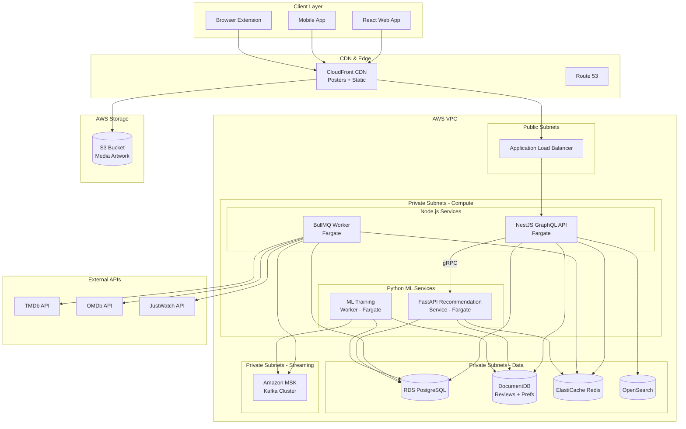
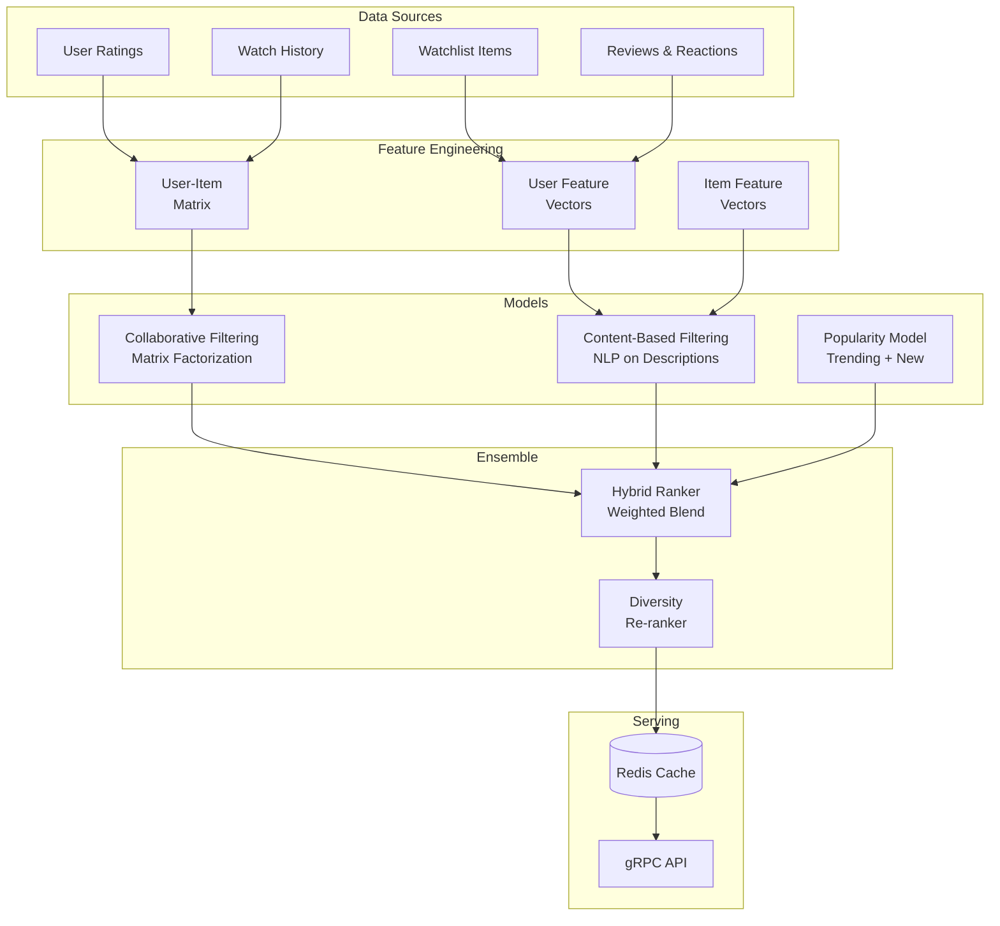

# Project 8 of 8: Movie/Media Watchlist Manager

## 1. Project Overview

### Project Name and Number
**Project 8 of 8: Movie/Media Watchlist Manager**

### Executive Summary
A modern, extensible movie and TV show cataloging platform enabling users to track what they watch, maintain personal and shared watchlists, review and rate titles, discover recommendations, and sync with third-party content APIs. This hybrid architecture combines a Node.js API with a Python recommendation engine, demonstrating advanced ML techniques for personalized content discovery.

### Target Audience
- **Individuals:** Users tracking movies/shows they've watched, want to watch, or own
- **Film/TV Enthusiast Communities:** Movie clubs with shared lists and group ratings
- **Reviewers/Bloggers:** Writers sharing public reviews requiring discoverability
- **Families:** Maintaining shared watchlists with multiple profiles
- **App Developers:** Integrating via public API for watchlist management

### Key Value Propositions
1. **Unified Catalog** – One place to manage all watched, owned, and planned media
2. **Rich Metadata** – Title, year, cast, genres, streaming availability from TMDb/OMDb
3. **Personalization** – Custom lists, personal ratings, episode tracking
4. **AI-Powered Recommendations** – ML-based suggestions from viewing history and preferences
5. **Social Features** – Follow friends, compare lists, share recommendations
6. **Powerful Search** – Full-text fuzzy search with filtering and analytics
7. **Multi-Platform** – API for web, mobile, browser extensions, smart TVs

### Developer Learning Objectives
- Build recommendation systems with collaborative filtering
- Implement content-based filtering using NLP
- Design hybrid recommendation architectures
- Handle large-scale media metadata management
- Build real-time activity feeds
- Master model deployment and A/B testing

---

## 2. Detailed Functional Requirements

### 2.1 User Management & Authentication
- **Registration & Login**
  - Email/password with email verification
  - OAuth2 (Google, Facebook, Apple, optional TMDb)
  - Optional 2FA
  - Session and device management

- **Profile Management**
  - Avatar upload (S3/CDN)
  - Display name, bio, location
  - Social links and timezone
  - Privacy settings (public/private/friends-only)

- **Multi-Profile Support**
  - Family accounts with multiple profiles
  - Kid mode and guest profiles
  - Profile switching

### 2.2 Core Business Logic (Watchlist Management)
- **Lists & Watchlists**
  - Create multiple custom lists
  - System lists: Favorites, To Watch, Watching, Completed
  - Add/remove/reorder items
  - Drag-and-drop management
  - List sharing and collaboration

- **Library Views**
  - All watched and owned titles
  - Filter by any metadata
  - Mark as owned (Blu-ray, streaming, etc.)
  - Collection management

- **Media Cataloging**
  - Search TMDb/OMDb APIs for titles
  - Manual entry option
  - Batch import (CSV, IMDB export)
  - TV show episode tracking
  - Watch/rewatch tracking

- **Metadata Management**
  - Director, cast, genres, language
  - Runtime, trailers, streaming sources
  - Posters and artwork
  - MPAA ratings

### 2.3 Search & Discovery
- **Elasticsearch-Powered Search**
  - Full-text search on titles, actors, directors
  - Fuzzy matching with autocomplete
  - Faceted filtering (genre, year, rating, streaming)

- **Discovery Features**
  - Trending titles (user, friends, global)
  - New releases
  - AI-powered recommendations
  - Daily/weekly highlights

- **Release Calendar**
  - Upcoming releases subscription
  - Per-list/tag/franchise alerts
  - Email/SMS notifications

### 2.4 Notifications & Communication
- **Notification Types**
  - Friend activity updates
  - New title availability
  - Reminder notifications
  - Comment mentions
  - Release/premiere dates

- **Delivery Channels**
  - Web notifications
  - Push notifications
  - Email digests
  - Per-user granularity

### 2.5 Analytics & Reporting
- **Personal Analytics**
  - Viewing streaks
  - Genre breakdown
  - Director/actor statistics
  - Watch time analysis

- **Social Analytics**
  - Top unwatched recommendations
  - Historical viewing data
  - Friend comparison

- **Export Capabilities**
  - CSV/JSON export
  - Lists, ratings, reviews, notes
  - Import from other services

### 2.6 File Management
- **Artwork Storage**
  - S3/MinIO for custom artwork
  - Multiple resolutions
  - CDN-backed delivery
  - Attachment quotas

### 2.7 External Integrations
- **Content APIs**
  - TMDb for metadata and images
  - OMDb for additional data
  - JustWatch for streaming availability
  - Scheduled enrichment jobs

- **Calendar Integration**
  - Google Calendar/O365/iCal
  - Dynamic .ics generation
  - "Add to Calendar" links

- **Webhooks**
  - Watched/added/removed events
  - Review events
  - HMAC signed outbound
  - Error/retry logging

- **Browser Extension API**
  - Quick-add from streaming sites
  - Mark as watched
  - Token-based authentication

### 2.8 Accessibility & Internationalization
- **Accessibility (WCAG 2.1 AA)**
  - Keyboard navigation
  - ARIA labels
  - High contrast mode
  - Screen reader support

- **Localization**
  - Multi-language UI
  - i18next integration
  - Date/time localization

### 2.9 Security & Compliance
- **Authentication Security**
  - JWT/OAuth tokens
  - SSO provider support
  - Session management

- **Data Privacy**
  - Visibility options per list/review
  - Analytics opt-out
  - Third-party consent
  - Data deletion/export
  - Full audit logging

---

## 3. Technical Stack Specification

```yaml
# Node.js API
Node_API:
  Runtime: Node.js 20 LTS
  Framework: NestJS 10.x + Apollo GraphQL
  API_Style: GraphQL (primary) + REST (batch/files)
  ORM: Prisma 5.x
  Validation: class-validator, Zod
  Real_Time: GraphQL Subscriptions

# Python Recommendation Service
Python_Recommendation:
  Runtime: Python 3.11+
  Framework: FastAPI 0.100+
  ML_Libraries: scikit-learn, Surprise, TensorFlow
  Communication: gRPC + Kafka
  Validation: Pydantic v2

Frontend:
  Framework: Next.js 14
  State_Management: Apollo Client + Zustand
  Styling: TailwindCSS 3.x
  Forms: React Hook Form + Zod

Databases:
  Primary_SQL: PostgreSQL 15
  Document_Store: MongoDB 7.0 (reviews, notes)
  Search_Engine: Elasticsearch 8.x
  Cache: Redis 7.x

Message_Queue:
  Queue: BullMQ (Redis-backed)
  Event_Streaming: Apache Kafka

File_Storage:
  Development: MinIO
  Production: AWS S3 + CloudFront CDN

Authentication:
  Strategy: Passport.js
  Tokens: JWT (RS256)
  OAuth: Google, Facebook, Apple

Infrastructure:
  Containerization: Docker + Docker Compose
  Orchestration: Kubernetes (Helm Charts)
  CI_CD: GitHub Actions
  IaC: Terraform

AWS_Services:
  Compute: ECS Fargate
  Database: RDS (Postgres), DocumentDB (MongoDB)
  Search: OpenSearch Service
  Cache: ElastiCache (Redis)
  Storage: S3
  Streaming: MSK (Kafka)
  Secrets: AWS Secrets Manager
  Monitoring: CloudWatch

Monitoring_Observability:
  Metrics: Prometheus + Grafana
  Logging: Winston/structlog → ELK Stack
  Error_Tracking: Sentry
  Tracing: OpenTelemetry + Jaeger
```

---

## 4. Database Schema Design

### Entity Relationship Diagram (PostgreSQL)

```mermaid
erDiagram
    USERS ||--o{ PROFILES : has
    USERS ||--o{ FOLLOWS : follows
    
    PROFILES ||--o{ LISTS : creates
    PROFILES ||--o{ RATINGS : gives
    PROFILES ||--o{ REVIEWS : writes
    PROFILES ||--o{ WATCH_HISTORY : tracks
    
    LISTS ||--o{ LIST_ITEMS : contains
    
    MEDIA ||--o{ LIST_ITEMS : in_list
    MEDIA ||--o{ RATINGS : receives
    MEDIA ||--o{ REVIEWS : receives
    MEDIA ||--o{ WATCH_HISTORY : watched
    MEDIA ||--o{ MEDIA_GENRES : has
    MEDIA ||--o{ MEDIA_CAST : features
    
    TV_SHOWS ||--o{ SEASONS : has
    SEASONS ||--o{ EPISODES : contains
    EPISODES ||--o{ EPISODE_PROGRESS : tracked_by
    
    USERS {
        uuid id PK
        string email UK
        string password_hash
        string display_name
        string avatar_url
        jsonb settings
        timestamp created_at
    }
    
    PROFILES {
        uuid id PK
        uuid user_id FK
        string name
        string avatar_url
        boolean is_kid_profile
        jsonb preferences
        timestamp created_at
    }
    
    MEDIA {
        uuid id PK
        string tmdb_id UK
        string imdb_id
        enum media_type
        string title
        string original_title
        text overview
        date release_date
        integer runtime_minutes
        string poster_path
        string backdrop_path
        float vote_average
        integer vote_count
        jsonb external_ids
        jsonb streaming_availability
        timestamp metadata_updated_at
        timestamp created_at
    }
    
    GENRES {
        uuid id PK
        string name UK
        string tmdb_id
    }
    
    MEDIA_GENRES {
        uuid id PK
        uuid media_id FK
        uuid genre_id FK
    }
    
    PEOPLE {
        uuid id PK
        string tmdb_id UK
        string name
        string profile_path
        date birth_date
        text biography
    }
    
    MEDIA_CAST {
        uuid id PK
        uuid media_id FK
        uuid person_id FK
        string character_name
        string role
        integer order
    }
    
    TV_SHOWS {
        uuid id PK
        uuid media_id FK UK
        integer number_of_seasons
        integer number_of_episodes
        enum status
        date first_air_date
        date last_air_date
    }
    
    SEASONS {
        uuid id PK
        uuid tv_show_id FK
        integer season_number
        string name
        text overview
        string poster_path
        date air_date
        integer episode_count
    }
    
    EPISODES {
        uuid id PK
        uuid season_id FK
        integer episode_number
        string title
        text overview
        date air_date
        integer runtime_minutes
        string still_path
    }
    
    LISTS {
        uuid id PK
        uuid profile_id FK
        string name
        text description
        string icon
        boolean is_public
        boolean is_system
        integer sort_order
        timestamp created_at
    }
    
    LIST_ITEMS {
        uuid id PK
        uuid list_id FK
        uuid media_id FK
        integer position
        text notes
        timestamp added_at
    }
    
    RATINGS {
        uuid id PK
        uuid profile_id FK
        uuid media_id FK
        integer rating
        timestamp rated_at
    }
    
    REVIEWS {
        uuid id PK
        uuid profile_id FK
        uuid media_id FK
        text content
        boolean contains_spoilers
        integer helpful_count
        boolean is_public
        timestamp created_at
        timestamp updated_at
    }
    
    WATCH_HISTORY {
        uuid id PK
        uuid profile_id FK
        uuid media_id FK
        integer watch_count
        timestamp first_watched_at
        timestamp last_watched_at
    }
    
    EPISODE_PROGRESS {
        uuid id PK
        uuid profile_id FK
        uuid episode_id FK
        boolean is_watched
        integer progress_seconds
        timestamp watched_at
    }
    
    FOLLOWS {
        uuid id PK
        uuid follower_id FK
        uuid following_id FK
        timestamp created_at
    }
    
    ACTIVITY_FEED {
        uuid id PK
        uuid profile_id FK
        enum activity_type
        uuid target_id
        jsonb metadata
        timestamp created_at
    }
```

### MongoDB Collections

```javascript
// Extended Reviews Collection
{
  _id: ObjectId,
  reviewId: UUID, // PostgreSQL reference
  profileId: UUID,
  mediaId: UUID,
  content: String,
  reactions: [
    {
      userId: UUID,
      type: String, // "like", "helpful", "funny"
      createdAt: ISODate
    }
  ],
  comments: [
    {
      id: ObjectId,
      userId: UUID,
      content: String,
      createdAt: ISODate,
      updatedAt: ISODate
    }
  ],
  tags: [String],
  updatedAt: ISODate
}

// User Preferences for Recommendations
{
  _id: ObjectId,
  profileId: UUID,
  genrePreferences: {
    action: 0.8,
    comedy: 0.6,
    drama: 0.9,
    // ...
  },
  actorPreferences: [
    { personId: UUID, score: 0.9 }
  ],
  directorPreferences: [
    { personId: UUID, score: 0.85 }
  ],
  viewingPatterns: {
    preferredDecades: ["2010s", "2020s"],
    averageRuntime: 120,
    preferredLanguages: ["en", "ko"]
  },
  lastUpdated: ISODate
}

// Recommendation Cache
{
  _id: ObjectId,
  profileId: UUID,
  recommendationType: String, // "collaborative", "content", "trending"
  recommendations: [
    {
      mediaId: UUID,
      score: Number,
      reason: String
    }
  ],
  generatedAt: ISODate,
  expiresAt: ISODate
}
```

---

## 5. Technical Architecture Diagram



---

## 6. Frontend Functional & Technical Requirements

### 6.1 UI/UX Pages & Screens

| Page/Screen | Description | Key Components |
|-------------|-------------|----------------|
| **Landing Page** | App overview | Hero, Popular movies, Features |
| **Login/Register** | Authentication | OAuth buttons, TMDb connect |
| **Dashboard** | Personal overview | Continue watching, Recommendations, Activity |
| **Browse** | Discover content | Category tabs, Infinite scroll, Filters |
| **Search** | Find movies/shows | Search bar, Auto-suggest, Results grid |
| **Movie/Show Detail** | Title info | Poster, Metadata, Cast, Trailers, Reviews |
| **TV Show Seasons** | Episode tracking | Season accordion, Episode checklist |
| **Watchlist** | To-watch list | Drag-reorder, Grid/list toggle, Filters |
| **My Lists** | Custom lists | List cards, Create/edit, Share options |
| **Reviews** | User reviews | Write review, Rating stars, Spoiler toggle |
| **Profile** | User profile | Avatar, Stats, Public lists, Followers |
| **Friends** | Social features | Friend list, Activity feed, Discover users |
| **Settings** | Preferences | Notifications, Privacy, Connected services |

### 6.2 Component Architecture

```
src/
├── components/
│   ├── common/                 # Shared UI components
│   │   ├── Button/
│   │   ├── Input/
│   │   ├── Modal/
│   │   ├── Card/
│   │   ├── Rating/             # Star rating
│   │   ├── Badge/
│   │   ├── InfiniteScroll/
│   │   └── Toast/
│   ├── layout/                 # Layout components
│   │   ├── Header/
│   │   ├── Sidebar/
│   │   ├── Footer/
│   │   └── PageWrapper/
│   ├── media/                  # Media components
│   │   ├── MediaCard/
│   │   ├── MediaPoster/
│   │   ├── MediaGrid/
│   │   ├── MediaCarousel/
│   │   ├── MediaDetail/
│   │   └── TrailerPlayer/
│   ├── tv/                     # TV show specific
│   │   ├── SeasonList/
│   │   ├── EpisodeRow/
│   │   ├── EpisodeProgress/
│   │   └── NextEpisode/
│   ├── lists/                  # Watchlist components
│   │   ├── ListCard/
│   │   ├── ListGrid/
│   │   ├── ListEditor/
│   │   └── DragDropList/
│   ├── reviews/                # Review components
│   │   ├── ReviewCard/
│   │   ├── ReviewForm/
│   │   ├── StarRating/
│   │   └── SpoilerToggle/
│   ├── social/                 # Social features
│   │   ├── UserCard/
│   │   ├── ActivityFeed/
│   │   ├── FollowButton/
│   │   └── FriendSuggestions/
│   ├── recommendations/        # AI recommendations
│   │   ├── RecommendationRow/
│   │   ├── ReasonBadge/
│   │   └── SimilarMedia/
│   └── search/
│       ├── SearchBar/
│       ├── AutoSuggest/
│       ├── SearchResults/
│       └── FilterPanel/
├── graphql/                    # Apollo Client
│   ├── queries/
│   │   ├── media.ts
│   │   ├── lists.ts
│   │   └── recommendations.ts
│   ├── mutations/
│   │   ├── lists.ts
│   │   ├── ratings.ts
│   │   └── reviews.ts
│   └── subscriptions/
│       └── activity.ts
├── hooks/                      # Custom React hooks
│   ├── useAuth.ts
│   ├── useMedia.ts
│   ├── useLists.ts
│   ├── useRatings.ts
│   ├── useRecommendations.ts
│   └── useInfiniteScroll.ts
├── store/                      # State management
│   ├── authStore.ts
│   ├── uiStore.ts
│   └── searchStore.ts
└── types/
    ├── media.types.ts
    ├── list.types.ts
    └── review.types.ts
```

### 6.3 State Management

| State Type | Solution | Use Case |
|------------|----------|----------|
| **Server State** | Apollo Client | Media data, lists, recommendations |
| **Client State** | Zustand | UI state, filters, theme |
| **Form State** | React Hook Form | Reviews, list creation |
| **URL State** | React Router | Search queries, filters |
| **Real-time State** | Apollo Subscriptions | Friend activity |

### 6.4 Client-Side Validation Rules

| Field | Validation | Error Message |
|-------|------------|---------------|
| Rating | Integer 1-10 | "Please select a rating (1-10)" |
| Review Content | Min 20 chars, max 5000 | "Review must be 20-5000 characters" |
| List Name | Required, 2-100 chars | "List name must be 2-100 characters" |
| List Description | Max 500 chars | "Description too long (max 500)" |
| Search Query | Min 2 chars | "Enter at least 2 characters" |

### 6.5 Responsive Design Breakpoints

| Breakpoint | Width | Layout Changes |
|------------|-------|----------------|
| `xs` | < 640px | 2-column poster grid, bottom nav, sheet modals |
| `sm` | ≥ 640px | 3-column grid, compact cards |
| `md` | ≥ 768px | 4-column grid, side filters |
| `lg` | ≥ 1024px | 5-column grid, sidebar nav |
| `xl` | ≥ 1280px | 6-column grid, hover previews |
| `2xl` | ≥ 1536px | 7+ columns, expanded detail panels |

### 6.6 Frontend Accessibility Requirements

| Requirement | Implementation |
|-------------|----------------|
| **Keyboard Navigation** | Arrow keys in grids, Enter to view details |
| **Screen Reader** | Movie title, year, rating announced |
| **Focus Management** | Focus visible on posters, modal trapping |
| **Color Contrast** | Rating colors, badge colors accessible |
| **Image Alt Text** | Movie title and year as alt text |
| **Video Player** | Trailer player keyboard controls |

### 6.7 Frontend Performance Requirements

| Metric | Target | Measurement |
|--------|--------|-------------|
| **First Contentful Paint (FCP)** | < 1.5s | Lighthouse |
| **Largest Contentful Paint (LCP)** | < 2.5s | Lighthouse |
| **Image Loading** | Lazy load, blur-up placeholders | IntersectionObserver |
| **Infinite Scroll** | 60fps, no jank | Performance API |
| **Bundle Size** | < 200KB initial | Webpack Analyzer |
| **Poster Images** | WebP, responsive sizes | Next.js Image |

### 6.8 Frontend Testing Requirements

| Test Type | Coverage Target | Tools |
|-----------|-----------------|-------|
| **Unit Tests** | > 80% components | Jest, RTL |
| **GraphQL Mocking** | All queries | MSW |
| **E2E Tests** | Search, add to list, rate | Cypress, Playwright |
| **Visual Regression** | Media cards, grids | Chromatic |
| **Accessibility** | All pages | axe-core |

---

## 7. AWS Deployment Architecture

### Compute Strategy
- **Node.js GraphQL API** on ECS Fargate
- **Python Recommendation Service** on ECS Fargate with optional GPU
- **Workers** for metadata sync and ML training
- Auto-scaling based on request count and Kafka consumer lag

### ML Service Architecture
- **gRPC** for synchronous recommendation requests
- **Kafka** for async training data events
- Model versioning with A/B testing support
- Redis for recommendation caching

### Content Enrichment
- Scheduled jobs for TMDb/OMDb sync
- Circuit breaker for API failures
- Local caching of metadata
- Background enrichment queue

### CI/CD Pipeline
```yaml
Pipeline:
  1. Push to GitHub → Trigger Actions
  
  # Node.js Services
  2. Run NestJS/Jest tests
  3. GraphQL schema validation
  4. Build Node Docker images
  
  # Python ML Services
  5. Run pytest
  6. Model validation tests
  7. Build Python Docker images
  
  8. Push all to ECR
  9. Deploy to Staging
  10. A/B Test Setup
  11. Deploy to Production
```

---

## 8. AI/ML Feature Specification

### Use Case 1: Personalized Recommendations

#### Problem Statement
Users need personalized movie and TV show recommendations based on their viewing history, ratings, and preferences.

#### Model Architecture



#### Collaborative Filtering Implementation

```python
from surprise import SVD, Dataset, Reader
from typing import List, Tuple
import numpy as np

class CollaborativeFilter:
    def __init__(self):
        self.model = SVD(n_factors=100, n_epochs=20, lr_all=0.005)
        
    def train(self, ratings_df):
        """Train on user-item ratings matrix."""
        reader = Reader(rating_scale=(1, 10))
        data = Dataset.load_from_df(
            ratings_df[['user_id', 'media_id', 'rating']], 
            reader
        )
        trainset = data.build_full_trainset()
        self.model.fit(trainset)
        
    def get_recommendations(
        self, 
        user_id: str, 
        n: int = 20,
        exclude_ids: List[str] = None
    ) -> List[Tuple[str, float]]:
        """Get top-N recommendations for a user."""
        all_items = self.get_all_items()
        
        if exclude_ids:
            all_items = [i for i in all_items if i not in exclude_ids]
        
        predictions = []
        for item_id in all_items:
            pred = self.model.predict(user_id, item_id)
            predictions.append((item_id, pred.est))
        
        predictions.sort(key=lambda x: x[1], reverse=True)
        return predictions[:n]
```

#### Content-Based Filtering Implementation

```python
from sklearn.feature_extraction.text import TfidfVectorizer
from sklearn.metrics.pairwise import cosine_similarity
import numpy as np

class ContentBasedFilter:
    def __init__(self):
        self.vectorizer = TfidfVectorizer(
            max_features=5000,
            stop_words='english',
            ngram_range=(1, 2)
        )
        self.item_vectors = None
        
    def build_item_profiles(self, items_df):
        """Build TF-IDF vectors for all items."""
        # Combine title, overview, genres, cast into single text
        items_df['content'] = (
            items_df['title'] + ' ' +
            items_df['overview'] + ' ' +
            items_df['genres'].apply(lambda x: ' '.join(x)) + ' ' +
            items_df['cast'].apply(lambda x: ' '.join(x[:5]))
        )
        
        self.item_vectors = self.vectorizer.fit_transform(items_df['content'])
        self.item_ids = items_df['id'].tolist()
        
    def get_similar_items(
        self, 
        item_id: str, 
        n: int = 20
    ) -> List[Tuple[str, float]]:
        """Get similar items based on content."""
        idx = self.item_ids.index(item_id)
        item_vector = self.item_vectors[idx]
        
        similarities = cosine_similarity(item_vector, self.item_vectors)[0]
        
        similar_indices = np.argsort(similarities)[::-1][1:n+1]
        
        return [
            (self.item_ids[i], similarities[i]) 
            for i in similar_indices
        ]
    
    def get_user_recommendations(
        self,
        user_profile_vector,
        n: int = 20,
        exclude_ids: List[str] = None
    ) -> List[Tuple[str, float]]:
        """Get recommendations based on user's content preferences."""
        similarities = cosine_similarity(
            user_profile_vector.reshape(1, -1), 
            self.item_vectors
        )[0]
        
        if exclude_ids:
            for item_id in exclude_ids:
                if item_id in self.item_ids:
                    idx = self.item_ids.index(item_id)
                    similarities[idx] = -1
        
        top_indices = np.argsort(similarities)[::-1][:n]
        
        return [
            (self.item_ids[i], similarities[i]) 
            for i in top_indices
        ]
```

### Use Case 2: Trending & Social Recommendations

#### Implementation

```python
class TrendingRecommender:
    def __init__(self, redis_client):
        self.redis = redis_client
        
    def get_trending(
        self, 
        timeframe: str = "week",
        genre: str = None,
        limit: int = 20
    ) -> List[dict]:
        """Get trending items based on recent activity."""
        key = f"trending:{timeframe}"
        if genre:
            key += f":{genre}"
            
        # Get from sorted set
        items = self.redis.zrevrange(key, 0, limit - 1, withscores=True)
        
        return [
            {"media_id": item[0], "score": item[1]}
            for item in items
        ]
    
    def update_trending_score(self, media_id: str, event_type: str):
        """Update trending score based on user events."""
        weights = {
            "watched": 1.0,
            "rated": 2.0,
            "reviewed": 3.0,
            "added_to_list": 0.5
        }
        
        weight = weights.get(event_type, 0.5)
        
        # Update hourly, daily, weekly buckets
        for timeframe in ["hour", "day", "week"]:
            key = f"trending:{timeframe}"
            self.redis.zincrby(key, weight, media_id)


class SocialRecommender:
    def get_friend_activity(
        self,
        user_id: str,
        limit: int = 20
    ) -> List[dict]:
        """Get recommendations based on friends' activity."""
        # Get user's friends
        friends = self.get_friends(user_id)
        
        # Aggregate their recent activity
        friend_watches = self.get_recent_watches(friends)
        friend_ratings = self.get_recent_ratings(friends)
        
        # Score items
        scores = {}
        for item in friend_watches:
            scores[item['media_id']] = scores.get(item['media_id'], 0) + 1
        
        for item in friend_ratings:
            if item['rating'] >= 7:
                scores[item['media_id']] = scores.get(item['media_id'], 0) + 2
        
        # Sort and return
        sorted_items = sorted(scores.items(), key=lambda x: x[1], reverse=True)
        return [{"media_id": k, "score": v} for k, v in sorted_items[:limit]]
```

---

## 9. gRPC Service Definition

```protobuf
syntax = "proto3";

package watchlist.recommendation;

service RecommendationService {
    // Get personalized recommendations
    rpc GetRecommendations(RecommendationRequest) 
        returns (RecommendationResponse);
    
    // Get similar items
    rpc GetSimilarItems(SimilarItemsRequest) 
        returns (SimilarItemsResponse);
    
    // Get trending items
    rpc GetTrending(TrendingRequest) 
        returns (TrendingResponse);
    
    // Update user preferences (async via Kafka)
    rpc UpdateUserPreferences(UserPreferencesUpdate) 
        returns (UpdateResponse);
}

message RecommendationRequest {
    string profile_id = 1;
    int32 limit = 2;
    repeated string exclude_ids = 3;
    repeated string genres = 4;
    RecommendationType type = 5;
}

enum RecommendationType {
    ALL = 0;
    COLLABORATIVE = 1;
    CONTENT_BASED = 2;
    TRENDING = 3;
    SOCIAL = 4;
}

message RecommendationResponse {
    repeated Recommendation recommendations = 1;
    string model_version = 2;
}

message Recommendation {
    string media_id = 1;
    float score = 2;
    string reason = 3;
    RecommendationType source = 4;
}

message SimilarItemsRequest {
    string media_id = 1;
    int32 limit = 2;
}

message SimilarItemsResponse {
    repeated SimilarItem items = 1;
}

message SimilarItem {
    string media_id = 1;
    float similarity_score = 2;
    repeated string shared_features = 3;
}

message TrendingRequest {
    string timeframe = 1; // "day", "week", "month"
    string genre = 2;
    int32 limit = 3;
}

message TrendingResponse {
    repeated TrendingItem items = 1;
}

message TrendingItem {
    string media_id = 1;
    float trending_score = 2;
    int32 watch_count = 3;
}
```

---

## 10. Monorepo Structure

```
movie-watchlist-manager/
├── apps/
│   ├── api/                    # NestJS GraphQL API
│   │   ├── src/
│   │   │   ├── modules/
│   │   │   │   ├── auth/
│   │   │   │   ├── users/
│   │   │   │   ├── profiles/
│   │   │   │   ├── media/
│   │   │   │   ├── lists/
│   │   │   │   ├── ratings/
│   │   │   │   ├── reviews/
│   │   │   │   ├── search/
│   │   │   │   ├── social/
│   │   │   │   └── recommendations/
│   │   │   ├── graphql/
│   │   │   │   ├── schema/
│   │   │   │   └── resolvers/
│   │   │   ├── grpc/
│   │   │   │   └── recommendation-client.ts
│   │   │   └── main.ts
│   │   └── test/
│   ├── worker/                 # Node.js Worker
│   │   └── src/
│   │       ├── jobs/
│   │       │   ├── metadata-sync/
│   │       │   ├── notifications/
│   │       │   └── activity-feed/
│   │       └── processors/
│   ├── recommendation-service/ # Python ML Service
│   │   ├── src/
│   │   │   ├── api/
│   │   │   │   ├── grpc_server.py
│   │   │   │   └── routes.py
│   │   │   ├── models/
│   │   │   │   ├── collaborative.py
│   │   │   │   ├── content_based.py
│   │   │   │   ├── trending.py
│   │   │   │   └── hybrid.py
│   │   │   ├── training/
│   │   │   │   ├── pipeline.py
│   │   │   │   └── feature_engineering.py
│   │   │   ├── services/
│   │   │   └── main.py
│   │   ├── tests/
│   │   └── requirements.txt
│   ├── ml-trainer/             # ML Training Worker
│   │   └── src/
│   │       ├── kafka_consumer.py
│   │       └── training_job.py
│   └── web/                    # React Frontend
│       └── src/
│           ├── pages/
│           ├── components/
│           └── graphql/
├── libs/
│   ├── db/                     # Prisma schema
│   ├── types/                  # Shared TypeScript types
│   ├── grpc-protos/            # gRPC definitions
│   └── kafka-events/           # Event schemas
├── infrastructure/
│   ├── terraform/
│   ├── helm/
│   └── kafka/
├── docker-compose.yml
└── package.json
```

---

## 11. GraphQL Schema

```graphql
type Query {
  # Media queries
  media(id: ID!): Media
  searchMedia(input: SearchInput!): MediaConnection!
  trending(timeframe: Timeframe!, limit: Int): [Media!]!
  
  # Recommendation queries
  recommendations(input: RecommendationInput!): [Recommendation!]!
  similarMedia(mediaId: ID!, limit: Int): [SimilarMedia!]!
  
  # Profile queries
  me: User!
  profile(id: ID!): Profile
  
  # List queries
  lists: [List!]!
  list(id: ID!): List
  
  # Social queries
  friendActivity(limit: Int): [ActivityItem!]!
  friends: [Profile!]!
}

type Mutation {
  # List management
  createList(input: CreateListInput!): List!
  addToList(listId: ID!, mediaId: ID!): ListItem!
  removeFromList(listId: ID!, mediaId: ID!): Boolean!
  
  # Ratings and reviews
  rateMedia(mediaId: ID!, rating: Int!): Rating!
  createReview(input: CreateReviewInput!): Review!
  
  # Watch tracking
  markAsWatched(mediaId: ID!): WatchHistory!
  updateEpisodeProgress(input: EpisodeProgressInput!): EpisodeProgress!
  
  # Social
  followUser(userId: ID!): Follow!
  unfollowUser(userId: ID!): Boolean!
}

type Subscription {
  friendWatched(userId: ID!): WatchEvent!
  newRecommendations(profileId: ID!): Recommendation!
}

type Media {
  id: ID!
  tmdbId: String!
  imdbId: String
  type: MediaType!
  title: String!
  originalTitle: String
  overview: String
  releaseDate: Date
  runtime: Int
  posterPath: String
  backdropPath: String
  voteAverage: Float
  genres: [Genre!]!
  cast: [CastMember!]!
  streamingAvailability: [StreamingProvider!]!
  
  # User-specific
  myRating: Int
  myReview: Review
  isInList(listId: ID!): Boolean!
  watchHistory: WatchHistory
}

type Recommendation {
  media: Media!
  score: Float!
  reason: String!
  source: RecommendationSource!
}

enum RecommendationSource {
  COLLABORATIVE
  CONTENT_BASED
  TRENDING
  SOCIAL
  BECAUSE_YOU_WATCHED
}
```

---

## 12. Success Criteria

1. **Recommendation Quality**: >25% click-through rate on recommendations
2. **Personalization**: Users engage 40% more with personalized vs. generic suggestions
3. **Search Performance**: <100ms response time for search queries
4. **Metadata Freshness**: TMDb sync within 24 hours of new releases
5. **Real-Time Updates**: Activity feed updates within 1 second
6. **A/B Testing**: Infrastructure for testing recommendation algorithms
7. **Scale**: Support 100,000+ active users with <200ms API response

---

*Last Updated: December 2024*
