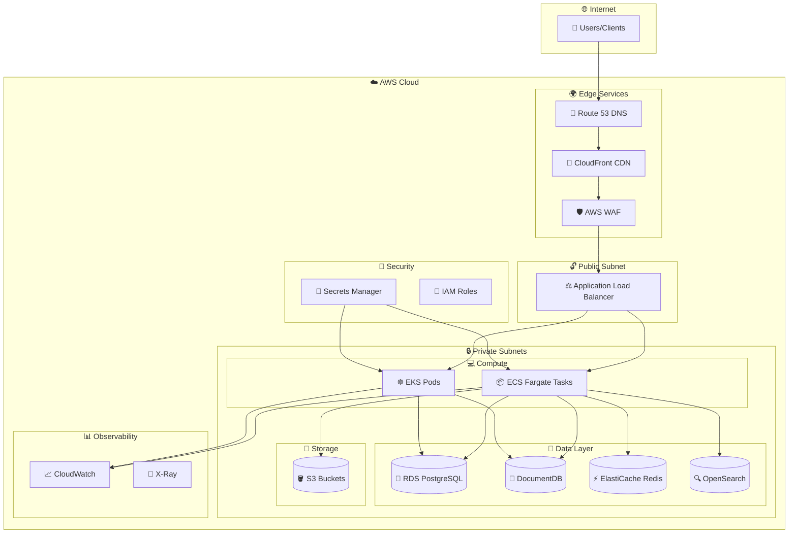
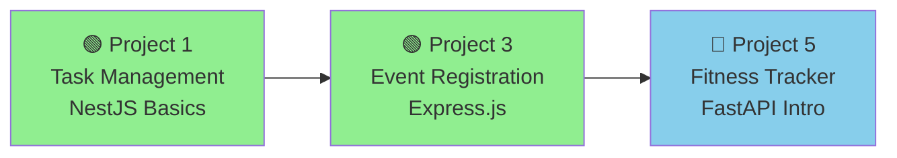
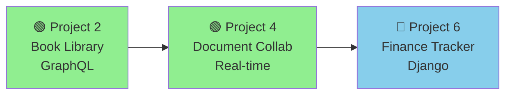
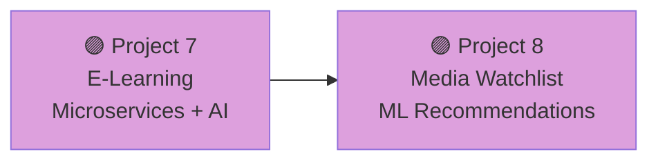
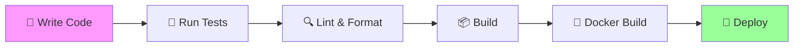

# 🎯 Portfolio Projects

<div align="center">


**🚀 8 Production-Ready Full-Stack Applications | Cloud-Native Architecture | AWS Deployment**

</div>

---

## 📋 Executive Summary

This portfolio consists of **8 production-ready full-stack applications** designed to demonstrate mastery of modern software development practices, cloud-native architecture, and end-to-end deployment on AWS. Each project progressively increases in complexity and introduces new technologies, patterns, and architectural decisions.

### 🎓 What You'll Master

| Area | Skills |
|------|--------|
| **Backend** | Node.js (NestJS, Express, Fastify), Python (FastAPI, Django), REST, GraphQL, gRPC |
| **Frontend** | React 18, Next.js 14, TailwindCSS, Real-time updates |
| **Databases** | PostgreSQL, MongoDB, Elasticsearch, Redis |
| **DevOps** | Docker, Kubernetes, Terraform, GitHub Actions |
| **Cloud** | AWS (ECS, RDS, S3, CloudFront, Lambda) |
| **AI/ML** | Recommendation engines, NLP, Collaborative filtering |

---

## 🗂️ Project Phases

### 🟢 Phase 1: Node.js Backend (Projects 1-4)
> **Focus:** Master backend development with different Node.js frameworks and architectural patterns.
> 
> **Duration:** ~12-16 weeks | **Difficulty:** Beginner → Intermediate

| # | Project | Framework | API Style | Key Learning | Est. Time |
|:-:|---------|-----------|-----------|--------------|:---------:|
| 1️⃣ | [Task Management Platform](./01-Task-Management-Platform.md) | NestJS | REST | Modular architecture, RBAC, hybrid DB | 3-4 weeks |
| 2️⃣ | [Book Library System](./02-Book-Library-System.md) | NestJS + Apollo | GraphQL | GraphQL APIs, DataLoader, external APIs | 3-4 weeks |
| 3️⃣ | [Event Registration Platform](./03-Event-Registration-Platform.md) | Express.js | REST + GraphQL | Payment integration, multi-tenancy | 3-4 weeks |
| 4️⃣ | [Document Collaboration Platform](./04-Document-Collaboration-Platform.md) | Fastify | REST + WebSocket | Real-time CRDT, collaborative editing | 3-4 weeks |

### 🔵 Phase 2: Python Backend (Projects 5-6)
> **Focus:** Transition to Python ecosystem with modern async frameworks.
> 
> **Duration:** ~6-8 weeks | **Difficulty:** Intermediate

| # | Project | Framework | API Style | Key Learning | Est. Time |
|:-:|---------|-----------|-----------|--------------|:---------:|
| 5️⃣ | [Fitness Tracker API](./05-Fitness-Tracker-API.md) | FastAPI | REST | Async Python, device integrations, health data | 3-4 weeks |
| 6️⃣ | [Personal Finance Tracker](./06-Personal-Finance-Tracker.md) | Django | REST | Django ORM, financial APIs, ML categorization | 3-4 weeks |

### 🟣 Phase 3: Hybrid Node.js + Python with AI/ML (Projects 7-8)
> **Focus:** Combine both ecosystems with AI/ML capabilities using microservices architecture.
> 
> **Duration:** ~8-10 weeks | **Difficulty:** Advanced

| # | Project | Architecture | AI/ML Component | Key Learning | Est. Time |
|:-:|---------|--------------|-----------------|--------------|:---------:|
| 7️⃣ | [E-Learning Platform](./07-E-Learning-Platform.md) | Node.js Gateway + Python AI | Content recommendations, adaptive learning | Microservices, gRPC, Kafka | 4-5 weeks |
| 8️⃣ | [Movie/Media Watchlist Manager](./08-Movie-Media-Watchlist-Manager.md) | Node.js API + Python ML | Recommendation engine | Collaborative filtering, A/B testing | 4-5 weeks |

---

## 🏗️ Shared Infrastructure

All projects share a common infrastructure foundation documented in the [📘 Shared Infrastructure Guide](./09-Shared-Infrastructure-Guide.md).

### 🔧 Common Tech Stack

<table>
<tr>
<td>

```yaml
# Databases
Databases:
  Primary_SQL: PostgreSQL 15
  Document_Store: MongoDB 7.0
  Search_Engine: Elasticsearch 8.x
  Cache: Redis 7.x

# Queues
Message_Queue:
  Queue: BullMQ (Redis-backed)
  Event_Streaming: Apache Kafka
```

</td>
<td>

```yaml
# Storage
File_Storage:
  Development: MinIO
  Production: AWS S3 + CloudFront

# Infrastructure
Infrastructure:
  Containerization: Docker
  Orchestration: Kubernetes
  CI_CD: GitHub Actions
  IaC: Terraform
```

</td>
<td>

```yaml
# AWS
AWS_Services:
  Compute: ECS Fargate / EKS
  Database: RDS, DocumentDB
  Search: OpenSearch Service
  Cache: ElastiCache
  Storage: S3

# Observability
Monitoring:
  Metrics: Prometheus + Grafana
  Logging: ELK Stack
  Errors: Sentry
```

</td>
</tr>
</table>

---

## 📊 Technology Progression Matrix

```
┌─────────────────────────────────────────────────────────────────────────────────────┐
│                           🎯 TECHNOLOGY PROGRESSION MAP                              │
├─────────────────────────────────────────────────────────────────────────────────────┤
│                                                                                      │
│  PHASE 1: Node.js Mastery                    PHASE 2: Python Mastery                │
│  ┌─────────┐ ┌─────────┐ ┌─────────┐ ┌─────────┐ ┌─────────┐ ┌─────────┐           │
│  │ P1      │ │ P2      │ │ P3      │ │ P4      │ │ P5      │ │ P6      │           │
│  │ NestJS  │→│ NestJS  │→│ Express │→│ Fastify │→│ FastAPI │→│ Django  │           │
│  │ REST    │ │ GraphQL │ │ Hybrid  │ │ WebSock │ │ Async   │ │ Full    │           │
│  └────┬────┘ └────┬────┘ └────┬────┘ └────┬────┘ └────┬────┘ └────┬────┘           │
│       │          │          │          │          │          │                      │
│       └──────────┴──────────┴──────────┴──────────┴──────────┘                      │
│                              │                                                       │
│                    ┌─────────┴─────────┐                                            │
│                    │  🏗️ AWS FOUNDATION │                                            │
│                    │  ECS • RDS • S3    │                                            │
│                    └─────────┬─────────┘                                            │
│                              │                                                       │
│       ┌──────────────────────┴───────────────────────┐                              │
│       │              PHASE 3: AI/ML Integration       │                              │
│       │  ┌───────────────────┐ ┌───────────────────┐ │                              │
│       │  │ P7: E-Learning    │ │ P8: Watchlist     │ │                              │
│       │  │ Node.js + Python  │ │ Node.js + Python  │ │                              │
│       │  │ 🧠 AI Gateway     │ │ 🎬 Recommendations│ │                              │
│       │  │ gRPC • Kafka      │ │ ML • A/B Testing  │ │                              │
│       │  └───────────────────┘ └───────────────────┘ │                              │
│       └──────────────────────────────────────────────┘                              │
└─────────────────────────────────────────────────────────────────────────────────────┘
```

---

## ☁️ AWS Architecture Overview (All Projects)



---

## 🎓 Learning Path Recommendations

### 🌱 Beginner Path
> **For developers new to full-stack development**



| Step | Project | Focus | Time |
|:----:|---------|-------|:----:|
| 1 | **Task Management Platform** | NestJS fundamentals, REST APIs, PostgreSQL | 3-4 weeks |
| 2 | **Event Registration Platform** | Express.js patterns, Payment integration | 3-4 weeks |
| 3 | **Fitness Tracker API** | Introduction to Python/FastAPI | 3-4 weeks |

### 🌿 Intermediate Path
> **For developers with basic backend experience**



| Step | Project | Focus | Time |
|:----:|---------|-------|:----:|
| 1 | **Book Library System** | Master GraphQL, DataLoader optimization | 3-4 weeks |
| 2 | **Document Collaboration Platform** | Real-time systems, CRDT, WebSocket | 3-4 weeks |
| 3 | **Personal Finance Tracker** | Complex Django applications, ML features | 3-4 weeks |

### 🌳 Advanced Path
> **For experienced developers seeking microservices & AI/ML expertise**



| Step | Project | Focus | Time |
|:----:|---------|-------|:----:|
| 1 | **E-Learning Platform** | Microservices, gRPC, AI content recommendations | 4-5 weeks |
| 2 | **Movie/Media Watchlist** | ML recommendation systems, A/B testing | 4-5 weeks |

---

## 🧠 Integrating Core Engineering Fundamentals

> **Transform these portfolio projects into a comprehensive curriculum for engineering mastery and senior-level interview preparation.**

Building projects is excellent for practical, hands-on experience. However, to bridge the gap between building projects and succeeding in top-tier interviews, it's crucial to explicitly integrate core computer science fundamentals. This section provides a framework for systematically studying and applying **Data Structures & Algorithms (DSA)**, **System Design**, and **Computer Networks (CN)** in the context of these 8 portfolio projects.

### 🏗️ System Design: Treat Each Project as a System Design Problem

Every project in this portfolio is an opportunity to practice real-world system design. Before writing code, ask yourself these questions:

| Question | Example (Task Management Platform) |
|----------|-----------------------------------|
| **What are the functional requirements?** | Create tasks, assign users, track progress, set deadlines |
| **What are the non-functional requirements?** | Support 10K concurrent users, <200ms response time, 99.9% uptime |
| **How will you scale reads vs. writes?** | Read-heavy workload → Implement caching with Redis |
| **What's your data model?** | PostgreSQL for relational data, MongoDB for activity logs |
| **How do you handle failures?** | Circuit breakers, retry logic, graceful degradation |

**Action Items:**
- 📐 Before starting each project, draw a high-level architecture diagram
- 📊 Estimate load: users, requests/second, data volume
- 🔄 Design for horizontal scaling from day one
- 📝 Document your design decisions and trade-offs

### 📊 DSA: Apply Algorithms to Solve Real Problems

Data structures and algorithms aren't just for interviews—they're the foundation of efficient software. Here's how to apply DSA concepts directly to the portfolio projects:

| DSA Concept | Project Application | Problem Solved |
|-------------|---------------------|----------------|
| **Graphs (DFS/BFS)** | P1: Task Management | Task dependencies and critical path calculation |
| **Topological Sort** | P1: Task Management | Determining task execution order |
| **Trie** | P2: Book Library | Autocomplete for book search |
| **Inverted Index** | P2: Book Library | Full-text search implementation |
| **Priority Queue/Heap** | P3: Event Registration | Waitlist management with priority |
| **[CRDT](https://crdt.tech/) (Conflict-free Replicated Data Types)** | P4: Document Collaboration | Real-time conflict resolution without coordination |
| **Sliding Window** | P5: Fitness Tracker | Calculating rolling averages (e.g., 7-day step count) |
| **Dynamic Programming** | P6: Finance Tracker | Budget optimization and forecasting |
| **Collaborative Filtering (Matrix Factorization)** | P7: E-Learning | Content recommendations |
| **KNN (K-Nearest Neighbors)** | P8: Media Watchlist | Content-based similar item recommendations |
| **Graph Algorithms (PageRank, Random Walk)** | P8: Media Watchlist | Social graph-based recommendations |

**Action Items:**
- 🎯 Before implementing a feature, identify the underlying DSA problem
- ⏱️ Analyze time and space complexity of your solutions
- 🔧 Implement core algorithms from scratch at least once before using libraries
- 📝 Keep a DSA journal: document which algorithms you used and why

### 🌐 Computer Networks & OS: Understand the "Why" Behind Performance

Understanding networks and operating systems helps you make informed engineering decisions about performance, latency, and resource management.

| Concept | Project Application | Why It Matters |
|---------|---------------------|----------------|
| **TCP vs UDP** | P4: Document Collaboration | WebSocket uses TCP for reliable real-time updates |
| **HTTP/2 & gRPC** | P7: E-Learning | Efficient microservice communication with multiplexing |
| **CDN & Edge Caching** | All Projects | Reduce latency by serving static assets from edge locations |
| **Connection Pooling** | All Projects | Reuse database connections to reduce overhead |
| **Load Balancing (Round Robin, Least Connections)** | All Projects (AWS) | Distribute traffic efficiently across instances |
| **DNS Resolution** | All Projects (AWS) | Route 53 for low-latency, reliable routing |
| **Process vs Thread** | P5: Fitness Tracker | Use async I/O (single-threaded) for concurrent API calls; multiprocessing for CPU-bound data analysis |
| **Memory Management** | P7, P8: AI/ML Projects | Efficient model loading and inference |

**Action Items:**
- 🔍 Use tools like `curl -v`, `tcpdump`, and browser DevTools to inspect network traffic
- 📈 Monitor resource usage with `htop`, `docker stats`, and AWS CloudWatch
- ⚡ Profile your applications to identify bottlenecks
- 📚 Read about the OSI model and how each layer applies to your projects

### 🎯 Integration Strategy: A Week-by-Week Approach

| Week | Focus | Deliverable |
|:----:|-------|-------------|
| 1 | System Design | Architecture diagram + capacity estimation |
| 2-3 | Core Implementation | Apply relevant DSA concepts as you build |
| 4 | Optimization | Profile, identify bottlenecks, apply CN/OS knowledge |
| 5 | Documentation | Write a design document explaining your decisions |

By treating each project as both a **coding exercise** and a **learning laboratory for fundamentals**, you'll build a portfolio that demonstrates not just what you can build, but how you think as an engineer.

---

## 🚀 Quick Start

### 📋 Prerequisites

| Tool | Version | Purpose |
|------|---------|---------|
| Docker | 24.0+ | Container runtime |
| Docker Compose | 2.20+ | Multi-container orchestration |
| Node.js | 20 LTS | Projects 1-4, 7-8 |
| Python | 3.11+ | Projects 5-8 |
| AWS CLI | 2.x | Cloud deployment |
| kubectl | 1.28+ | Kubernetes management |
| Helm | 3.x | Kubernetes package manager |

### 💻 Local Development

```bash
# 1️⃣ Clone repository
git clone <repo-url>
cd <project-folder>

# 2️⃣ Copy environment file
cp .env.example .env

# 3️⃣ Start all services (databases, cache, search)
docker-compose up -d

# 4️⃣ Install dependencies
npm install           # For Node.js projects
pip install -r requirements.txt  # For Python projects

# 5️⃣ Run database migrations
npm run migration:run
# or
python manage.py migrate

# 6️⃣ Start development server
npm run start:dev     # Node.js
uvicorn main:app --reload  # FastAPI
python manage.py runserver  # Django

# 7️⃣ View logs
docker-compose logs -f api
```

### 🔧 Development Workflow



---

## 📈 Project Status

| Project | Phase | Status | Documentation | Tests | AWS Ready |
|:--------|:-----:|:------:|:-------------:|:-----:|:---------:|
| 1️⃣ Task Management | 1 | 📝 Spec Complete | ✅ | ⬜ | ⬜ |
| 2️⃣ Book Library | 1 | 📝 Spec Complete | ✅ | ⬜ | ⬜ |
| 3️⃣ Event Registration | 1 | 📝 Spec Complete | ✅ | ⬜ | ⬜ |
| 4️⃣ Document Collaboration | 1 | 📝 Spec Complete | ✅ | ⬜ | ⬜ |
| 5️⃣ Fitness Tracker | 2 | 📝 Spec Complete | ✅ | ⬜ | ⬜ |
| 6️⃣ Personal Finance | 2 | 📝 Spec Complete | ✅ | ⬜ | ⬜ |
| 7️⃣ E-Learning Platform | 3 | 📝 Spec Complete | ✅ | ⬜ | ⬜ |
| 8️⃣ Media Watchlist | 3 | 📝 Spec Complete | ✅ | ⬜ | ⬜ |

### Legend
- 📝 Spec Complete = Specification document finished
- ✅ = Complete
- ⬜ = Not started
- 🔄 = In progress

---

## 📚 Related Documentation

| Document | Description |
|----------|-------------|
| [📘 Shared Infrastructure Guide](./09-Shared-Infrastructure-Guide.md) | Common infrastructure patterns, AWS setup, CI/CD templates |
| [🏗️ AWS Deployment Playbook](./09-Shared-Infrastructure-Guide.md#deployment-playbook) | Step-by-step AWS deployment guide |
| [🔄 CI/CD Pipeline Guide](./09-Shared-Infrastructure-Guide.md#cicd-pipeline) | GitHub Actions workflow templates |
| [🔐 Security Best Practices](./09-Shared-Infrastructure-Guide.md#authentication--security) | Authentication, authorization, and security patterns |

---

## 🤝 Contributing

1. Fork the repository
2. Create a feature branch (`git checkout -b feature/amazing-feature`)
3. Commit your changes (`git commit -m 'Add amazing feature'`)
4. Push to the branch (`git push origin feature/amazing-feature`)
5. Open a Pull Request

---

<div align="center">

**⭐ Star this repository if you find it helpful!**

Made with ❤️ for developers who want to build production-ready applications

*Last Updated: December 2024*

</div>
